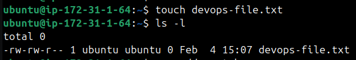
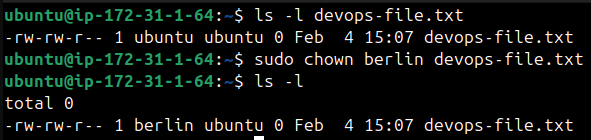
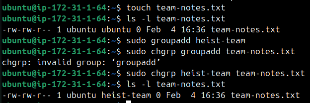
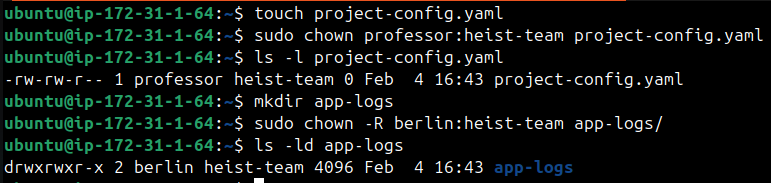
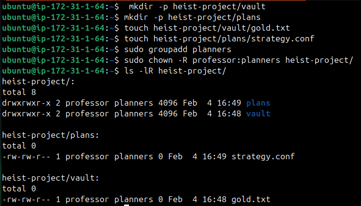
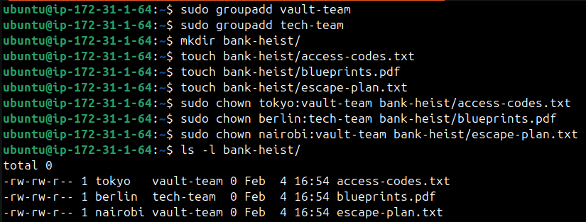

#  File Ownership Challenge (chown & chgrp)

## Users Created
- tokyo
- berlin
- nairobi
- professor

## Groups Created
- heist-team
- planners
- vault-team
- tech-team

## Files & Directories Created
- devops-file.txt
- app-logs/
- bank-heist/access-codes.txt
- bank-heist/blueprints.pdf
- bank-heist/escape-plan.txt
- heist-project/plans/strategy.conf
- heist-project/vault/gold.txt
- project-config.yml
- team-notes.txt

## Understanding Ownership

- Run ls -l in your home directory
- Identify the owner and group columns
- Check who owns your files



* Owner : The owner is usually the user who created the file or directory. Owner can change permission of file.
* Group : The group is a collection of users who share access to the file.

## Basic chown Operations

- Create file devops-file.txt
- Check current owner: ls -l devops-file.txt
- Change owner to berlin
- Verify the changes



## Basic chgrp Operations 

- Create file team-notes.txt
- Check current group: ls -l team-notes.txt
- Create group: sudo groupadd heist-team
- Change file group to heist-team
- Verify the change



## Combined Owner & Group Change

Using chown you can change both owner and group together:

- Create file project-config.yaml
- Change owner to professor AND group to heist-team (one command)
- Create directory app-logs/
- Change its owner to berlin and group to heist-team



## Recursive Ownership

1. Create directory structure:
   ```
   mkdir -p heist-project/vault
   mkdir -p heist-project/plans
   touch heist-project/vault/gold.txt
   touch heist-project/plans/strategy.conf
   ```

2. Create group `planners`: `sudo groupadd planners`

3. Change ownership of entire `heist-project/` directory:
   - Owner: `professor`
   - Group: `planners`
   - Use recursive flag (`-R`)

4. Verify all files and subdirectories changed: `ls -lR heist-project/`



### Task 6: Practice Challenge

1. Create users: `tokyo`, `berlin`, `nairobi` (if not already created)
2. Create groups: `vault-team`, `tech-team`
3. Create directory: `bank-heist/`
4. Create 3 files inside:
   ```
   touch bank-heist/access-codes.txt
   touch bank-heist/blueprints.pdf
   touch bank-heist/escape-plan.txt
   ```

5. Set different ownership:
   - `access-codes.txt` → owner: `tokyo`, group: `vault-team`
   - `blueprints.pdf` → owner: `berlin`, group: `tech-team`
   - `escape-plan.txt` → owner: `nairobi`, group: `vault-team`

**Verify:** `ls -l bank-heist/`



## Commands Used

- View ownership : `ls -l filename`
- Change owner only : `sudo chown newowner filename`
- Change group only : `sudo chgrp newgroup filename`
- Change both owner and group : `sudo chown owner:group filename`
- Recursive change (directories) : `sudo chown -R owner:group directory/`
- Change only group with chown : `sudo chown :groupname filename` 

## What I Learned

* Managing User & Groups
* Understood file ownership
