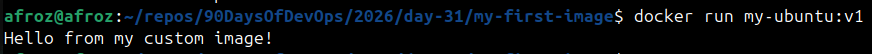
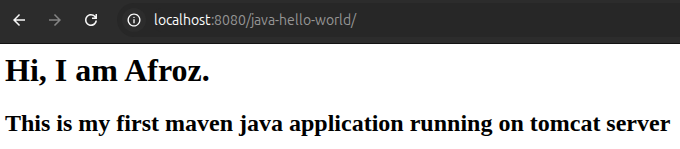
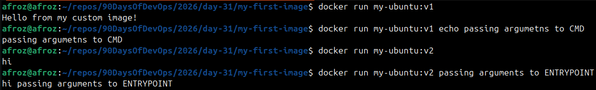
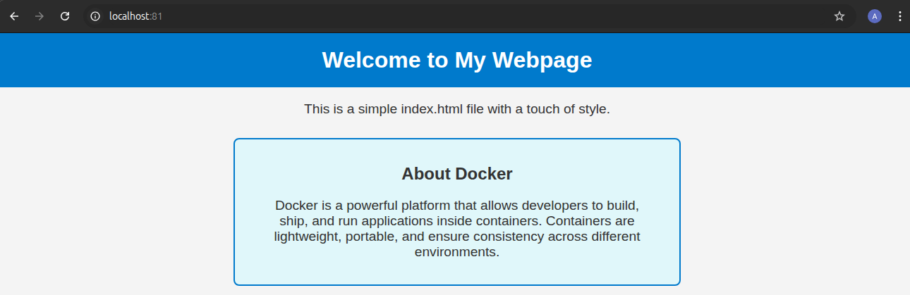
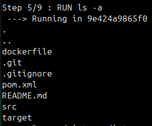
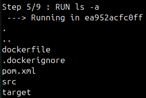

# Day 31 – Dockerfile: Build Your Own Images

## Task 1: Your First Dockerfile
1. Create a folder called `my-first-image`
2. Inside it, create a `Dockerfile` that:
   - Uses `ubuntu` as the base image
   - Installs `curl`
   - Sets a default command to print `"Hello from my custom image!"`
3. Build the image and tag it `my-ubuntu:v1`
4. Run a container from your image

**Verify:** The message prints on `docker run`

    [Docker file](my-first-image/dockerfile)

    
    
---

## Task 2: Dockerfile Instructions
Create a new Dockerfile that uses **all** of these instructions:
- `FROM` — base image
- `RUN` — execute commands during build
- `COPY` — copy files from host to image
- `WORKDIR` — set working directory
- `EXPOSE` — document the port
- `CMD` — default command

Build and run it. Understand what each line does.

    [Docker file](java-hello-world-webapp/dockerfile)

    
    
---

## Task 3: CMD vs ENTRYPOINT
1. Create an image with `CMD ["echo", "hello"]` — run it, then run it with a custom command. What happens?
2. Create an image with `ENTRYPOINT ["echo"]` — run it, then run it with additional arguments. What happens?
3. Write in your notes: When would you use CMD vs ENTRYPOINT?

    
    
* **CMD** : Provides defaults for container runtime. Completely overridden if you pass a command at runtime.
* **ENTRYOINT** : Always runs the specified command first. Appends any additional arguments passed at runtime.

---

## Task 4: Build a Simple Web App Image
1. Create a small static HTML file (`index.html`) with any content
2. Write a Dockerfile that:
   - Uses `nginx:alpine` as base
   - Copies your `index.html` to the Nginx web directory
3. Build and tag it `my-website:v1`
4. Run it with port mapping and access it in your browser

    [Docker file](nginx-demo/dockerfile)

    
    
---

## Task 5: .dockerignore
1. Create a `.dockerignore` file in one of your project folders
2. Add entries for: `node_modules`, `.git`, `*.md`, `.env`
3. Build the image — verify that ignored files are not included
    
   
    
   
    
---

## Task 6: Build Optimization
1. Build an image, then change one line and rebuild — notice how Docker uses **cache**
2. Reorder your Dockerfile so that frequently changing lines come **last**
3. Write in your notes: Why does layer order matter for build speed?

* Docker builds images in layers. Each instructions (FROM, COPY, RUN) creates a new layer.
* Docker caches layers, so all layers before any unchanged instruction is not rebuilt, used from cache.
* If a layer changes, all layers after it are rebuilt.
* Placing frequently changing layers last, ensures maximum use of cache and minimum rebuild time.
* Provides faster and efficient builds.

---

