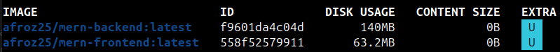

# Day 36 – Docker Project: Dockerize a Full Application

## Task 1: Pick Your App

- I chose this app from GitHub, it doesn't have docker. 
- I built dockerfiles and compose file from scratch.

[https://github.com/aayush301/MERN-task-manager](https://github.com/aayush301/MERN-task-manager)

---

## Task 2: Write the Dockerfile
1. Create a Dockerfile for your application
2. Use a **multi-stage build** if applicable
3. Use a **non-root user**
4. Keep the image **small** — use alpine or slim base images
5. Add a `.dockerignore` file

Build and test it locally.

### DONE

---

### Task 3: Add Docker Compose
Write a `docker-compose.yml` that includes:
1. Your **app** service (built from Dockerfile)
2. A **database** service (Postgres, MySQL, MongoDB — whatever your app needs)
3. **Volumes** for database persistence
4. A **custom network**
5. **Environment variables** for configuration (use `.env` file)
6. **Healthchecks** on the database

Run `docker compose up` and verify everything works together.

### DONE

---

### Task 4: Ship It
1. Tag your app image
2. Push it to Docker Hub
3. Share the Docker Hub link
4. Write a `README.md` in your project with:
   - What the app does
   - How to run it with Docker Compose
   - Any environment variables needed

## DONE

---

### Task 5: Test the Whole Flow
1. Remove all local images and containers
2. Pull from Docker Hub and run using only your compose file
3. Does it work fresh? If not — fix it until it does

## DONE

---

##  Challenges faced and how I solved them
**Issue** - At first when I did `docker compose up` it ran, but it was throwing **(404 Not Found)** 
  error when trying to login/signup. Since the frontend was served by Nginx, it was treating API requests (like /api/login) as internal file paths.

**Solution** - implemented an Nginx Reverse Proxy configuration. 
    Added required configuration in nginx.conf so that nginx now intercept API calls and forwards them to the backend container

## Final image size

   

## Docker Hub link

https://hub.docker.com/repositories/afroz25

---
## Project & Dockrfiles

   * Complete Project 

   [MERN-task-manager](https://github.com/Afroz-J-Shaikh/MERN-task-manager/tree/main)

   * Frontend Dockerfile

   [MERN-task-manager](https://github.com/Afroz-J-Shaikh/MERN-task-manager/blob/main/frontend/Dockerfile)

   * Backend Dockerfile

   [MERN-task-manager](https://github.com/Afroz-J-Shaikh/MERN-task-manager/blob/main/backend/Dockerfile)

   * Docker Compose

   [MERN-task-manager](https://github.com/Afroz-J-Shaikh/MERN-task-manager/blob/main/docker-compose.yml)

 
## Running App

[app.webm](https://github.com/user-attachments/assets/4e0e8925-4d57-41e3-a2ca-398dbc95c58b)
