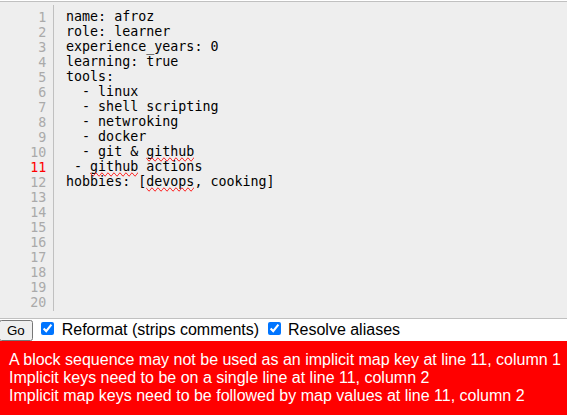
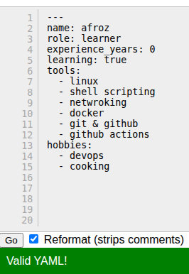
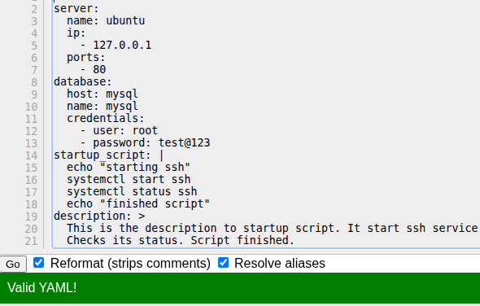

# Day 38 – YAML Basics

## Task 1: Key-Value Pairs
Create `person.yaml` that describes yourself with:
- `name`
- `role`
- `experience_years`
- `learning` (a boolean)

**Verify:** Run `cat person.yaml` — does it look clean? No tabs?

   [person.yaml](files/person.yaml)

---

## Task 2: Lists
Add to `person.yaml`:
- `tools` — a list of 5 DevOps tools you know or are learning
- `hobbies` — a list using the inline format `[item1, item2]`

Write in your notes: What are the two ways to write a list in YAML?
1 -
```sh
tools:
  - linux
  - shell scripting
  - netwroking
  - docker
  - git & github
  - github actions
```

2 -
```sh
hobbies: [devops, cooking]
```
---

## Task 3: Nested Objects
Create `server.yaml` that describes a server:
- `server` with nested keys: `name`, `ip`, `port`
- `database` with nested keys: `host`, `name`, `credentials` (nested further: `user`, `password`)

**Verify:** Try adding a tab instead of spaces — what happens when you validate it?
- validation error

   [server.yaml](files/server.yaml)
   
---

## Task 4: Multi-line Strings
In `server.yaml`, add a `startup_script` field using:
1. The `|` block style (preserves newlines)
2. The `>` fold style (folds into one line)

Write in your notes: When would you use `|` vs `>`?
* Use `|` when writing configurations,scripts or formatted text blocks.
* Use `>` for long description or message.

```sh
startup_script: |
  echo "starting ssh"
  systemctl start ssh
  systemctl status ssh
  echo "finished script"

description: >
  This is the description to startup script.
  It start ssh service.
  Checks its status.
  Script finished.
```

---

## Task 5: Validate Your YAML
1. Install `yamllint` or use an online validator
2. Validate both your YAML files
3. Intentionally break the indentation — what error do you get?
4. Fix it and validate again

### person.yml

* Invalid

   

* Valid

   

### server.yml

   
---

### Task 6: Spot the Difference
Read both blocks and write what's wrong with the second one:

```yaml
# Block 1 - correct
name: devops
tools:
  - docker
  - kubernetes
```

```yaml
# Block 2 - broken
name: devops
tools:
- docker
  - kubernetes
```
* Indentation is wrong in the second block.
---

## What I lerned

* Learned writing yml files.
* Two space indentation works best.