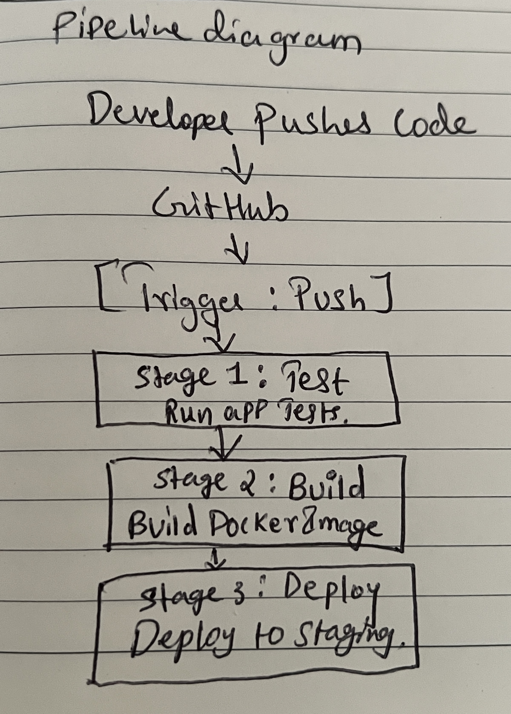

# Day 39 – CI/CD Concepts

Today I learned why CI/CD is important, how Continuous Integration differs from Continuous Delivery and Continuous Deployment, and how a typical pipeline is structured.

---

## Why CI/CD?

When multiple developers work on the same repository, different changes can conflict with each other or break the application.

Another common problem is:

> **"It works on my machine."**

This usually happens when a developer has the correct dependencies, versions, environment variables, or configuration locally, but the same setup does not exist somewhere else.

Manual deployments also increase the chance of human error, especially when deployments happen frequently.

CI/CD helps make this process more consistent and automated.

---

## CI vs Continuous Delivery vs Continuous Deployment

### Continuous Integration

Developers frequently integrate their code into a shared repository.

Whenever code is pushed, automated builds and tests can run to catch problems early.

```text
Code Push
    ↓
  Build
    ↓
  Test
    ↓
Pass / Fail
```

### Continuous Delivery

Code is automatically built, tested, and kept ready for production.

The final production release normally requires manual approval.

```text
Push
 ↓
Build
 ↓
Test
 ↓
Ready for Production
 ↓
Manual Approval
 ↓
Deploy
```

### Continuous Deployment

If the code passes all required checks, it is automatically deployed to production.

```text
Push
 ↓
Build
 ↓
Test
 ↓
Checks Pass
 ↓
Production
```

---

## Pipeline Anatomy

A CI/CD pipeline is made up of several important parts:

* **Trigger** – the event that starts the pipeline, such as a push or pull request.
* **Stage** – a major phase such as Test, Build, or Deploy.
* **Job** – a unit of work performed inside the pipeline.
* **Step** – a smaller action that helps complete a job.
* **Runner** – the machine or VM that executes the job.
* **Artifact** – an output produced by a job that can be saved or used later.

---

## Pipeline Diagram

For this exercise, the pipeline starts when a developer pushes code to GitHub.

```text
Developer Pushes Code
        ↓
      GitHub
        ↓
   Trigger: Push
        ↓
┌────────────────────┐
│   Stage 1: Test    │
│   Run App Tests    │
└────────────────────┘
        ↓
┌────────────────────┐
│   Stage 2: Build   │
│ Build Docker Image │
└────────────────────┘
        ↓
┌────────────────────┐
│  Stage 3: Deploy   │
│ Deploy to Staging  │
└────────────────────┘
```

### My Hand-Drawn Pipeline

I first mapped the pipeline by hand to understand how a code push moves through testing, building, and deployment.
``

``
---

## Exploring a Real GitHub Actions Workflow

I explored a real GitHub Actions workflow from the FastAPI project.

### Triggers

The workflow can run when:

* Code is pushed to the `master` branch
* A pull request is opened or updated

### Jobs

The workflow contained jobs including:

```text
changes
langs
build-docs
docs-all-green
```

### `build-docs` Job

The `build-docs` job is responsible for generating the FastAPI documentation.

The job performs actions such as:

```text
Checkout code
     ↓
Set up Python
     ↓
Install dependencies
     ↓
Build documentation
     ↓
Upload generated documentation
```

---

## Artifact

The generated documentation is uploaded using GitHub Actions as an artifact.

The artifact name uses:

```text
docs-site-${{ matrix.lang }}
```

This allows documentation for different languages to be stored separately.

The workflow uploads content from the generated `site` directory.

---

## What I Learned

1. **Continuous Integration** helps detect problems early by automatically building and testing changes.

2. **Continuous Delivery** keeps code ready for production but normally requires manual approval before release.

3. **Continuous Deployment** automatically releases code after all required checks pass.

4. A CI/CD pipeline is built from triggers, stages, jobs, steps, runners, and artifacts.

5. Artifacts allow workflow outputs such as documentation, binaries, or reports to be saved and reused.

6. Automation reduces repetitive manual work and makes deployments more consistent.

---

## Key Takeaway

CI/CD is not just about automatically deploying code.

It is about creating a reliable path:

```text
Code → Build → Test → Package → Deploy
```

where problems can be detected before they reach users.
