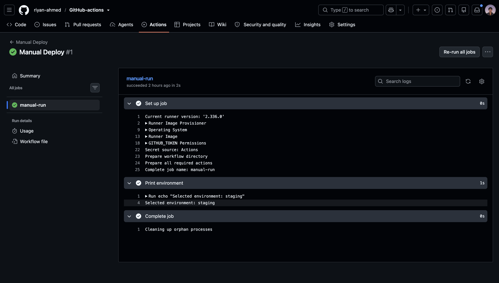
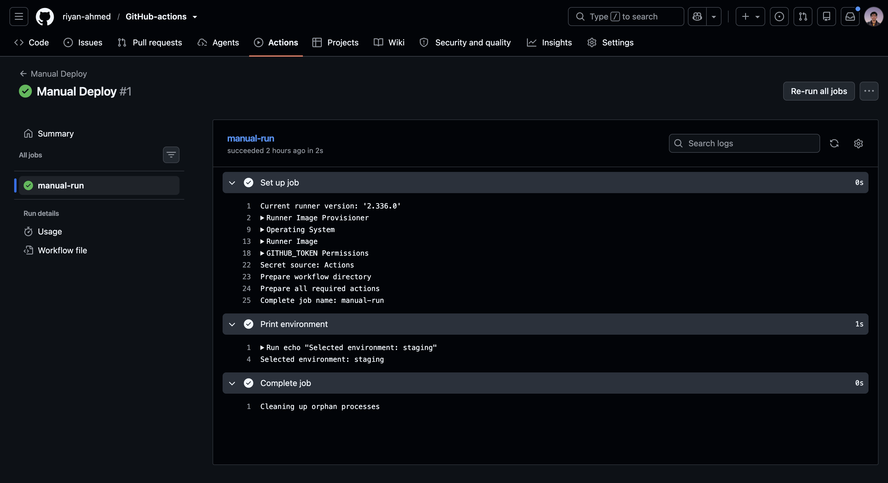
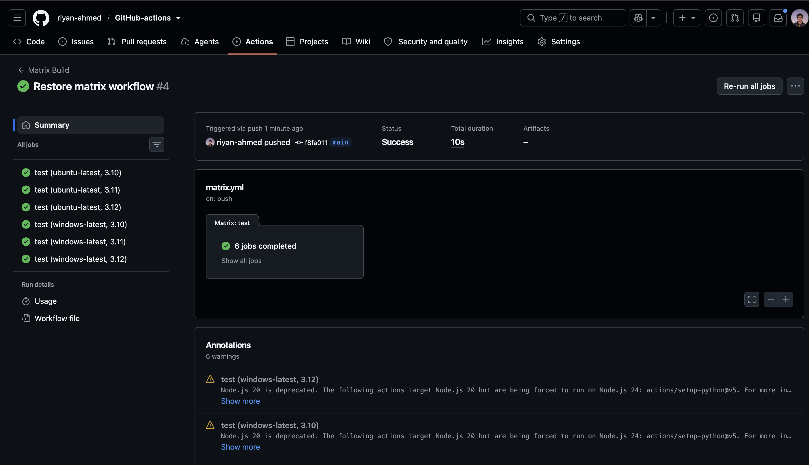

# Day 41 – GitHub Actions Triggers & Matrix Builds

Today I practised different GitHub Actions triggers and learned how matrix builds can run the same job across multiple environments.

## 1. Pull Request Trigger

I created a workflow that runs when a pull request is opened or updated against `main`.

```yaml
on:
  pull_request:
    branches:
      - main
    types:
      - opened
      - synchronize
```

- `opened` runs when a PR is created.
- `synchronize` runs again when new commits are pushed to the PR branch.



---

## 2. Scheduled Trigger

I added a scheduled workflow using cron:

```yaml
schedule:
  - cron: "0 0 * * *"
```

This means the workflow runs every day at midnight UTC.

### Cron Question

Every Monday at 9 AM UTC:

```text
0 9 * * 1
```

Cron format:

```text
minute hour day-of-month month day-of-week
```

---

## 3. Manual Trigger

I used `workflow_dispatch` to manually run a workflow and choose an environment.

```yaml
on:
  workflow_dispatch:
    inputs:
      environment:
        description: Choose environment
        required: true
        type: choice
        options:
          - staging
          - production
```

The workflow successfully received:

```text
Selected environment: staging
```



---

## 4. Matrix Builds

I created a matrix workflow using multiple Python versions and operating systems.

```yaml
strategy:
  fail-fast: false
  matrix:
    os:
      - ubuntu-latest
      - windows-latest
    python-version:
      - "3.10"
      - "3.11"
      - "3.12"
    exclude:
      - os: windows-latest
        python-version: "3.10"
```

The matrix originally created:

```text
3 Python versions × 2 operating systems = 6 jobs
```

After excluding Windows + Python 3.10:

```text
5 jobs
```



---

## 5. Fail-Fast

I intentionally failed one matrix combination to understand `fail-fast`.

- `fail-fast: true` – remaining matrix jobs may be cancelled when one fails.
- `fail-fast: false` – other matrix jobs continue running even if one fails.

I tested this by deliberately failing Ubuntu + Python 3.11. The other matrix jobs continued running successfully.

## What I Learned

- GitHub Actions workflows can run from different events such as pushes, pull requests, schedules, and manual triggers.
- Cron expressions can schedule workflows automatically.
- `workflow_dispatch` can accept user inputs.
- Matrix builds allow the same job to run across multiple versions and operating systems.
- `exclude` removes specific matrix combinations.
- `fail-fast: false` allows the remaining matrix jobs to continue after one fails.
