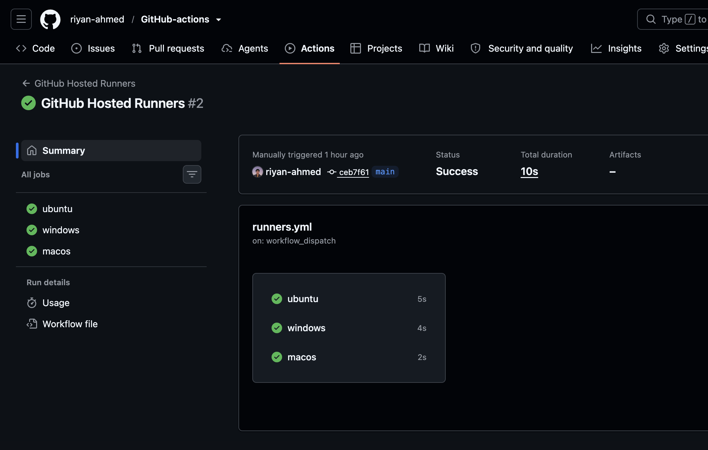
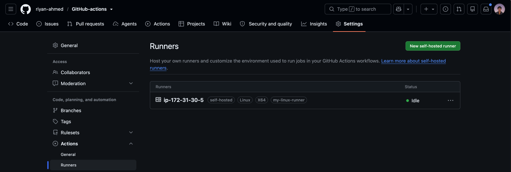
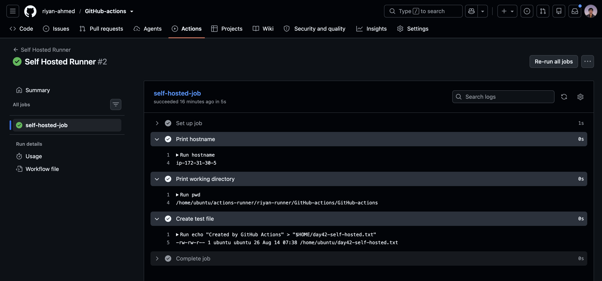
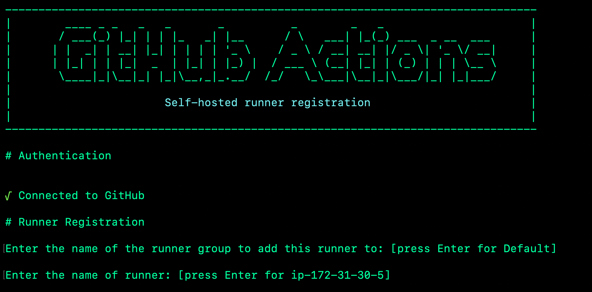
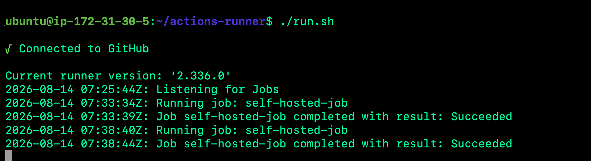

# Day 42 – GitHub-Hosted & Self-Hosted Runners

Today I explored how GitHub Actions runners work and tested both GitHub-hosted and self-hosted runners.

## 1. GitHub-Hosted Runners

I ran jobs on three GitHub-hosted environments:

* Ubuntu
* Windows
* macOS

```yaml
jobs:
  ubuntu:
    runs-on: ubuntu-latest

  windows:
    runs-on: windows-latest

  macos:
    runs-on: macos-latest
```

A GitHub-hosted runner is a temporary virtual machine provided and managed by GitHub to execute workflow jobs.



## 2. Pre-installed Tools

I checked some tools already available on the Ubuntu runner.

```text
Docker 28.0.4
Python 3.12.3
Node.js v22.23.1
Git 2.54.0
```

Having common tools pre-installed means workflows can start without installing everything from scratch.

## 3. Self-Hosted Runner

I configured an Ubuntu EC2 instance as a self-hosted GitHub Actions runner.

After starting the runner with:

```bash
./run.sh
```

it successfully connected to GitHub and showed:

```text
Listening for Jobs
```

GitHub also displayed the runner as **Idle** with a green status.



## 4. Running a Workflow on My Own Runner

I created a workflow using:

```yaml
runs-on: self-hosted
```

The workflow printed the hostname and working directory and created a file directly on the EC2 machine.

I verified it on the server using:

```bash
cat ~/day42-self-hosted.txt
```

Output:

```text
Created by GitHub Actions
```

This confirmed that the GitHub Actions job was actually executing on my EC2 instance.



## 5. Custom Runner Labels

I added the custom label:

```text
my-linux-runner
```

and targeted it with:

```yaml
runs-on: [self-hosted, my-linux-runner]
```

Labels are useful when several self-hosted runners exist because they allow workflows to target machines with specific purposes or capabilities.

## GitHub-Hosted vs Self-Hosted

| Area                   | GitHub-hosted      | Self-hosted                   |
| ---------------------- | ------------------ | ----------------------------- |
| Management             | Managed by GitHub  | Managed by us                 |
| Control                | Less control       | More control                  |
| Maintenance            | Minimal            | Our responsibility            |
| Infrastructure         | Provided by GitHub | We provide it                 |
| Private network access | Limited by default | Can access internal resources |
| Setup                  | Quick and easy     | More setup required           |

## What I Learned

* GitHub-hosted runners are temporary VMs managed by GitHub.
* Self-hosted runners run workflows on infrastructure that I control.
* Common development tools are already available on GitHub-hosted runners.
* `runs-on` determines where a job executes.
* Custom labels help route jobs to specific self-hosted runners.
* Self-hosted runners provide more control but also require more maintenance and security responsibility.

## 3. Self-Hosted Runner

I configured an Ubuntu EC2 instance as a self-hosted GitHub Actions runner.

During registration, the runner successfully authenticated and connected to my GitHub repository.



After starting the runner with:

```bash
./run.sh
```

it connected successfully and started waiting for workflow jobs:

```text
Connected to GitHub
Listening for Jobs
```

GitHub also displayed the runner as **Idle** and ready to accept jobs.


## 4. Running a Workflow on My Own Runner

I then created a workflow targeting my self-hosted runner.

```yaml
runs-on: [self-hosted, my-linux-runner]
```

When I triggered the workflow, I could see the job arriving directly in the EC2 terminal.

```text
Running job: self-hosted-job
Job self-hosted-job completed with result: Succeeded
```



The workflow also created a file directly on the EC2 instance.

I verified it with:

```bash
cat ~/day42-self-hosted.txt
```

Output:

```text
Created by GitHub Actions
```

This confirmed that the GitHub Actions workflow was genuinely executing on infrastructure that I controlled.


