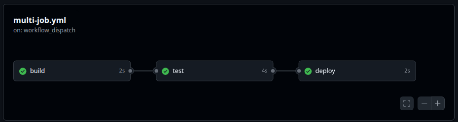
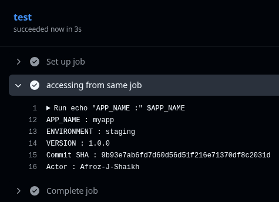
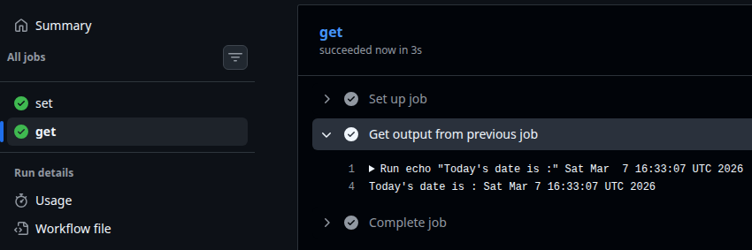
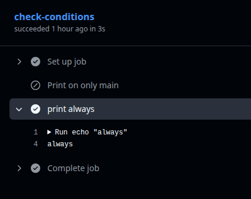
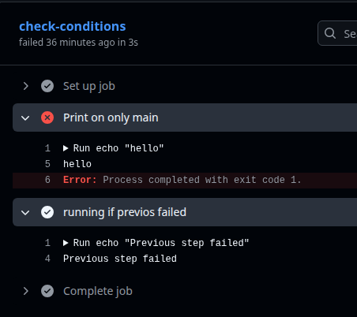
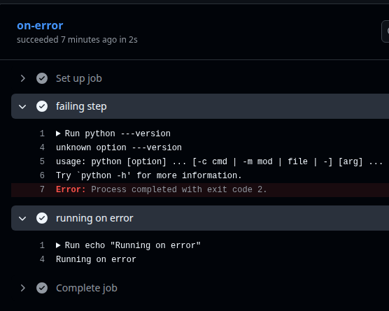
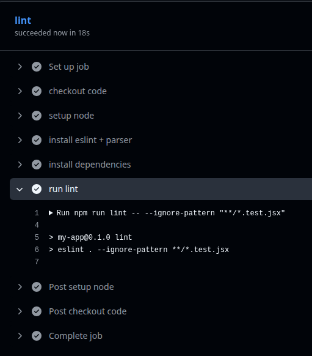
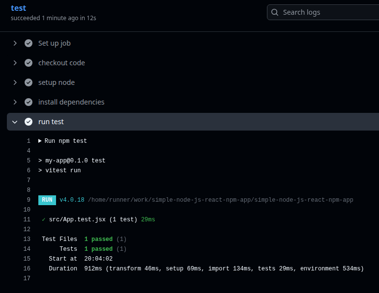
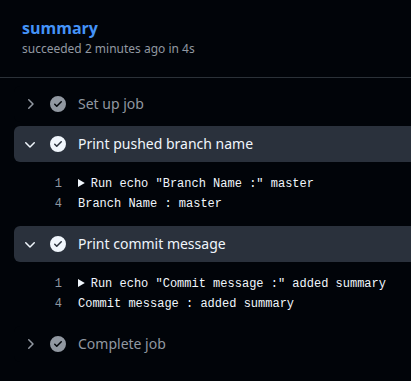

# Day 43 – Jobs, Steps, Env Vars & Conditionals

## Task 1: Multi-Job Workflow
Create `.github/workflows/multi-job.yml` with 3 jobs:
- `build` — prints "Building the app"
- `test` — prints "Running tests"
- `deploy` — prints "Deploying"

Make `test` run only **after** `build` succeeds.
Make `deploy` run only **after** `test` succeeds.

**Verify:** Check the workflow graph in the Actions tab — does it show the dependency chain? - **YES**

   [multi-job workflow file](https://github.com/Afroz-J-Shaikh/github-actions-practice/blob/d1b5d64166b58db1e36952fc0ec284dff19df15f/.github/workflows/multi-job.yml)

   

---

## Task 2: Environment Variables
In a new workflow, use environment variables at 3 levels:
1. **Workflow level** — `APP_NAME: myapp`
2. **Job level** — `ENVIRONMENT: staging`
3. **Step level** — `VERSION: 1.0.0`

Print all three in a single step and verify each is accessible.

Then use a **GitHub context variable** — print the commit SHA and the actor (who triggered the run).
   
   [Environment variable yml](https://github.com/Afroz-J-Shaikh/github-actions-practice/blob/9b93e7ab6fd7d60d56d51f216e71370df8c2031d/.github/workflows/test_environment.yml)

   

---

## Task 3: Job Outputs
1. Create a job that **sets an output** — e.g., today's date as a string
2. Create a second job that **reads that output** and prints it
3. Pass the value using `outputs:` and `needs.<job>.outputs.<name>`

   [Passing jobs output yml](https://github.com/Afroz-J-Shaikh/github-actions-practice/blob/619c82124dcb6a28aeb58f3cb7e1c16407a102f4/.github/workflows/jobs-output.yml)

   

Write in your notes: Why would you pass outputs between jobs?
   * When your job depends on previous jobs output.

---

## Task 4: Conditionals
In a workflow, add:

   [conditions yml file](https://github.com/Afroz-J-Shaikh/github-actions-practice/blob/66c83f72fb0a838245973338da78d6647553fe46/.github/workflows/conditions.yml)

1. A step that only runs when the branch is `main`

      

2. A step that only runs when the previous step **failed**

   

3. A job that only runs on **push** events, not on pull requests

   

4. A step with `continue-on-error: true` — what does this do?

   

---

## Task 5: Putting It Together
Create `.github/workflows/smart-pipeline.yml` that:
1. Triggers on push to any branch
2. Has a `lint` job and a `test` job running in parallel
3. Has a `summary` job that runs after both, prints whether it's a `main` branch push or a feature branch push, and prints the commit message

   [smart-pipeline yml file](https://github.com/Afroz-J-Shaikh/simple-node-js-react-npm-app/blob/72b61787a0a092057205ff3d90ae7f0752d6d64f/.github/workflows/smart-pipeline.yml)

   * Lint Job

   

   * Test Job

   

   * Summary

   

---

