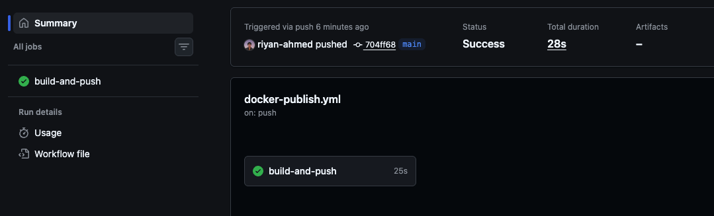
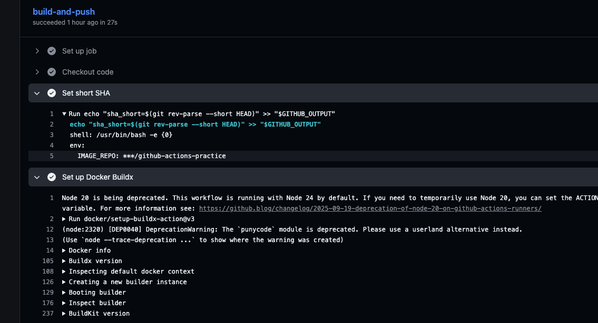
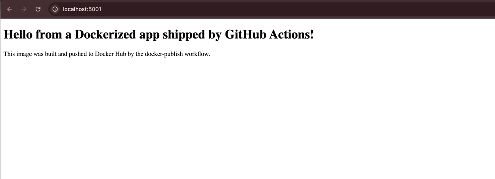

# Day 45 – Docker Build & Push with GitHub Actions

Today I connected GitHub Actions with Docker Hub and built a complete workflow that automatically builds, tags, and publishes a Docker image.

The goal was to understand what happens between:

```text
git push
   ↓
GitHub Actions
   ↓
Docker Build
   ↓
Docker Hub
   ↓
docker pull
   ↓
docker run
```

---

## Task 1 – Build the Docker Image Locally

Before automating the process, I first confirmed that the existing Dockerfile could build successfully on my local machine.

```bash
docker build -t day45-test .
```

The build completed successfully:

```text
[+] Building 4.2s (12/12) FINISHED
```

The image was created as:

```text
day45-test:latest
```

This confirmed that the Dockerfile worked before moving the build process into GitHub Actions.

---

## Task 2 – Docker Build Workflow

I created:

```text
.github/workflows/docker-publish.yml
```

The workflow is triggered whenever code is pushed to a branch:

```yaml
"on":
  push:
    branches:
      - "**"
```

This allows both the `main` branch and feature branches to run the Docker build.

---

## Setting the Docker Image Repository

I defined the Docker Hub repository as an environment variable:

```yaml
env:
  IMAGE_REPO: >-
    ${{ secrets.DOCKER_USERNAME }}/github-actions-practice
```

This avoids repeating the full Docker repository name throughout the workflow.

---

## Checking Out the Repository

The first workflow step downloads the repository code onto the GitHub-hosted runner:

```yaml
- name: Checkout code
  uses: actions/checkout@v4
```

Without checking out the repository, Docker would not have access to the Dockerfile and application files.

---

## Creating a Short Commit SHA

I created a short version of the Git commit SHA:

```yaml
- name: Set short SHA
  id: vars
  run: echo "sha_short=$(git rev-parse --short HEAD)" >> "$GITHUB_OUTPUT"
```

This value can later be used as a Docker image tag.

For example:

```text
sha-a1b2c3d
```

Using the commit SHA makes it easier to identify exactly which version of the code produced a Docker image.

---

## Setting Up Docker Buildx

The workflow uses Docker Buildx:

```yaml
- name: Set up Docker Buildx
  uses: docker/setup-buildx-action@v3
```

Buildx provides Docker's advanced image-building capabilities and integrates with GitHub Actions.

---

## Task 3 – Docker Hub Authentication

Docker Hub credentials are stored securely using GitHub Repository Secrets.

The workflow uses:

```text
DOCKER_USERNAME
DOCKER_TOKEN
```

Instead of storing credentials directly inside the workflow YAML.

The login step is:

```yaml
- name: Log in to Docker Hub
  if: github.ref == 'refs/heads/main'
  uses: docker/login-action@v3

  with:
    username: ${{ secrets.DOCKER_USERNAME }}
    password: ${{ secrets.DOCKER_TOKEN }}
```

The login happens only when the workflow is running on the `main` branch.

This means feature branches can build images without requiring Docker Hub authentication.

---

## Debugging Missing Secrets

During the workflow run, Docker login initially failed with:

```text
Error: Username and password required
```

I added a safe validation step:

```yaml
- name: Verify Docker Hub secrets
  env:
    DOCKER_USERNAME: ${{ secrets.DOCKER_USERNAME }}
    DOCKER_TOKEN: ${{ secrets.DOCKER_TOKEN }}
  run: |
    if [ -z "$DOCKER_USERNAME" ]; then
      echo "DOCKER_USERNAME is missing"
      exit 1
    fi

    if [ -z "$DOCKER_TOKEN" ]; then
      echo "DOCKER_TOKEN is missing"
      exit 1
    fi

    echo "Both Docker Hub secrets are available"
```

The workflow showed:

```text
DOCKER_USERNAME is missing
```

This helped identify that the repository secret had not been configured correctly.

After adding the secrets to:

```text
Repository
→ Settings
→ Secrets and variables
→ Actions
→ Repository secrets
```

the workflow completed successfully.

This was a useful reminder that GitHub repository secrets are specific to the repository in which they are configured.

---

## Building and Publishing the Image

The Docker image is built using:

```yaml
- name: Build image (push only on main)
  uses: docker/build-push-action@v5

  with:
    context: .
    push: ${{ github.ref == 'refs/heads/main' }}
    tags: |
      ${{ env.IMAGE_REPO }}:latest
      ${{ env.IMAGE_REPO }}:sha-${{ steps.vars.outputs.sha_short }}
```

Two image tags are created.

### Latest Tag

```text
riyan0/github-actions-practice:latest
```

### Commit SHA Tag

```text
riyan0/github-actions-practice:sha-<short-sha>
```

The SHA tag allows a particular image to be traced back to the Git commit that created it.

---

## Task 4 – Main Branch vs Feature Branch

One important part of the workflow is:

```yaml
push: ${{ github.ref == 'refs/heads/main' }}
```

This means the Docker image is published only when the workflow runs on `main`.

The workflow still runs on feature branches because the trigger is:

```yaml
branches:
  - "**"
```

The behaviour becomes:

```text
Feature Branch Push
        ↓
GitHub Actions
        ↓
Build Docker Image
        ↓
Do NOT Push

Main Branch Push
        ↓
GitHub Actions
        ↓
Build Docker Image
        ↓
Login to Docker Hub
        ↓
Push Docker Image
```

I tested this using:

```text
day45-feature-test
```

The Docker build completed successfully, but Docker showed:

```text
WARNING: No output specified with docker-container driver.
Build result will only remain in the build cache.
To push result image into registry use --push
```

This confirmed that the image was built but not pushed from the feature branch.

---

## Cleaning Up Old Workflow Triggers

During testing, one `git push` was triggering several older workflows.

For example:

```text
Conditionals
Docker Publish
Smart Pipeline
Hello
```

This happened because several previous learning workflows still contained:

```yaml
"on":
  push:
```

I changed completed practice workflows such as `Hello`, `Smart Pipeline`, and `Conditionals` to:

```yaml
"on":
  workflow_dispatch:
```

Now they run manually instead of being triggered by every push.

This keeps the GitHub Actions page cleaner and avoids unnecessary workflow runs.

---

## Task 5 – Workflow Status Badge

I added the Docker workflow status badge to the practice repository README:

```markdown

```

This provides a quick visual indication of whether the latest Docker workflow run succeeded.

---

## Task 6 – Pull the Image from Docker Hub

After the image was published, I tested whether it could be downloaded and executed locally.

Initially I ran:

```bash
docker pull riyan0/github-actions-practice:latest
```

My Mac returned:

```text
no matching manifest for linux/arm64/v8
```

The GitHub-hosted runner had produced a Linux AMD64 image, while my Mac was using ARM64.

I therefore pulled the AMD64 image explicitly:

```bash
docker pull --platform linux/amd64 \
  riyan0/github-actions-practice:latest
```

This allowed Docker Desktop to run the AMD64 image using emulation.

---

## Running the Published Container

I initially attempted:

```bash
docker run -d \
  --platform linux/amd64 \
  --name day45-app \
  -p 5000:5000 \
  riyan0/github-actions-practice:latest
```

However, port `5000` was already being used on my machine.

Docker returned:

```text
bind: address already in use
```

I changed the host port to `5001`:

```bash
docker run -d \
  --platform linux/amd64 \
  --name day45-app \
  -p 5001:5000 \
  riyan0/github-actions-practice:latest
```

The mapping means:

```text
Mac port       Container port
5001     →     5000
```

---

## Testing the Running Application

Finally, I tested the health endpoint:

```bash
curl http://localhost:5001/health
```

The application returned:

```text
Server is up and running
```

This confirmed that the image:

1. Was built by GitHub Actions
2. Was pushed to Docker Hub
3. Could be pulled onto another machine
4. Could be started as a container
5. Successfully served the application

---

## Full CI/CD Flow

The complete process I practised today was:

```text
Developer changes code
        ↓
git push
        ↓
GitHub receives push
        ↓
GitHub Actions workflow starts
        ↓
Checkout repository
        ↓
Generate short commit SHA
        ↓
Set up Docker Buildx
        ↓
Build Docker image
        ↓
Is branch main?
     ↙       ↘
   No         Yes
   ↓           ↓
Build only   Login to Docker Hub
              ↓
           Tag image
              ↓
           Push image
              ↓
           Docker Hub
              ↓
           docker pull
              ↓
           docker run
              ↓
        Running application
```

---

## What I Learned

Before this exercise, I understood Docker builds and GitHub Actions separately.

Today I connected both concepts together.

When code is pushed to GitHub, GitHub Actions can automatically:

- Check out the code
- Build a Docker image
- Generate image tags
- Read credentials securely from GitHub Secrets
- Authenticate with Docker Hub
- Push images automatically
- Prevent feature branches from publishing images
- Make images available for deployment on other machines

I also learned why commit-based Docker tags are useful.

Instead of relying only on:

```text
latest
```

an image can be identified using something such as:

```text
sha-a1b2c3d
```

This gives traceability between:

```text
Git Commit
    ↕
Docker Image
```

---

## Troubleshooting Lessons

I encountered several real issues during this exercise.

### Missing Docker Hub Credentials

```text
Error: Username and password required
```

Cause:

```text
DOCKER_USERNAME was not available to the workflow.
```

Solution:

Configure the required repository secrets correctly.

### Architecture Mismatch

```text
no matching manifest for linux/arm64/v8
```

Cause:

```text
GitHub runner image → linux/amd64
My Mac             → linux/arm64
```

Solution:

```bash
docker pull --platform linux/amd64 ...
```

A future improvement would be to publish multi-platform images for both:

```text
linux/amd64
linux/arm64
```

### Port Already in Use

```text
bind: address already in use
```

Solution:

Use another host port:

```text
5001:5000
```

---

## Key Takeaway

My biggest takeaway from Day 45 is understanding the complete journey of an application after a code push.

```text
Code
 ↓
Git
 ↓
GitHub
 ↓
GitHub Actions
 ↓
Docker Build
 ↓
Docker Image
 ↓
Docker Hub
 ↓
Pull
 ↓
Container
 ↓
Application
```

## Successful Docker Publish



## Docker Hub Image Tags



## Running Container



GitHub Actions is therefore not just running tests after a push. It can automate the process of turning source code into a versioned Docker image that is ready to be deployed.
