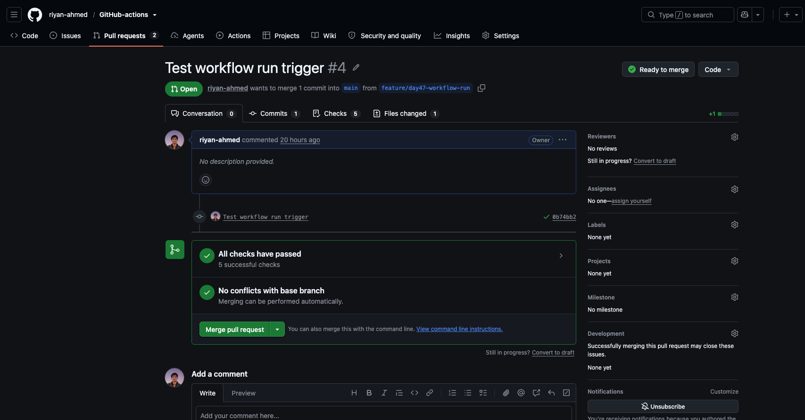

# Day 47 – Advanced Triggers: PR Events, Cron Schedules & Event-Driven Pipelines

Today I explored advanced GitHub Actions triggers beyond basic `push` and `pull_request`.

The main goal was to understand how workflows can react to:

- Different stages of a pull request
- Scheduled cron events
- Specific branches and file paths
- Completion of another workflow
- Events triggered by external systems

This made GitHub Actions feel much more event-driven.

---

# Task 1 – Pull Request Lifecycle Events

I created:

```text
.github/workflows/pr-lifecycle.yml
```

The workflow listens for different pull request activity types:

```yaml
---
name: PR Lifecycle

"on":
  pull_request:
    types:
      - opened
      - synchronize
      - reopened
      - closed

jobs:
  pr-info:
    runs-on: ubuntu-latest

    steps:
      - name: Print PR information
        run: |
          echo "Event: ${{ github.event.action }}"
          echo "Title: ${{ github.event.pull_request.title }}"
          echo "Author: ${{ github.event.pull_request.user.login }}"
          echo "Source: ${{ github.head_ref }}"
          echo "Target: ${{ github.base_ref }}"

      - name: PR was merged
        if: >
          github.event.action == 'closed' &&
          github.event.pull_request.merged == true
        run: echo "The pull request was merged"
```
## PR Validation – Successful Run

The validation workflow successfully passed all checks on a correctly named
feature branch.




## Testing the PR Lifecycle

I created a test branch and opened a pull request.

### PR Opened

The first workflow run showed:

```text
Event: opened
Title: Test Day 47 PR lifecycle
Author: riyan-ahmed
Source: day47-pr-test
Target: main
```

This showed that the `opened` event fires when a new pull request is created.

---

### PR Synchronize

I pushed another commit to the same branch while the PR was still open.

The next workflow run showed:

```text
Event: synchronize
Title: Test Day 47 PR lifecycle
Author: riyan-ahmed
Source: day47-pr-test
Target: main
```

The `synchronize` event therefore means that new commits were pushed to the branch associated with an existing pull request.

The flow was:

```text
Open Pull Request
      ↓
opened

Push another commit
      ↓
synchronize
```

---

### PR Closed Without Merge

I closed the pull request without merging it.

The workflow showed:

```text
Event: closed
```

The conditional merge step was skipped because:

```text
closed = true
merged = false
```

---

### PR Reopened

I reopened the same pull request.

The workflow showed:

```text
Event: reopened
```

This confirmed that GitHub Actions can also react when a previously closed PR is reopened.

---

### PR Merged

Finally, I merged the pull request.

GitHub again reported:

```text
Event: closed
```

However, this time:

```text
github.event.pull_request.merged == true
```

so the conditional step ran:

```text
The pull request was merged
```

This helped me understand that merging a PR is technically a `closed` event with an additional `merged = true` property.

The complete lifecycle I tested was:

```text
opened
   ↓
synchronize
   ↓
closed
   ↓
reopened
   ↓
closed + merged=true
```

---

# Task 2 – PR Validation Workflow

Next I created a real PR validation gate:

```text
.github/workflows/pr-checks.yml
```

The goal was to automatically validate a pull request before it is merged.

```yaml
---
name: PR Checks

"on":
  pull_request:
    branches:
      - main

jobs:
  file-size-check:
    runs-on: ubuntu-latest

    steps:
      - name: Checkout code
        uses: actions/checkout@v4
        with:
          fetch-depth: 0

      - name: Check changed file sizes
        env:
          BASE_SHA: ${{ github.event.pull_request.base.sha }}
          HEAD_SHA: ${{ github.event.pull_request.head.sha }}
        run: |
          git diff --name-only "$BASE_SHA" "$HEAD_SHA" |
          while IFS= read -r file; do
            [ -f "$file" ] || continue
            size=$(wc -c < "$file")

            if [ "$size" -gt 1048576 ]; then
              echo "Too large: $file ($size bytes)"
              exit 1
            fi
          done

          echo "All changed files are under 1 MB"

  branch-name-check:
    runs-on: ubuntu-latest

    steps:
      - name: Validate branch name
        env:
          BRANCH_NAME: ${{ github.head_ref }}
        run: |
          if [[ "$BRANCH_NAME" =~ ^(feature|fix|docs)/.+$ ]]; then
            echo "Valid branch name: $BRANCH_NAME"
          else
            echo "Invalid branch name: $BRANCH_NAME"
            echo "Use feature/*, fix/*, or docs/*"
            exit 1
          fi

  pr-body-check:
    runs-on: ubuntu-latest

    steps:
      - name: Check PR description
        env:
          PR_BODY: ${{ github.event.pull_request.body }}
        run: |
          if [ -z "$PR_BODY" ]; then
            echo "::warning::PR description is empty"
          else
            echo "PR description is present"
          fi
```

The three validation gates were:

```text
Pull Request → main
        │
        ├── File size check
        ├── Branch naming check
        └── PR description check
```

---

## Testing an Invalid Branch

I intentionally created:

```text
bad-branch-name
```

The branch-name check failed because it did not match:

```text
feature/*
fix/*
docs/*
```

The workflow correctly showed:

```text
branch-name-check ❌
```

This proved that CI can enforce development standards automatically.

---

## Testing a Valid Branch

I then created:

```text
feature/day47-pr-validation
```

This matched the required naming pattern.

The validation checks passed successfully:

```text
file-size-check    ✅
branch-name-check  ✅
pr-body-check      ✅
```

This demonstrated how GitHub Actions can act as an automated PR gate.

---

## PR Checks Screenshot

Add my screenshot here:

```markdown

```

---

# Task 3 – Scheduled Workflows

I created:

```text
.github/workflows/scheduled-tasks.yml
```

The workflow contains two cron schedules and a manual trigger:

```yaml
---
name: Scheduled Tasks

"on":
  workflow_dispatch:

  schedule:
    - cron: "30 2 * * 1"
    - cron: "0 */6 * * *"

jobs:
  scheduled-check:
    runs-on: ubuntu-latest

    steps:
      - name: Print trigger information
        run: |
          echo "Event: ${{ github.event_name }}"
          echo "Schedule: ${{ github.event.schedule }}"

      - name: Health check
        run: |
          status=$(curl -s -o /dev/null -w "%{http_code}" \
            https://github.com)

          echo "HTTP status: $status"

          if [ "$status" -ge 200 ] && [ "$status" -lt 400 ]; then
            echo "Health check passed"
          else
            echo "Health check failed"
            exit 1
          fi
```

---

## Understanding the Cron Expressions

### Every Monday at 02:30 UTC

```text
30 2 * * 1
```

Cron format:

```text
minute hour day-of-month month day-of-week
```

Therefore:

```text
30 → minute 30
2  → 02:00 hour
*  → any day of month
*  → any month
1  → Monday
```

---

### Every Six Hours

```text
0 */6 * * *
```

This runs at approximately:

```text
00:00
06:00
12:00
18:00
```

UTC.

---

## Required Cron Exercises

### Every Weekday at 9:00 AM IST

IST is:

```text
UTC + 5:30
```

Therefore:

```text
09:00 IST
=
03:30 UTC
```

Cron expression:

```text
30 3 * * 1-5
```

---

### First Day of Every Month at Midnight UTC

```text
0 0 1 * *
```

Meaning:

```text
Minute       = 0
Hour         = 0
Day of month = 1
Month        = any
Day of week  = any
```

---

## Manual Test

I also added:

```yaml
workflow_dispatch:
```

so that I did not need to wait for the scheduled time.

The manual run printed:

```text
Event: workflow_dispatch
Schedule:
```

The schedule was empty because the workflow had been triggered manually rather than by cron.

The health check returned:

```text
HTTP status: 200
Health check passed
```

This confirmed that the workflow itself worked correctly.

Scheduled workflows may sometimes be delayed because GitHub Actions scheduling is not designed as a precise real-time scheduler. Scheduled workflows also run from the repository's default branch.

---

# Task 4 – Path and Branch Filters

Next I explored how to trigger workflows only when relevant files change.

I created:

```text
.github/workflows/smart-triggers.yml
```

```yaml
---
name: Smart Triggers

"on":
  push:
    branches:
      - main
      - "release/*"
    paths:
      - "src/**"
      - "app/**"

jobs:
  changed-code:
    runs-on: ubuntu-latest

    steps:
      - name: Code change detected
        run: |
          echo "A file inside src/ or app/ changed"
          echo "Branch: ${{ github.ref_name }}"
```

For this workflow to run, both conditions must match:

```text
Correct branch
AND
Correct file path
```

For example:

```text
main + src/app.py
→ RUN

main + README.md
→ SKIP

feature/test + src/app.py
→ SKIP

release/v1 + app/main.py
→ RUN
```

---

## Testing `paths`

When I first pushed only:

```text
.github/workflows/smart-triggers.yml
```

the workflow did not run.

GitHub showed:

```text
0 workflow runs
```

This was correct because the changed file did not match:

```text
src/**
app/**
```

I then created:

```text
src/day47-test.txt
```

and pushed it to `main`.

This time:

```text
Branch = main ✅
Path = src/** ✅
```

and the workflow ran successfully.

---

# Using `paths-ignore`

I created a second workflow:

```text
.github/workflows/docs-ignore.yml
```

```yaml
---
name: Ignore Docs Changes

"on":
  push:
    branches:
      - main
      - "release/*"
    paths-ignore:
      - "*.md"
      - "docs/**"

jobs:
  non-doc-change:
    runs-on: ubuntu-latest

    steps:
      - name: Non-documentation change detected
        run: |
          echo "A non-documentation file changed"
          echo "Branch: ${{ github.ref_name }}"
```

I then made a README-only commit.

The workflow produced:

```text
No new run
```

because:

```text
README.md
   ↓
matches *.md
   ↓
workflow skipped
```

---

## `paths` vs `paths-ignore`

My understanding is:

```text
paths:
Run ONLY when selected paths change.
```

For example:

```yaml
paths:
  - "src/**"
```

is useful when a workflow should run only if application code changes.

Whereas:

```text
paths-ignore:
Run normally, EXCEPT when only ignored paths change.
```

For example:

```yaml
paths-ignore:
  - "*.md"
  - "docs/**"
```

is useful when documentation changes do not need an expensive build or deployment pipeline.

---

# Cleaning Up Old Workflow Triggers

During this exercise I noticed that one `git push` was starting several older workflows.

For example:

```text
Hello
Conditionals
Smart Pipeline
Call Reusable Build
Docker Publish
```

The reason was that old learning workflows still had:

```yaml
"on":
  push:
```

even though those exercises were already complete.

I changed completed workflows to:

```yaml
"on":
  workflow_dispatch:
```

This made them manual-only.

This reduced unnecessary workflow executions and made the Actions page much easier to understand.

This also taught me that workflow triggers should be designed carefully because every unnecessary trigger consumes runner time.

---

# Task 5 – Chaining Workflows with `workflow_run`

The next exercise was to make one workflow start only after another workflow finishes.

I created:

```text
.github/workflows/tests.yml
```

```yaml
---
name: Run Tests

"on":
  push:

jobs:
  test:
    runs-on: ubuntu-latest

    steps:
      - name: Run tests
        run: |
          echo "Running tests..."
          echo "Tests passed"
```

Then I created:

```text
.github/workflows/deploy-after-tests.yml
```

```yaml
---
name: Deploy After Tests

"on":
  workflow_run:
    workflows:
      - Run Tests
    types:
      - completed

jobs:
  deploy:
    if: github.event.workflow_run.conclusion == 'success'
    runs-on: ubuntu-latest

    steps:
      - name: Deploy
        run: |
          echo "Tests completed successfully"
          echo "Starting deployment"

  tests-failed:
    if: github.event.workflow_run.conclusion != 'success'
    runs-on: ubuntu-latest

    steps:
      - name: Stop deployment
        run: |
          echo "::warning::Tests did not pass"
          echo "Deployment stopped"
          exit 1
```

The workflow chain becomes:

```text
git push
   ↓
Run Tests
   ↓
workflow completes
   ↓
workflow_run
   ↓
Check conclusion
   ↓
success?
 ┌───────┴───────┐
Yes              No
 ↓                ↓
Deploy       Stop Deployment
```

---

## Successful Test

My `Run Tests` workflow completed successfully.

This caused:

```text
Deploy After Tests
```

to start automatically.

The `deploy` job was green, while:

```text
tests-failed
```

was skipped.

This was expected because:

```text
github.event.workflow_run.conclusion == success
```

Therefore:

```text
Run Tests ✅
     ↓
Deploy After Tests ✅
     ↓
tests-failed skipped
```

---

# `workflow_run` vs `workflow_call`

These two features sound similar but solve different problems.

## `workflow_call`

I used `workflow_call` on Day 46.

It means:

```text
Workflow A explicitly calls Workflow B
```

For example:

```text
Caller Workflow
      ↓
uses:
      ↓
Reusable Workflow
```

I think of this like calling a function in programming.

The caller already knows which reusable workflow it wants to execute.

---

## `workflow_run`

`workflow_run` is different.

It means:

```text
Wait for another workflow to finish
           ↓
React to its result
```

For example:

```text
Run Tests
    ↓
finishes
    ↓
workflow_run event
    ↓
Deploy After Tests
```

My mental model is:

```text
workflow_call
= actively CALL another reusable workflow

workflow_run
= REACT when another workflow finishes
```

This makes `workflow_run` useful for event-driven pipelines such as:

```text
Tests
  ↓
Security Scan
  ↓
Deploy
  ↓
Post-Deployment Check
```

---

# Task 6 – External Events with `repository_dispatch`

Finally, I explored how systems outside GitHub can trigger GitHub Actions.

I created:

```text
.github/workflows/external-trigger.yml
```

```yaml
---
name: External Trigger

"on":
  repository_dispatch:
    types:
      - deploy-request

jobs:
  external-deploy:
    runs-on: ubuntu-latest

    steps:
      - name: Print external request
        run: |
          echo "Event type: ${{ github.event.action }}"
          echo "Environment: ${{ github.event.client_payload.environment }}"
```

The workflow listens for:

```text
deploy-request
```

The external system can also send additional information using:

```text
client_payload
```

---

## Triggering the Workflow Through the GitHub API

The payload used was:

```json
{
  "event_type": "deploy-request",
  "client_payload": {
    "environment": "production"
  }
}
```

The request followed this structure:

```bash
curl -X POST \
  -H "Accept: application/vnd.github+json" \
  -H "Authorization: Bearer $GITHUB_TOKEN" \
  https://api.github.com/repos/riyan-ahmed/GitHub-actions/dispatches \
  -d '{
    "event_type":"deploy-request",
    "client_payload":{
      "environment":"production"
    }
  }'
```

I stored the GitHub token in an environment variable rather than writing it directly into the command history:

```text
$GITHUB_TOKEN
```

---

## Troubleshooting Authentication

My first request returned:

```text
HTTP/2 401
Bad credentials
```

Instead of immediately changing the workflow, I tested authentication separately.

I checked that the environment variable existed:

```bash
echo ${#GITHUB_TOKEN}
```

The token length was:

```text
93
```

I then tested authentication against the GitHub user API.

The response was:

```text
200
```

This proved that the token itself was valid.

I retried the repository dispatch request carefully.

This time GitHub returned:

```text
204
```

`204 No Content` meant that GitHub successfully accepted the dispatch event.

This was a useful lesson in debugging APIs:

```text
401
↓
Check authentication

200 on /user
↓
Token is valid

Retry correct API request
↓
204
↓
Event accepted
```

---

# How `repository_dispatch` Works

The full flow is:

```text
External System
      ↓
GitHub REST API
      ↓
repository_dispatch
      ↓
event_type = deploy-request
      ↓
GitHub Actions
      ↓
Read client_payload
      ↓
Environment = production
```

This means a workflow does not always need to start because somebody pushed code.

It can be triggered by another system.

---

## When Would an External System Trigger a Pipeline?

Some real examples could include:

```text
Monitoring Tool
      ↓
Detects problem
      ↓
Trigger remediation workflow
```

```text
Slack Bot
      ↓
User requests deployment
      ↓
repository_dispatch
      ↓
Deployment workflow
```

```text
External Application
      ↓
New release available
      ↓
Trigger integration pipeline
```

```text
Internal Deployment Portal
      ↓
User selects production
      ↓
GitHub API
      ↓
Deployment workflow
```

This showed me that GitHub Actions can participate in a larger event-driven automation system.

---

# Day 47 Workflow Overview

The workflows I worked with today included:

```text
.github/workflows/
│
├── pr-lifecycle.yml
├── pr-checks.yml
├── scheduled-tasks.yml
├── smart-triggers.yml
├── docs-ignore.yml
├── tests.yml
├── deploy-after-tests.yml
└── external-trigger.yml
```

I also experimented with chaining:

```text
PR Checks
    ↓
After PR Checks
```

before implementing the challenge's final:

```text
Run Tests
    ↓
Deploy After Tests
```

---

# Full Mental Model

Before Day 47, most of my workflows were based mainly on:

```text
git push
   ↓
workflow
```

Today I learned that GitHub Actions can respond to many different events:

```text
Pull Request Events
        ↓
opened
synchronize
reopened
closed
merged
```

```text
Time
 ↓
Cron Schedule
 ↓
Scheduled Workflow
```

```text
Code Change
     ↓
Branch + Path Filters
     ↓
Relevant Workflow Only
```

```text
Workflow A
    ↓
completed
    ↓
workflow_run
    ↓
Workflow B
```

```text
External System
      ↓
GitHub API
      ↓
repository_dispatch
      ↓
Workflow
```

---

# Key Takeaways

Today I practised:

- `pull_request` activity types
- `github.event.action`
- PR metadata
- Conditional PR merge detection
- Automated PR validation gates
- Branch naming rules
- File-size checks
- PR body validation
- Cron schedules
- `workflow_dispatch`
- Health checks
- Branch filters
- `paths`
- `paths-ignore`
- `workflow_run`
- Workflow conclusions
- Chaining test and deployment workflows
- `repository_dispatch`
- GitHub REST API triggers
- `client_payload`
- API authentication troubleshooting

The biggest lesson for me was that GitHub Actions is fundamentally **event-driven**.

A pipeline does not always need to start because code was pushed.

It can start because:

```text
A PR was opened
A PR was updated
A PR was merged
A certain file changed
A scheduled time arrived
Another workflow finished
An external application sent an event
```

This gives much more control over when CI/CD automation should run.

My Day 47 mental model is:

```text
Event
  ↓
Filters
  ↓
Conditions
  ↓
Workflow
  ↓
Result
  ↓
Possible next event/workflow
```

This is much closer to how real CI/CD platforms operate in production environments.
