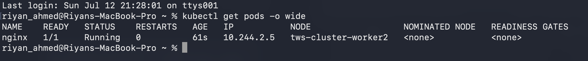
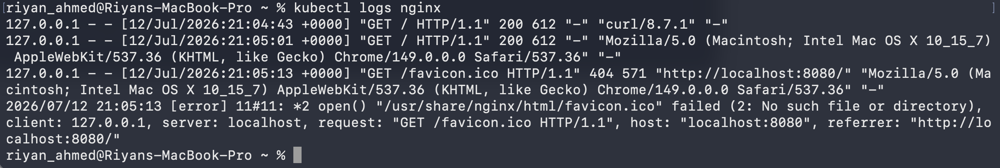
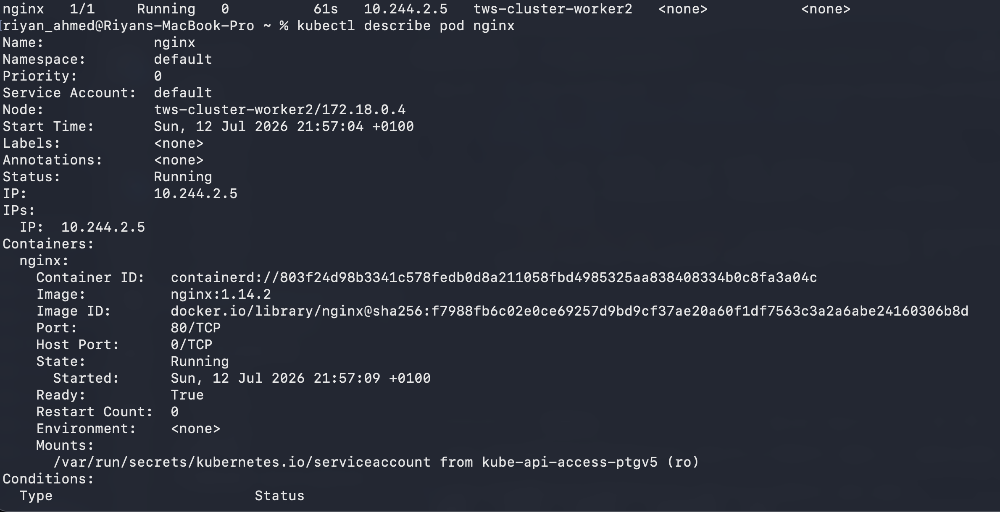
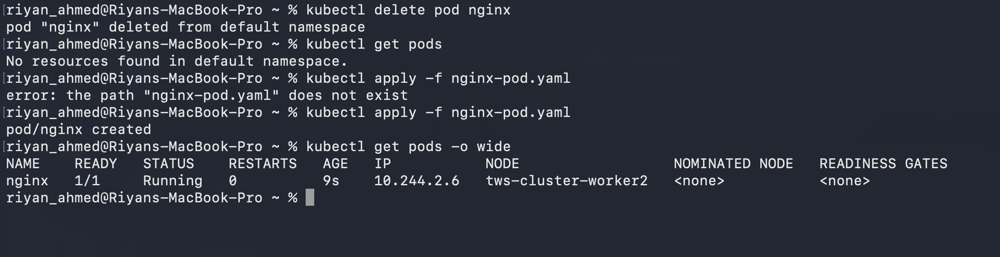

# Day 51 – Kubernetes Pods

## Task 1: Create My First Pod

Today I created my first Kubernetes Pod using a YAML manifest.

### Pod Manifest

```yaml
apiVersion: v1
kind: Pod
metadata:
  name: nginx-pod
  labels:
    app: nginx
spec:
  containers:
    - name: nginx
      image: nginx:latest
      ports:
        - containerPort: 80
```

### Create the Pod

```bash
kubectl apply -f nginx-pod.yaml
```

### Verify the Pod

```bash
kubectl get pods -o wide
```

### Observations

- The Pod was successfully created.
- The Pod reached the **Running** state.
- Kubernetes automatically scheduled the Pod onto one of the worker nodes.
- The Pod received its own IP address inside the cluster.

### Screenshot



---

## Task 2: Inspect the Pod

I inspected the Pod using:

```bash
kubectl describe pod nginx-pod
```

### Information Observed

- Pod Name
- Namespace
- Worker Node
- Pod IP
- Container Image
- Container State
- Restart Count
- Events

### Key Learning

`kubectl describe pod` provides detailed information about a Pod and is one of the first commands used while troubleshooting Kubernetes workloads.

### Screenshot


---

## Task 3: View Application Logs

I viewed the container logs using:

```bash
kubectl logs nginx-pod
```

Initially, there were no logs because no requests had reached the application.

After accessing the application through port forwarding, the logs displayed successful HTTP requests.

### Observations

- `GET / HTTP/1.1 200` indicated that the application responded successfully.
- `GET /favicon.ico HTTP/1.1 404` occurred because the browser automatically requested a favicon that was not present in the default Nginx image.

### Key Learning

`kubectl logs` is used to view the output generated by containers and is one of the most important commands for debugging applications running in Kubernetes.

### Screenshot



---

## Task 4: Delete and Recreate the Pod

To understand the lifecycle of a Pod, I deleted the running Pod and recreated it using the same YAML manifest.

### Delete the Pod

```bash
kubectl delete pod nginx-pod
```

### Recreate the Pod

```bash
kubectl apply -f nginx-pod.yaml
```

### Verify

```bash
kubectl get pods -o wide
```

### Observations

- Kubernetes successfully recreated the Pod.
- The recreated Pod entered the **Running** state.
- The new Pod received a different IP address, confirming that a new Pod was created.

### Key Learning

Pods are ephemeral resources. If a standalone Pod is deleted, Kubernetes does not automatically recreate it. However, the same Pod can be recreated quickly using its YAML manifest.

### Screenshot


---

## Summary

Today I learned how to:

- Create a Pod using a Kubernetes manifest.
- Inspect Pod details using `kubectl describe`.
- View application logs using `kubectl logs`.
- Understand the temporary nature of Pods by deleting and recreating one.
- Verify Pod scheduling, IP allocation, and running status. 





