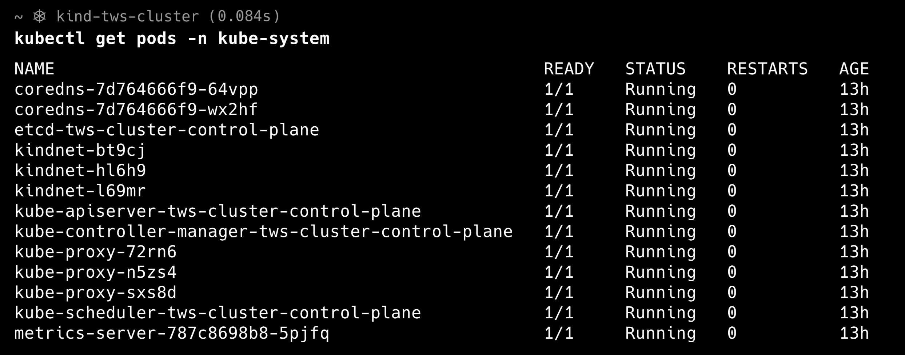
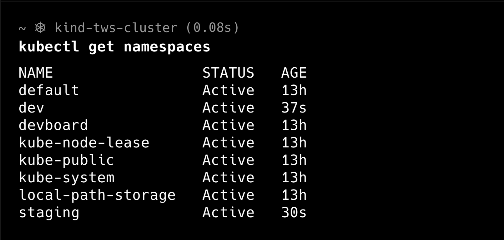
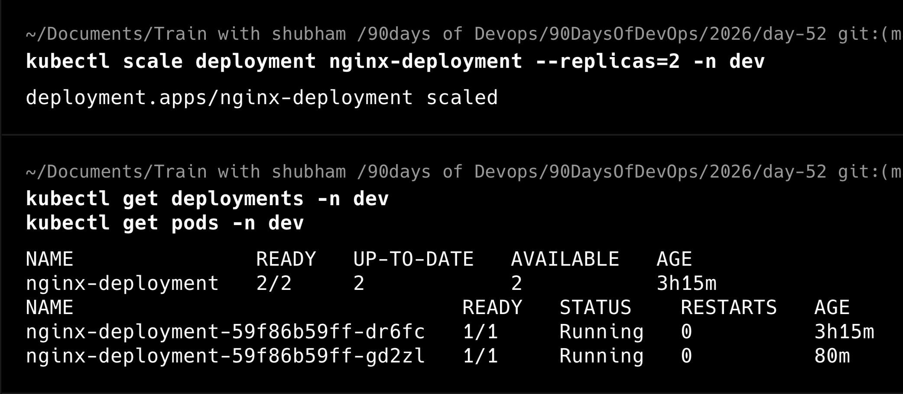

# Day 52 – Kubernetes Namespaces and Deployments

## Task 1: Explore Kubernetes Namespaces

Namespaces are used to logically separate and organise resources inside a Kubernetes cluster.

I checked the Kubernetes system Pods using:

```bash
kubectl get pods -n kube-system
```

### Observation

There were **13 Pods** running in the `kube-system` namespace.

The Pods included:

- CoreDNS
- etcd
- kube-apiserver
- kube-controller-manager
- kube-scheduler
- kube-proxy
- kindnet
- metrics-server

All Pods were in the `Running` state with zero restarts, confirming that the Kubernetes system components were healthy.

### Screenshot




---

## Task 2: Create Custom Namespaces

Namespaces help organise and isolate Kubernetes resources within the same cluster. They are commonly used to separate different environments such as development, staging, and production.

### Create Namespaces

I created two custom namespaces:

```bash
kubectl create namespace dev
kubectl create namespace staging
```

### Verify Namespaces

```bash
kubectl get namespaces
```

### Observation

The cluster now contains the following namespaces:

- default
- dev
- staging
- kube-system
- kube-public
- kube-node-lease
- local-path-storage
- devboard

The newly created `dev` and `staging` namespaces were successfully created and were in the **Active** state.

### Screenshot



## Key Learning

Namespaces provide logical isolation for Kubernetes resources. They allow multiple environments or teams to share the same cluster while keeping their resources separate and organised.


---

## Task 3: Deploy an Application in the `dev` Namespace

To understand how Deployments work, I created an Nginx Deployment inside the `dev` namespace.

### Deployment Manifest

```yaml
apiVersion: apps/v1
kind: Deployment
metadata:
  name: nginx-deployment
  namespace: dev
spec:
  replicas: 2
  selector:
    matchLabels:
      app: nginx
  template:
    metadata:
      labels:
        app: nginx
    spec:
      containers:
      - name: nginx
        image: nginx:latest
        ports:
        - containerPort: 80
```

### Deploy the Application

```bash
kubectl apply -f nginx-deployment.yaml
```

### Verify the Deployment

```bash
kubectl get deployments -n dev
```

### Verify the Pods

```bash
kubectl get pods -n dev
```

### Observations

- One Deployment named `nginx-deployment` was created.
- The Deployment successfully created **2 replicas**.
- Both Pods entered the **Running** state.
- Kubernetes automatically generated unique Pod names for each replica.

### Screenshot


## Key Learning

A Deployment manages Pods automatically.

Unlike standalone Pods, Deployments ensure that the desired number of replicas are always running. If one Pod fails or is deleted, the Deployment automatically creates a replacement Pod to maintain the desired state.

---

## Task 4: Scale the Deployment

One of the key advantages of a Deployment is that it can easily scale an application by increasing or decreasing the number of Pod replicas.

### Scale the Deployment

```bash
kubectl scale deployment nginx-deployment --replicas=5 -n dev
```

### Verify the Deployment

```bash
kubectl get deployments -n dev
```

### Verify the Pods

```bash
kubectl get pods -n dev
```

### Observations

- The Deployment was successfully scaled from **2 replicas** to **5 replicas**.
- Kubernetes automatically created three additional Pods.
- All five Pods entered the **Running** state without any manual intervention.

### Screenshot


## Key Learning

Deployments make application scaling simple. By changing the replica count, Kubernetes automatically creates or removes Pods to match the desired state without affecting the Deployment itself.

---

## Task 5: Scale Down the Deployment

After increasing the number of replicas, I scaled the Deployment back down to two replicas.

### Scale Down

```bash
kubectl scale deployment nginx-deployment --replicas=2 -n dev
```

### Verify

```bash
kubectl get deployments -n dev
kubectl get pods -n dev
```

### Observations

- The Deployment successfully scaled down from **5 replicas** to **2 replicas**.
- Kubernetes automatically terminated the extra Pods.
- The remaining two Pods continued running without interruption.

### Screenshot



## Key Learning

Deployments make scaling applications simple. Kubernetes automatically creates or removes Pods to match the desired number of replicas while keeping the application available.