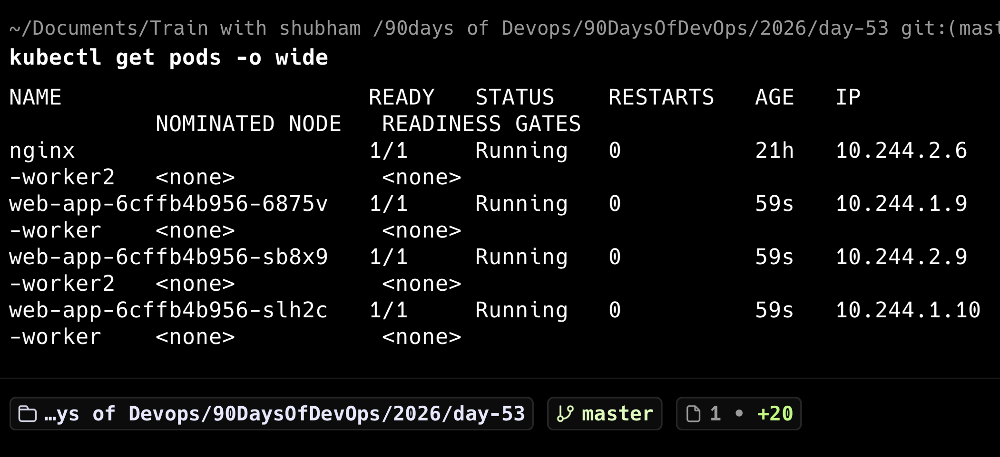
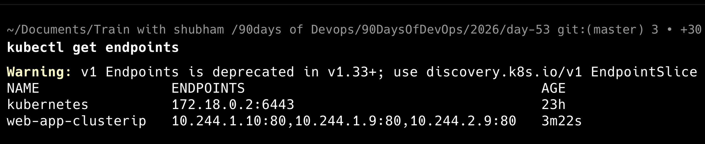
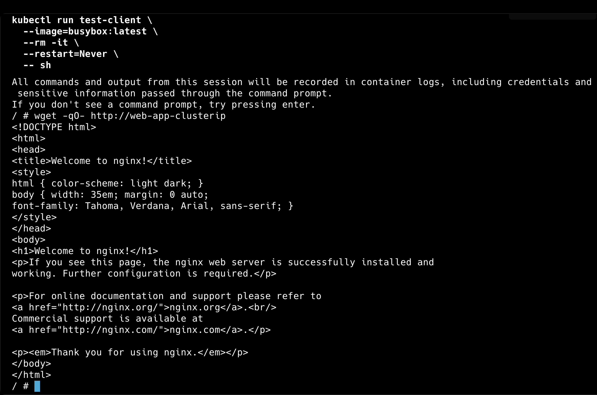

# Day 53 – Kubernetes Services

## Task 1: Deploy an Application

To understand why Kubernetes Services are required, I first deployed an application using a Deployment with three replicas.

### Deployment Manifest

```yaml
apiVersion: apps/v1
kind: Deployment
metadata:
  name: web-app
spec:
  replicas: 3
  selector:
    matchLabels:
      app: web-app
  template:
    metadata:
      labels:
        app: web-app
    spec:
      containers:
      - name: nginx
        image: nginx:1.25
        ports:
        - containerPort: 80
```

### Deploy the Application

```bash
kubectl apply -f app-deployment.yaml
```

### Verify

```bash
kubectl get pods -o wide
```

### Observations

- Kubernetes created three Pods from a single Deployment.
- Each Pod received its own unique IP address.
- The Pods were scheduled automatically across the available worker nodes.

### Screenshot



## Key Learning

Each Pod has its own IP address, but Pod IPs are temporary. If a Pod is deleted or recreated, its IP address changes. This is one of the reasons Kubernetes Services are required.

---

## Task 2: Create a ClusterIP Service

A ClusterIP Service provides a stable internal IP address and DNS name for a group of Pods.

I created a ClusterIP Service to route traffic to the three Pods managed by the `web-app` Deployment.

### Service Manifest

```yaml
apiVersion: v1
kind: Service
metadata:
  name: web-app-clusterip
spec:
  type: ClusterIP
  selector:
    app: web-app
  ports:
    - port: 80
      targetPort: 80
```

### Apply the Service

```bash
kubectl apply -f clusterip-service.yaml
```

### Verify the Service

```bash
kubectl get services
```

### Test the Service from Inside the Cluster

```bash
kubectl run test-client \
  --image=busybox:latest \
  --rm -it \
  --restart=Never \
  -- sh
```

Inside the temporary Pod:

```sh
wget -qO- http://web-app-clusterip
```

The Nginx welcome-page HTML was returned successfully.

### Key Learning

The ClusterIP Service provides:

- A stable internal IP address
- A stable DNS name
- Load balancing across all matching Pods
- Internal access from applications running inside the cluster

The Service uses the selector `app: web-app` to find the Pods it should send traffic to.

---

## Task 3: Verify Service Endpoints

To verify that the ClusterIP Service was correctly connected to the application Pods, I inspected the Service endpoints.

### View Endpoints

```bash
kubectl get endpoints
```

### Observations

The `web-app-clusterip` Service automatically discovered all three Pods created by the Deployment.

Each endpoint represents a Pod IP address and port:

- 10.244.1.10:80
- 10.244.1.9:80
- 10.244.2.9:80

This confirms that the Service is correctly forwarding requests to all healthy Pods matching the label selector.

### Screenshot



## Key Learning

A Kubernetes Service does not communicate with Pods directly by name. Instead, it maintains a list of Pod endpoints that match its selector labels. As Pods are created or deleted, Kubernetes automatically updates the endpoint list, ensuring the Service always routes traffic to healthy Pods.

---

## Task 4: Test the ClusterIP Service

To verify that the ClusterIP Service was functioning correctly, I created a temporary BusyBox Pod inside the Kubernetes cluster.

### Create a Test Pod

```bash
kubectl run test-client \
  --image=busybox:latest \
  --rm -it \
  --restart=Never \
  -- sh
```

Inside the BusyBox Pod, I tested the Service using its DNS name:

```bash
wget -qO- http://web-app-clusterip
```

### Observations

- The request successfully returned the Nginx welcome page.
- The Service resolved its DNS name correctly.
- The request was forwarded to one of the Pods managed by the Deployment.
- This confirmed that the ClusterIP Service was working correctly.

### Screenshot



## Key Learning

A ClusterIP Service provides a stable DNS name and IP address for a group of Pods. Applications inside the Kubernetes cluster communicate with the Service instead of individual Pod IP addresses, ensuring reliable communication even if Pods are recreated.