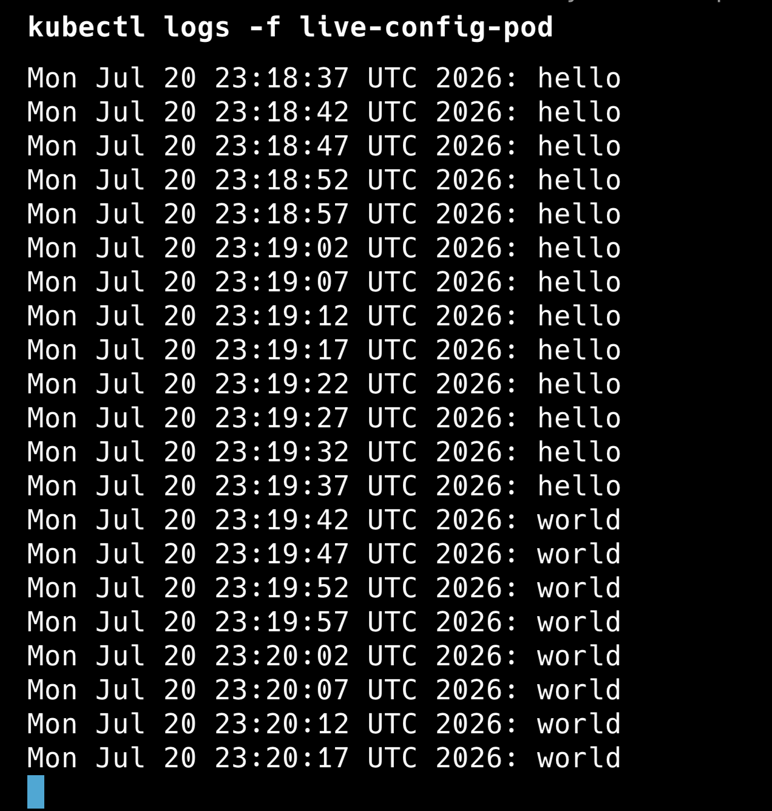

---

## Task 6: Update a ConfigMap and Observe Propagation

I created a ConfigMap containing the value:

```text
message=hello
```

The ConfigMap was mounted into a Pod as a volume. The Pod read the mounted file every five seconds.

### View the Pod Logs

```bash
kubectl logs -f live-config-pod
```

Initially, the logs displayed:

```text
hello
```

I then updated the ConfigMap using:

```bash
kubectl patch configmap live-config \
  --type merge \
  -p '{"data":{"message":"world"}}'
```

After a short delay, the mounted value automatically changed from:

```text
hello
```

to:

```text
world
```

The Pod did not need to be restarted.

### Screenshot



### Key Learning

ConfigMaps mounted as volumes can update automatically inside a running Pod.

ConfigMap values injected as environment variables do not update automatically because environment variables are set when the Pod starts. The Pod must be recreated to receive updated environment-variable values.