# Day 55 – Persistent Volumes and Persistent Volume Claims

## Task 1: Demonstrate Data Loss with emptyDir

I created a Pod that mounted an `emptyDir` volume at `/data` and wrote a timestamped message to:

```text
/data/message.txt
```

### Create the Pod

```bash
kubectl apply -f ephemeral-pod.yaml
```

### Verify the Data

```bash
kubectl exec ephemeral-demo-pod -- cat /data/message.txt
```

The first Pod displayed:

```text
Created at: Wed Jul 22 23:12:40 UTC 2026
```

I then deleted and recreated the Pod:

```bash
kubectl delete pod ephemeral-demo-pod
kubectl apply -f ephemeral-pod.yaml
```

After recreating it, I checked the file again:

```bash
kubectl exec ephemeral-demo-pod -- cat /data/message.txt
```

The recreated Pod displayed:

```text
Created at: Wed Jul 22 23:15:06 UTC 2026
```

### Observation

The timestamps were different. This confirmed that the original data was lost when the Pod was deleted.

An `emptyDir` volume exists for the lifetime of a Pod. It can survive a container restart inside the same Pod, but it does not survive deletion of the Pod.

### Screenshots

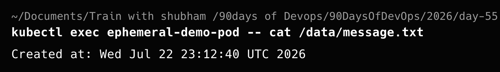

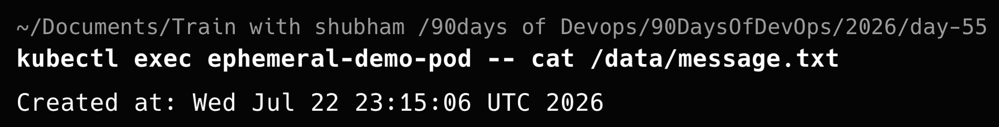

### Key Learning

Application data should not be stored only inside a Pod when it must survive Pod deletion or recreation. Persistent storage is required for databases and other stateful applications.

---

## Task 2: Create a Static PersistentVolume

I created a static PersistentVolume with one gibibyte of storage.

### PersistentVolume Manifest

```yaml
apiVersion: v1
kind: PersistentVolume
metadata:
  name: day55-pv
spec:
  capacity:
    storage: 1Gi
  accessModes:
    - ReadWriteOnce
  persistentVolumeReclaimPolicy: Retain
  storageClassName: manual
  hostPath:
    path: /tmp/day55-pv-data
    type: DirectoryOrCreate
```

### Create the PersistentVolume

```bash
kubectl apply -f persistent-volume.yaml
```

### Verify the PersistentVolume

```bash
kubectl get pv
```

### Observation

The `day55-pv` PersistentVolume entered the `Available` state.

Its configuration included:

- Capacity: `1Gi`
- Access mode: `ReadWriteOnce`
- Reclaim policy: `Retain`
- Storage class: `manual`

The `Available` state means the PersistentVolume exists but has not yet been claimed by a PersistentVolumeClaim.

### Screenshot

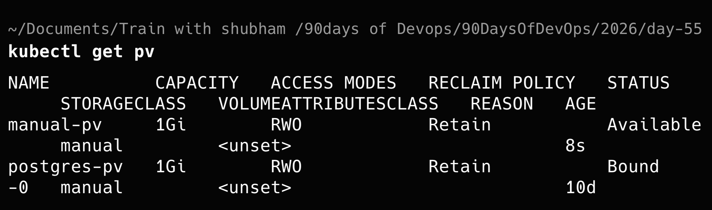

### Key Learning

A PersistentVolume is a cluster-wide storage resource. The `Retain` reclaim policy means the underlying data is preserved even after the associated claim is deleted.

The `hostPath` volume type is suitable for local Kubernetes learning but is not normally appropriate for production storage.


## Task 3: Create a PersistentVolumeClaim

A PersistentVolumeClaim allows an application to request storage from the Kubernetes cluster without needing to know the details of the underlying PersistentVolume.

### PersistentVolumeClaim Manifest

```yaml
apiVersion: v1
kind: PersistentVolumeClaim
metadata:
  name: manual-pvc
  namespace: default
spec:
  storageClassName: manual
  volumeName: day55-pv
  accessModes:
    - ReadWriteOnce
  resources:
    requests:
      storage: 500Mi
```

### Create the PersistentVolumeClaim

```bash
kubectl apply -f persistent-volume-claim.yaml
```

### Verify the PersistentVolumeClaim

```bash
kubectl get pvc
```

### Verify the PersistentVolume

```bash
kubectl get pv
```

### Observation

The `manual-pvc` requested:

- `500Mi` of storage
- `ReadWriteOnce` access
- The `manual` StorageClass

Kubernetes matched the claim with the available `day55-pv` because:

- The StorageClass matched.
- The access mode matched.
- The PersistentVolume had enough storage capacity.

After binding:

- The PVC status changed to `Bound`.
- The PV status changed from `Available` to `Bound`.
- The PVC’s `VOLUME` column showed `day55-pv`.

### Screenshot

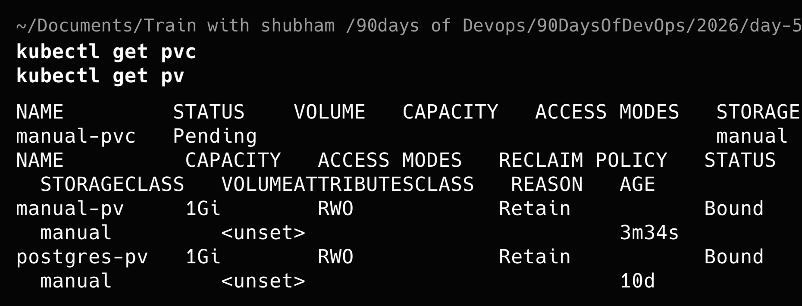

### Key Learning

A PersistentVolumeClaim is a request for storage made by an application.

The PersistentVolume provides the actual storage, while the PersistentVolumeClaim allows a Pod to use that storage.

```text
Pod
 ↓
PersistentVolumeClaim
 ↓
PersistentVolume
 ↓
Storage
```

---

## Task 4: Mount the PVC and Prove Data Persistence

I created a Pod that mounted `manual-pvc` at `/data`.

Because this lab used a `hostPath` volume in a multi-node Kind cluster, I pinned the Pod to `tws-cluster-worker`. A `hostPath` volume exists on one specific node and is not automatically shared across all cluster nodes.

### Persistent Pod Manifest

```yaml
apiVersion: v1
kind: Pod
metadata:
  name: persistent-demo-pod
  namespace: default
spec:
  nodeName: tws-cluster-worker

  containers:
    - name: busybox
      image: busybox:1.36
      command:
        - /bin/sh
        - -c
      args:
        - |
          echo "Written by $(hostname) at $(date)" >> /data/message.txt
          sleep 3600
      volumeMounts:
        - name: persistent-storage
          mountPath: /data

  volumes:
    - name: persistent-storage
      persistentVolumeClaim:
        claimName: manual-pvc
```

### Create the Pod

```bash
kubectl apply -f persistent-pod.yaml

kubectl wait --for=condition=Ready \
  pod/persistent-demo-pod \
  --timeout=90s
```

### Verify the Stored Data

```bash
kubectl exec persistent-demo-pod -- \
  cat /data/message.txt
```

I then deleted the Pod completely:

```bash
kubectl delete pod persistent-demo-pod

kubectl wait --for=delete \
  pod/persistent-demo-pod \
  --timeout=90s
```

I recreated the Pod using the same manifest:

```bash
kubectl apply -f persistent-pod.yaml

kubectl wait --for=condition=Ready \
  pod/persistent-demo-pod \
  --timeout=90s
```

After recreating the Pod, I checked the file again:

```bash
kubectl exec persistent-demo-pod -- \
  cat /data/message.txt
```

The file contained two timestamped entries:

```text
Written by persistent-demo-pod at Thu Jul 23 08:45:50 UTC 2026
Written by persistent-demo-pod at Thu Jul 23 08:49:56 UTC 2026
```

### Observation

Deleting the Pod did not delete the stored data.

The replacement Pod mounted the same PersistentVolumeClaim and accessed the existing file. It then added another line to the same file.

### Screenshot

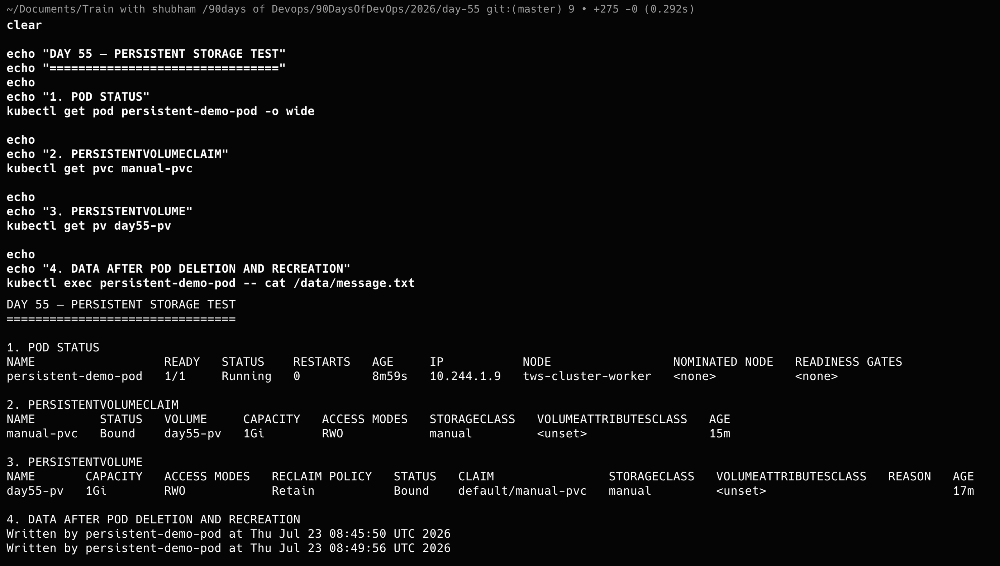

### Key Learning

A Pod is temporary, but application data can survive Pod deletion and recreation when it is stored through a PersistentVolumeClaim.

```text
Replacement Pod
      ↓
Same PVC
      ↓
Same PV
      ↓
Existing data
```

---

## Task 5: Inspect the Default StorageClass

I inspected the StorageClasses available in the cluster:

```bash
kubectl get storageclass
```

I then inspected the default StorageClass in more detail:

```bash
kubectl describe storageclass standard
```

The default StorageClass contained the following configuration:

- Name: `standard`
- Default StorageClass: `Yes`
- Provisioner: `rancher.io/local-path`
- Reclaim policy: `Delete`
- Volume binding mode: `WaitForFirstConsumer`
- Volume expansion: Not enabled

### StorageClass Summary

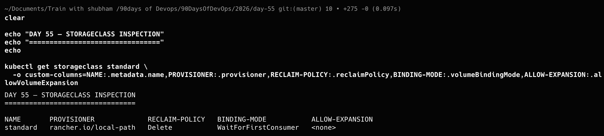

### StorageClass Details

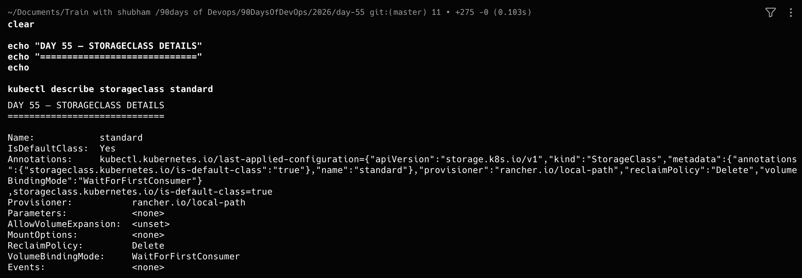

### Observation

The `WaitForFirstConsumer` binding mode delays volume creation or binding until a Pod starts using the PVC.

This allows Kubernetes to consider the node where the Pod will be scheduled before selecting or provisioning the storage.

The `Delete` reclaim policy means that a dynamically provisioned PersistentVolume is normally deleted after its associated PersistentVolumeClaim is deleted.

### Key Learning

A StorageClass defines how Kubernetes dynamically provides storage.

Applications can request storage through a PVC without requiring an administrator to manually create every PersistentVolume.

```text
Application creates PVC
          ↓
StorageClass selects provisioner
          ↓
Provisioner creates PV
          ↓
PVC binds to PV
```

---

## Task 6: Use Dynamic Provisioning

I created a PersistentVolumeClaim that used the default `standard` StorageClass.

Unlike static provisioning, I did not manually create a PersistentVolume.

### Dynamic PVC Manifest

```yaml
apiVersion: v1
kind: PersistentVolumeClaim
metadata:
  name: dynamic-pvc
  namespace: default
spec:
  accessModes:
    - ReadWriteOnce
  storageClassName: standard
  resources:
    requests:
      storage: 200Mi
```

### Create the Dynamic PVC

```bash
kubectl apply -f dynamic-pvc.yaml
```

I checked the status of the claim:

```bash
kubectl get pvc dynamic-pvc
kubectl describe pvc dynamic-pvc
```

Initially, the PVC remained in the `Pending` state.

The events showed:

```text
WaitForFirstConsumer
waiting for first consumer to be created before binding
```

This happened because the `standard` StorageClass uses `WaitForFirstConsumer`.

### Pending PVC Screenshot

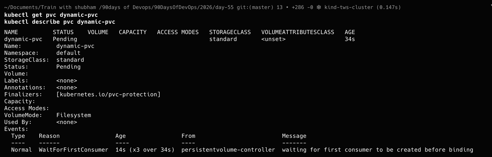

I then created a Pod that consumed the PVC.

### Dynamic Storage Pod Manifest

```yaml
apiVersion: v1
kind: Pod
metadata:
  name: dynamic-storage-pod
  namespace: default
spec:
  containers:
    - name: busybox
      image: busybox:1.36
      command:
        - /bin/sh
        - -c
      args:
        - |
          echo "Dynamically provisioned storage works" > /data/message.txt
          sleep 3600
      volumeMounts:
        - name: dynamic-storage
          mountPath: /data

  volumes:
    - name: dynamic-storage
      persistentVolumeClaim:
        claimName: dynamic-pvc

  restartPolicy: Never
```

### Create the Consumer Pod

```bash
kubectl apply -f dynamic-pod.yaml

kubectl wait --for=condition=Ready \
  pod/dynamic-storage-pod \
  --timeout=90s
```

After the Pod was scheduled:

- The PVC changed from `Pending` to `Bound`.
- Kubernetes automatically created a new PersistentVolume.
- The PV used the `standard` StorageClass.
- The PV inherited the `Delete` reclaim policy.
- The Pod successfully wrote data to the mounted storage.

I verified the stored message:

```bash
kubectl exec dynamic-storage-pod -- \
  cat /data/message.txt
```

The output was:

```text
Dynamically provisioned storage works
```

### Dynamic Provisioning Result

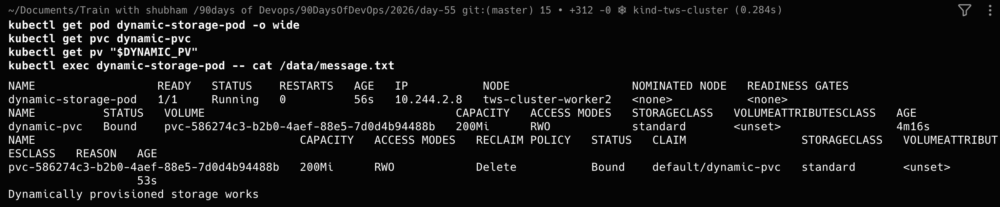

### Static and Dynamic Provisioning Comparison

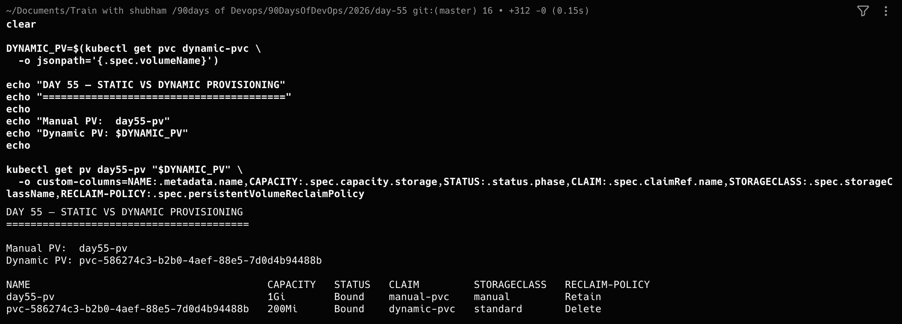

### Observation

For static provisioning, I manually created `day55-pv`.

For dynamic provisioning, I created only `dynamic-pvc`. The `rancher.io/local-path` provisioner automatically created the required PersistentVolume.

### Key Learning

```text
Static provisioning:

Administrator creates PV
          ↓
Application creates PVC
          ↓
Kubernetes binds them
```

```text
Dynamic provisioning:

Application creates PVC
          ↓
StorageClass creates PV
          ↓
Kubernetes binds them
```

Dynamic provisioning reduces manual storage administration and makes storage requests easier for application teams.

---

## Task 7: Compare Retain and Delete Reclaim Policies

I tested what happens to PersistentVolumes after their PersistentVolumeClaims are deleted.

First, I deleted both Day 55 Pods:

```bash
kubectl delete pod \
  persistent-demo-pod \
  dynamic-storage-pod
```

I then deleted both PVCs:

```bash
kubectl delete pvc \
  manual-pvc \
  dynamic-pvc
```

The manually created PV and the dynamically created PV behaved differently.

### Static PV with Retain Policy

The manually created `day55-pv` used:

```yaml
persistentVolumeReclaimPolicy: Retain
```

After deleting `manual-pvc`, the PV remained in the cluster with the status:

```text
Released
```

The previous claim information and underlying data were preserved.

The result was:

```text
NAME       STATUS     RECLAIM-POLICY   PREVIOUS-CLAIM
day55-pv   Released   Retain           manual-pvc
```

### Dynamically Provisioned PV with Delete Policy

The dynamically created PV inherited the following reclaim policy from the `standard` StorageClass:

```text
Delete
```

After deleting `dynamic-pvc`, Kubernetes automatically deleted the dynamically provisioned PersistentVolume.

### Screenshot

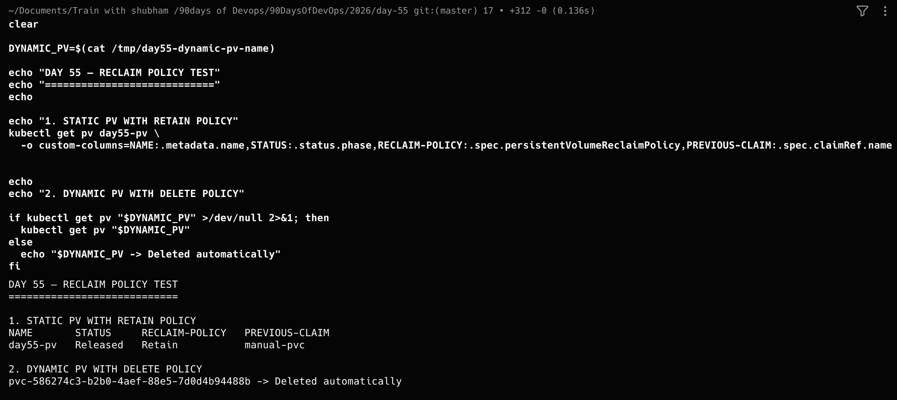

### Observation

The two reclaim policies produced different results:

| Reclaim policy | Result after PVC deletion |
|---|---|
| `Retain` | PV remained in the `Released` state |
| `Delete` | PV was deleted automatically |

A PV in the `Released` state is not immediately available to another claim because it still contains information about the previous claim and may still contain its data.

### Key Learning

- `Retain` preserves the PersistentVolume and its data after PVC deletion.
- `Delete` removes the dynamically provisioned PV and its backing storage.
- `Released` does not mean the PV is ready to be claimed again.
- Reclaim policies should be selected according to the value and lifecycle of the application data.

---

## Final Summary

During Day 55, I practised:

- Temporary storage using `emptyDir`
- Static PersistentVolume creation
- PersistentVolumeClaim binding
- Mounting persistent storage into a Pod
- Proving that data survives Pod deletion
- Inspecting the default StorageClass
- Understanding `WaitForFirstConsumer`
- Dynamically provisioning a PersistentVolume
- Comparing static and dynamic provisioning
- Testing the `Retain` and `Delete` reclaim policies

The most important lesson was that Pods are disposable, but application data does not have to be.

PersistentVolumes, PersistentVolumeClaims and StorageClasses separate the lifecycle of application storage from the lifecycle of individual Pods.