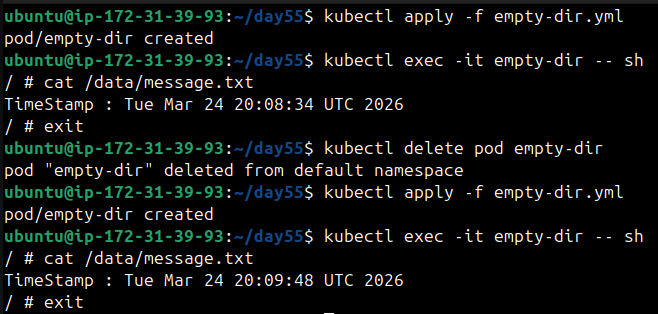
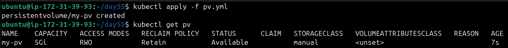
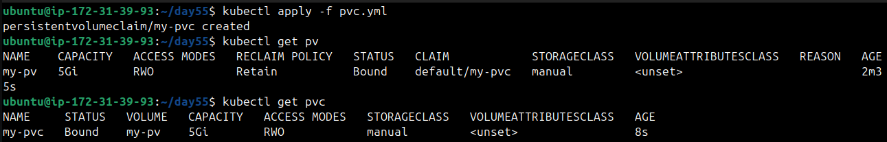
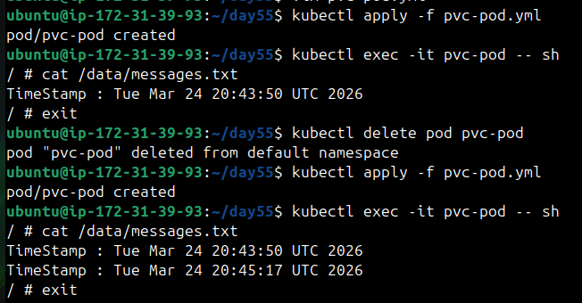
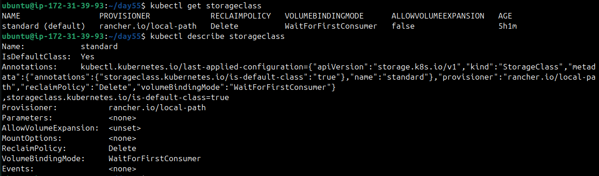
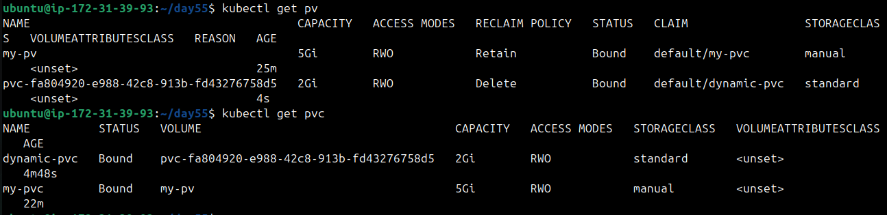
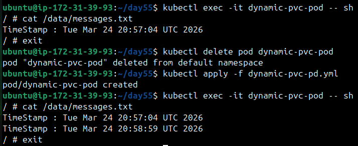
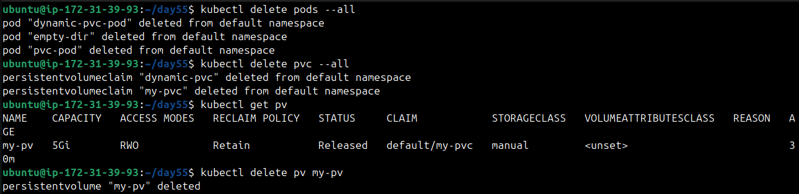

# Day 55 – Persistent Volumes (PV) and Persistent Volume Claims (PVC)

## Task 1: See the Problem — Data Lost on Pod Deletion
1. Write a Pod manifest that uses an `emptyDir` volume and writes a timestamped message to `/data/message.txt`
2. Apply it, verify the data exists with `kubectl exec`
3. Delete the Pod, recreate it, check the file again — the old message is gone

   

**Verify:** Is the timestamp the same or different after recreation?
**Different**

---

## Task 2: Create a PersistentVolume (Static Provisioning)
1. Write a PV manifest with `capacity: 1Gi`, `accessModes: ReadWriteOnce`, `persistentVolumeReclaimPolicy: Retain`, and `hostPath` pointing to `/tmp/k8s-pv-data`
2. Apply it and check `kubectl get pv` — status should be `Available`

Access modes to know:
- `ReadWriteOnce (RWO)` — read-write by a single node
- `ReadOnlyMany (ROX)` — read-only by many nodes
- `ReadWriteMany (RWX)` — read-write by many nodes

`hostPath` is fine for learning, not for production.

   

**Verify:** What is the STATUS of the PV?   
**Available**

---

## Task 3: Create a PersistentVolumeClaim
1. Write a PVC manifest requesting `500Mi` of storage with `ReadWriteOnce` access
2. Apply it and check both `kubectl get pvc` and `kubectl get pv`
3. Both should show `Bound` — Kubernetes matched them by capacity and access mode

   

**Verify:** What does the VOLUME column in `kubectl get pvc` show?
   * It shows the name of PersistentVolume the PVC is nbound to.

---

## Task 4: Use the PVC in a Pod — Data That Survives
1. Write a Pod manifest that mounts the PVC at `/data` using `persistentVolumeClaim.claimName`
2. Write data to `/data/message.txt`, then delete and recreate the Pod
3. Check the file — it should contain data from both Pods

   

**Verify:** Does the file contain data from both the first and second Pod?
   * Yes, the file contains data from both pods.

---

## Task 5: StorageClasses and Dynamic Provisioning
1. Run `kubectl get storageclass` and `kubectl describe storageclass`
2. Note the provisioner, reclaim policy, and volume binding mode
3. With dynamic provisioning, developers only create PVCs — the StorageClass handles PV creation automatically

   

**Verify:** What is the default StorageClass in your cluster?
**STANDARD**

---

## Task 6: Dynamic Provisioning
1. Write a PVC manifest that includes `storageClassName: standard` (or your cluster's default)
2. Apply it — a PV should appear automatically in `kubectl get pv`

   

3. Use this PVC in a Pod, write data, verify it works

   

**Verify:** How many PVs exist now? Which was manual, which was dynamic?
  * `2 PVs` exists now, the one with `storageClassName: manual` is manual, and
    one with `storageClassName: standard` is dynamic.

---

## Task 7: Clean Up
1. Delete all pods first
2. Delete PVCs — check `kubectl get pv` to see what happened
3. The dynamic PV is gone (Delete reclaim policy). The manual PV shows `Released` (Retain policy).
4. Delete the remaining PV manually

   

**Verify:** Which PV was auto-deleted and which was retained? Why?
   * `Dynamic PV` was auto deleted because it had `reclaimPolicy: Delete`.
   * `Manual PV` was retained because it had `reclaimPolicy: Retain`.

---

- Why containers need persistent storage
   * Containers are ephemeral, so any data inside disappears when they stop. For 
     databases or critical workloads, persistent storage ensures data survives restarts, rescheduling, or crashes.

- What PVs and PVCs are and how they relate
   * `PV` : 
      - It is a piece of storage in the cluster that has been provisioned.
      - It can be provisioned by an administrator or dynamically provisioned using a  
        StorageClass.
   * `PVC` :
      - It is request for storage by user.
      - It specifies reuirements such as size, access mode, storage class.
      - Kubernets binds a PVC to a PV that matches its requirements.
   * `Relationship` :
      - A `PVC` is bound to a `PV`, so basically PVs are supply and PVCs are demand.
      - Once bound, the pod uses the PVC, and behind the scenes, it’s really using the PV.

- Static vs dynamic provisioning
   * `Static` : A PV is created manually before creating PVC. (`storageClassName: mnaual`)
   * `Dynamic` : PV is automatically created, when pvc is created using class name other 
     than `manual` (`storageClassName: standard`)

- Access modes and reclaim policies

   * **Access Modes**

| Modes | Description | UseCase |
|-------|-------------|---------|
| ReadWriteOnce | Mounted as Read and write by single node | Databases |
| ReadOnlyMany | Mounted as Read Only by many nodes simultaneously | config/shared files |
| ReadWriteMany | Mounted as Read and write by many nodes | Shared storage for multiple pods |
| ReadWriteOncePod | Mounted as Read and Write by single pod only even if multiple pods are on the same node | Single-Instance Databases, Stateful Workloads |

   * **Reclaim Policies**

| Policy | Description |
|--------|-------------|
| Retain | PV is not deleted, data remains intact. Must manually clean up or reuse. |
| Delete | PV and its underlying storage resources are deleted automatically. Common in dynamic provisioning. |

---
