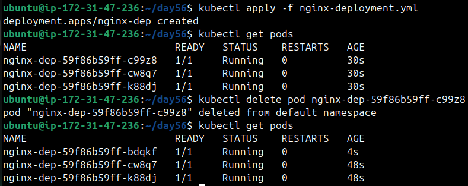
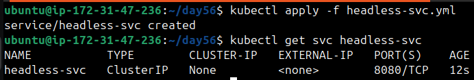
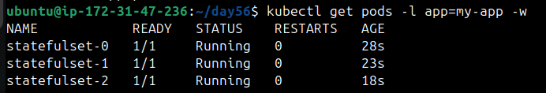
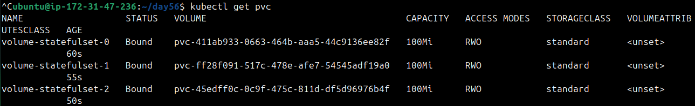
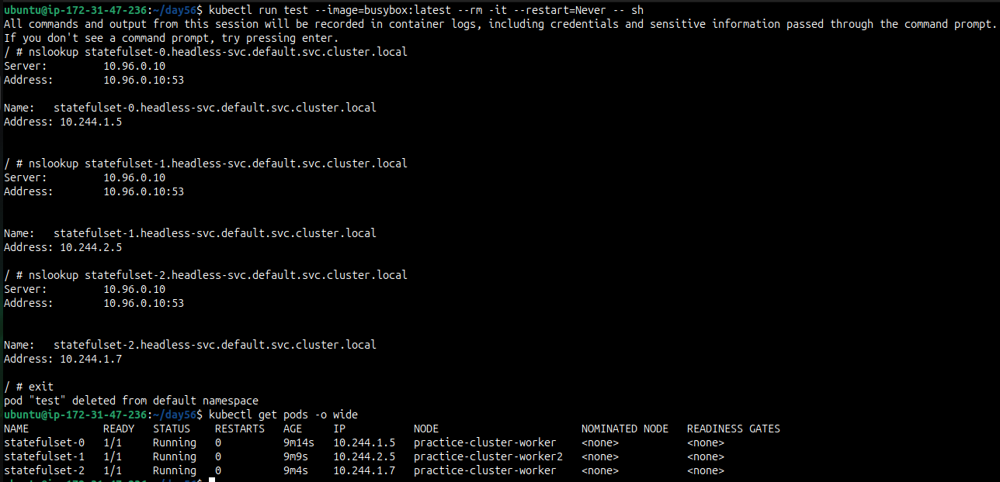
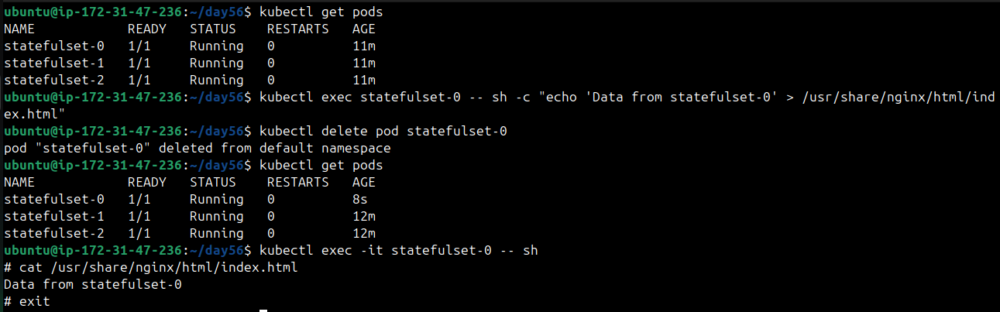
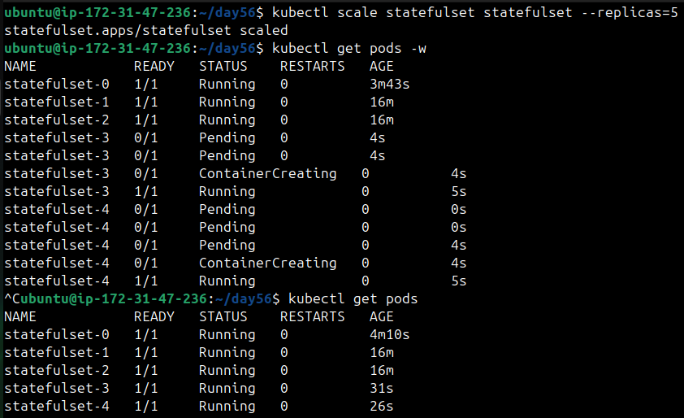
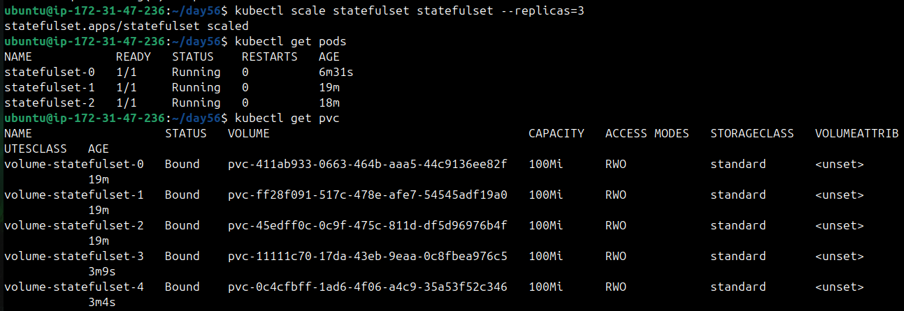
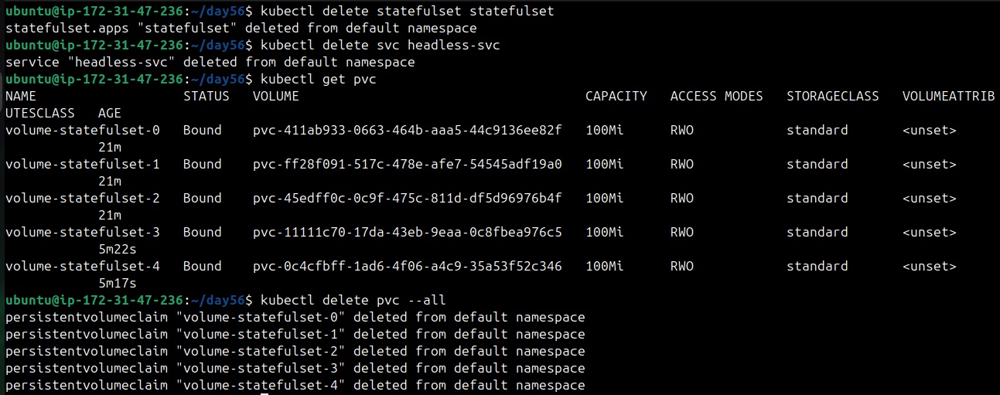

# Day 56 – Kubernetes StatefulSets

## Task 1: Understand the Problem
1. Create a Deployment with 3 replicas using nginx
2. Check the pod names — they are random (`app-xyz-abc`)
3. Delete a pod and notice the replacement gets a different random name

   

This is fine for web servers but not for databases where you need stable identity.

Delete the Deployment before moving on.

**Verify:** Why would random pod names be a problem for a database cluster?
   * In a database cluster, each pods need a stable identity(name+storage) so other nodes
     can connect, replicate data and maintain consistency.
   * With random pod names after evry restart the cluster can't recognize which node is
     which, replication breaks, storage consistency breaks.

---

## Task 2: Create a Headless Service
1. Write a Service manifest with `clusterIP: None` — this is a Headless Service
2. Set the selector to match the labels you will use on your StatefulSet pods
3. Apply it and confirm CLUSTER-IP shows `None`

A Headless Service creates individual DNS entries for each pod instead of load-balancing to one IP. StatefulSets require this.

   

**Verify:** What does the CLUSTER-IP column show?
**NONE**

---

## Task 3: Create a StatefulSet
1. Write a StatefulSet manifest with `serviceName` pointing to your Headless Service
2. Set replicas to 3, use the nginx image
3. Add a `volumeClaimTemplates` section requesting 100Mi of ReadWriteOnce storage
4. Apply and watch: `kubectl get pods -l <your-label> -w`

Observe ordered creation — `web-0` first, then `web-1` after `web-0` is Ready, then `web-2`.

   

Check the PVCs: `kubectl get pvc` — you should see `web-data-web-0`, `web-data-web-1`, `web-data-web-2` (names follow the pattern `<template-name>-<pod-name>`).

   

**Verify:** What are the exact pod names and PVC names?
>Pod Names: `statefulset-0` `statefulset-1` `statefulset-2`
>PVC Names: `volume-statefulset-0` `volume-statefulset-1` `volume-statefulset-2`

---

## Task 4: Stable Network Identity
Each StatefulSet pod gets a DNS name: `<pod-name>.<service-name>.<namespace>.svc.cluster.local`

1. Run a temporary busybox pod and use `nslookup` to resolve `web-0.<your-headless-service>.default.svc.cluster.local`
2. Do the same for `web-1` and `web-2`
3. Confirm the IPs match `kubectl get pods -o wide`

   

**Verify:** Does the nslookup IP match the pod IP?
**YES**

---

## Task 5: Stable Storage — Data Survives Pod Deletion
1. Write unique data to each pod: `kubectl exec web-0 -- sh -c "echo 'Data from web-0' > /usr/share/nginx/html/index.html"`
2. Delete `web-0`: `kubectl delete pod web-0`
3. Wait for it to come back, then check the data — it should still be "Data from web-0"

The new pod reconnected to the same PVC.

   

**Verify:** Is the data identical after pod recreation?
**YES**

---

## Task 6: Ordered Scaling
1. Scale up to 5: `kubectl scale statefulset web --replicas=5` — pods create in order (web-3, then web-4)

   

2. Scale down to 3 — pods terminate in reverse order (web-4, then web-3)
3. Check `kubectl get pvc` — all five PVCs still exist. Kubernetes keeps them on scale-down so data is preserved if you scale back up.

   

**Verify:** After scaling down, how many PVCs exist?
   * all 5 PVC exists.

---

## Task 7: Clean Up
1. Delete the StatefulSet and the Headless Service
2. Check `kubectl get pvc` — PVCs are still there (safety feature)
3. Delete PVCs manually

   

**Verify:** Were PVCs auto-deleted with the StatefulSet?
**NO**

---

- What StatefulSets are and when to use them vs Deployments
   - `StatefulSets `
     * Maintain state across pods.
     * Give each pod a predictable, ordered name (web-0, web-1, …).
     * Automatically bind a dedicated PVC to each pod.
     * Work with a headless Service to provide stable DNS names.
     * Best for stateful apps like databases or clusters where identity and storage 
       persistence matter
   - `Deployments`
     * Manage stateless workloads.
     * Pods get random names.
     * One pvc is shared by all pods.
     * Don’t require headless Services.
     * Best where apps don;t require a state to be maintained, where pods are 
       interchangeable.

- The comparison table

| Feature | Deployment | StatefulSet |
|---|---|---|
| Pod names | Random | Stable, ordered (`app-0`, `app-1`) |
| Startup order | All at once | Ordered: pod-0, then pod-1, then pod-2 |
| Storage | Shared PVC | Each pod gets its own PVC |
| Network identity | No stable hostname | Stable DNS per pod |

- How Headless Services, stable DNS, and volumeClaimTemplates work
   * `Headless Services`
     - Don’t provide a single cluster IP (so no load-balancing).
     - Instead, they create individual DNS records for each pod, which lets other pods 
       in the cluster reach them directly.
   * `Stable DNS`
     - Each pod gets a predictable hostname.
     - `web-0.headless-svc.default.svc.cluster.local` ,`web-1.headless-svc.default.svc.cluster.local`
     - This is critical for stateful apps like DB clusters, where nodes must talk to each other by stable names.
   * `volumeClaimTemplates`
     - Automatically creates a dedicated PVC per pod.
     - `volume-web-0` , `volume-web-1`
     - Ensures each pod has its own persistent storage that survives restarts.

---

