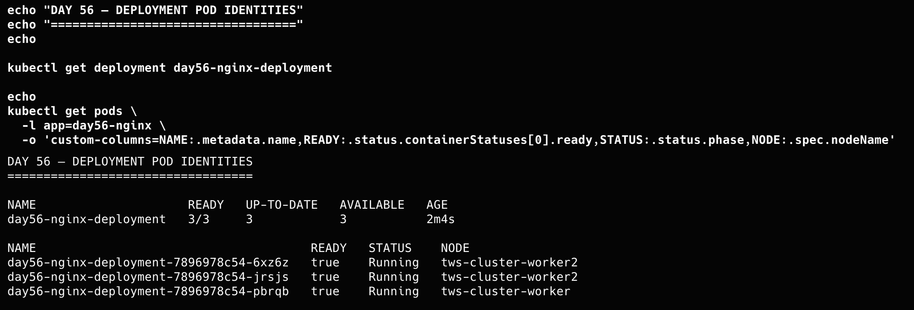
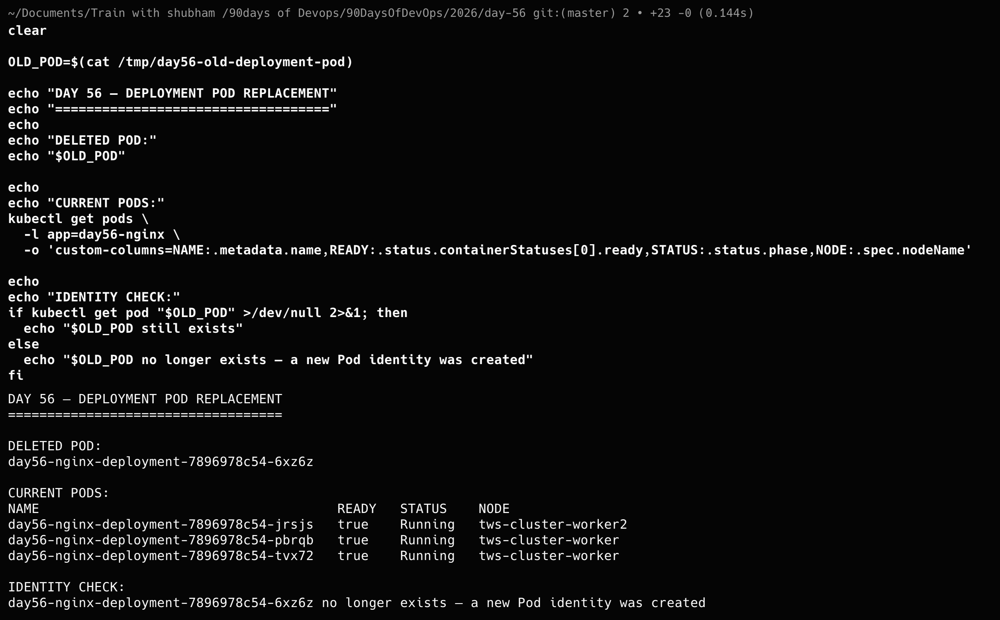
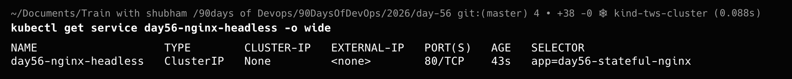
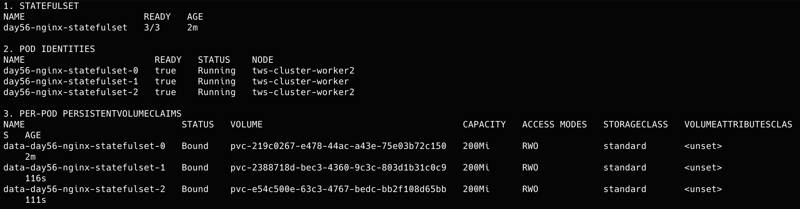
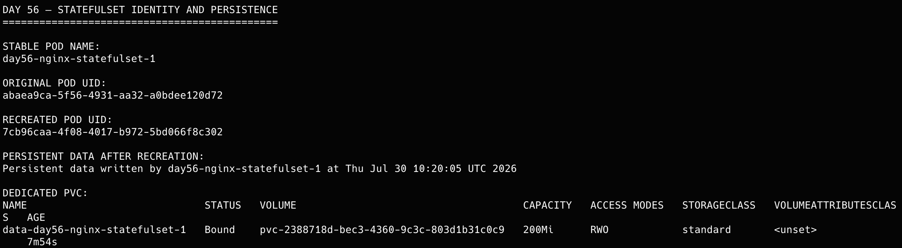
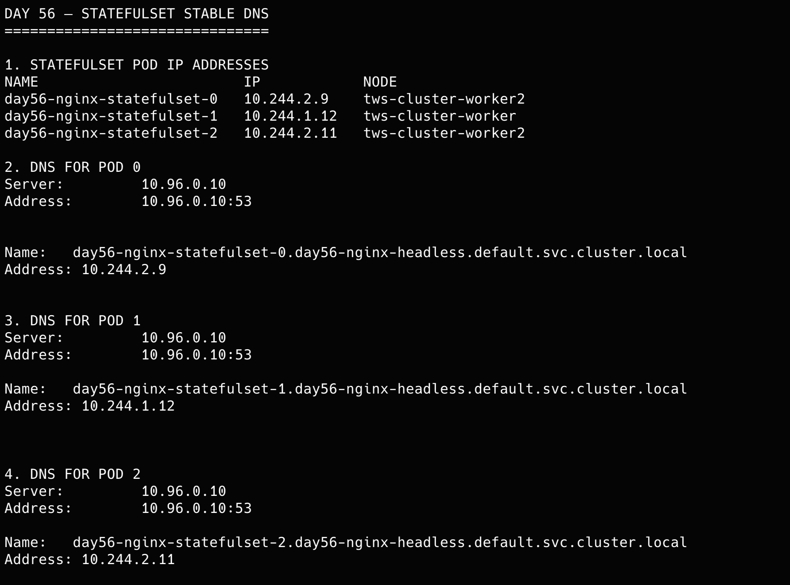
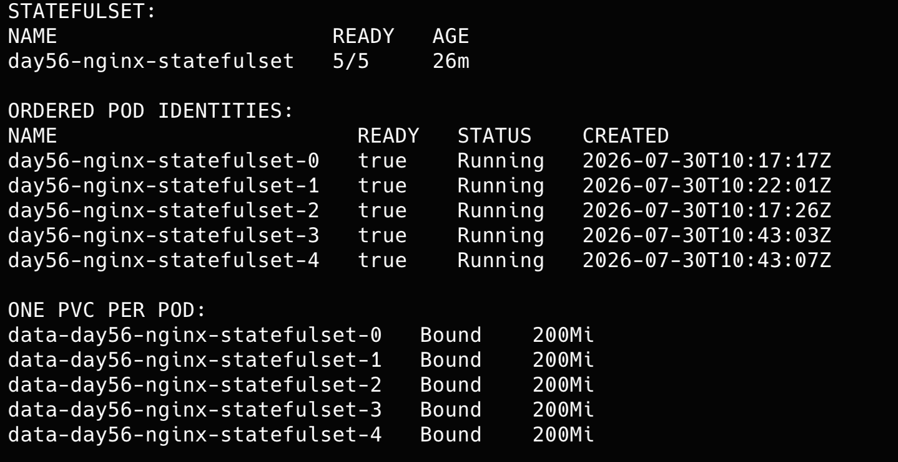
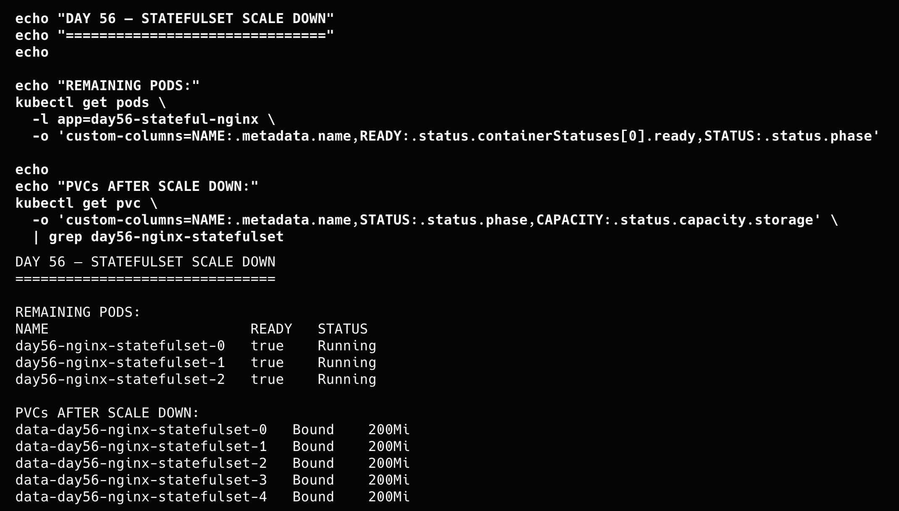

# Day 56 — Kubernetes StatefulSets

## Overview

On Day 56, I explored why stateful applications require more than a standard Kubernetes Deployment.

I compared Deployments with StatefulSets and tested:

- Random versus stable Pod identities
- Headless Services
- Stable DNS records
- Dedicated persistent storage for every Pod
- Data persistence after Pod deletion
- Ordered scaling
- PVC retention after scaling down

---

## Task 1: Compare Deployment Pod Identities

I first created a Deployment with three NGINX replicas.

### Deployment Manifest

```yaml
apiVersion: apps/v1
kind: Deployment
metadata:
  name: day56-nginx-deployment
  namespace: default
spec:
  replicas: 3

  selector:
    matchLabels:
      app: day56-nginx

  template:
    metadata:
      labels:
        app: day56-nginx
    spec:
      containers:
        - name: nginx
          image: nginx:1.27-alpine
          ports:
            - name: http
              containerPort: 80
```

### Create the Deployment

```bash
kubectl apply -f deployment-demo.yaml

kubectl rollout status \
  deployment/day56-nginx-deployment \
  --timeout=120s
```

The Deployment created three Pods with generated names:

```text
day56-nginx-deployment-7896978c54-6xz6z
day56-nginx-deployment-7896978c54-jrsjs
day56-nginx-deployment-7896978c54-pbrqb
```

### Screenshot



I deleted one of the Pods:

```bash
kubectl delete pod day56-nginx-deployment-7896978c54-6xz6z
```

The Deployment automatically created a replacement Pod:

```text
day56-nginx-deployment-7896978c54-tvx72
```

The replacement had a different generated name.

### Replacement Screenshot



### Observation

Deployment Pods are interchangeable.

When one Pod is deleted, the Deployment restores the desired replica count, but the replacement receives a new identity.

### Key Learning

Deployments are suitable for stateless applications where individual Pod identity does not matter.

---

## Task 2: Create a Headless Service

A StatefulSet uses a headless Service to provide stable network identities for its Pods.

### Headless Service Manifest

```yaml
apiVersion: v1
kind: Service
metadata:
  name: day56-nginx-headless
  namespace: default
spec:
  clusterIP: None

  selector:
    app: day56-stateful-nginx

  ports:
    - name: http
      port: 80
      targetPort: 80
```

### Create the Service

```bash
kubectl apply -f headless-service.yaml
```

The Service displayed:

```text
CLUSTER-IP: None
```

This confirmed that it was a headless Service.

### Screenshot



### Key Learning

A headless Service does not provide one virtual ClusterIP.

Instead, it allows DNS to resolve individual StatefulSet Pods.

---

## Task 3: Create a StatefulSet

I created a StatefulSet with three NGINX replicas.

Each Pod received:

- A predictable ordinal identity
- A dedicated PersistentVolumeClaim
- A stable network identity

### StatefulSet Manifest

```yaml
apiVersion: apps/v1
kind: StatefulSet
metadata:
  name: day56-nginx-statefulset
  namespace: default
spec:
  serviceName: day56-nginx-headless
  replicas: 3

  selector:
    matchLabels:
      app: day56-stateful-nginx

  template:
    metadata:
      labels:
        app: day56-stateful-nginx
    spec:
      containers:
        - name: nginx
          image: nginx:1.27-alpine
          command:
            - /bin/sh
            - -c
          args:
            - |
              echo "<h1>Pod: $(hostname)</h1>" > /usr/share/nginx/html/index.html
              echo "Created by $(hostname) at $(date -u)" >> /data/identity.txt
              exec nginx -g 'daemon off;'
          ports:
            - name: http
              containerPort: 80
          volumeMounts:
            - name: data
              mountPath: /data

  volumeClaimTemplates:
    - metadata:
        name: data
      spec:
        accessModes:
          - ReadWriteOnce
        storageClassName: standard
        resources:
          requests:
            storage: 200Mi
```

### Create the StatefulSet

```bash
kubectl apply -f statefulset.yaml

kubectl rollout status \
  statefulset/day56-nginx-statefulset \
  --timeout=180s
```

The StatefulSet created predictable Pod names:

```text
day56-nginx-statefulset-0
day56-nginx-statefulset-1
day56-nginx-statefulset-2
```

It also created one PVC for each Pod:

```text
data-day56-nginx-statefulset-0
data-day56-nginx-statefulset-1
data-day56-nginx-statefulset-2
```

### Screenshot



### Observation

Unlike Deployment Pods, StatefulSet Pods are not treated as completely interchangeable.

Each Pod receives a stable ordinal number and its own persistent storage claim.

---

## Task 4: Prove Stable Identity and Data Persistence

I selected:

```text
day56-nginx-statefulset-1
```

I recorded its original Kubernetes UID and wrote a message to its dedicated volume:

```bash
kubectl exec day56-nginx-statefulset-1 -- sh -c \
  'echo "Persistent data written by $(hostname) at $(date -u)" > /data/persistence-proof.txt'
```

I then deleted the Pod:

```bash
kubectl delete pod day56-nginx-statefulset-1
```

The StatefulSet recreated a Pod with the same stable name:

```text
day56-nginx-statefulset-1
```

However, its UID changed because it was a new Kubernetes Pod object.

The stored message remained available:

```text
Persistent data written by day56-nginx-statefulset-1 at Thu Jul 30 10:20:05 UTC 2026
```

The recreated Pod reattached to:

```text
data-day56-nginx-statefulset-1
```

### Screenshot



### Observation

The old and new Pod UIDs were different, proving the original Pod object was destroyed.

However:

- The Pod name remained stable.
- The ordinal remained `1`.
- The dedicated PVC remained attached.
- The stored data survived.

### Key Learning

A StatefulSet preserves the logical identity of a replica even when the underlying Pod object is recreated.

```text
Old Pod object
     ↓ deleted

New Pod object
     ↓
Same ordinal identity
     ↓
Same dedicated PVC
     ↓
Existing data
```

---

## Task 5: Test Stable DNS

I created a temporary BusyBox Pod to test DNS resolution.

StatefulSet DNS records followed this pattern:

```text
<pod-name>.<service-name>.<namespace>.svc.cluster.local
```

Examples:

```text
day56-nginx-statefulset-0.day56-nginx-headless.default.svc.cluster.local
day56-nginx-statefulset-1.day56-nginx-headless.default.svc.cluster.local
day56-nginx-statefulset-2.day56-nginx-headless.default.svc.cluster.local
```

I used `nslookup` from the DNS test Pod:

```bash
kubectl exec day56-dns-test -- \
  nslookup day56-nginx-statefulset-0.day56-nginx-headless.default.svc.cluster.local
```

Each DNS record resolved to the corresponding StatefulSet Pod IP.

### Screenshot



### Key Learning

Stable DNS allows stateful applications to locate specific replicas.

This is useful for systems where members have different responsibilities or need to communicate with known peers.

---

## Task 6: Scale the StatefulSet Up

I scaled the StatefulSet from three replicas to five:

```bash
kubectl scale \
  statefulset day56-nginx-statefulset \
  --replicas=5
```

The StatefulSet created the next ordered identities:

```text
day56-nginx-statefulset-3
day56-nginx-statefulset-4
```

It also created matching PVCs:

```text
data-day56-nginx-statefulset-3
data-day56-nginx-statefulset-4
```

### Screenshot



### Observation

The StatefulSet continued the existing ordinal sequence instead of creating random Pod names.

---

## Task 7: Scale the StatefulSet Down

I scaled the StatefulSet back to three replicas:

```bash
kubectl scale \
  statefulset day56-nginx-statefulset \
  --replicas=3
```

The higher ordinal Pods were removed:

```text
day56-nginx-statefulset-4
day56-nginx-statefulset-3
```

The remaining Pods were:

```text
day56-nginx-statefulset-0
day56-nginx-statefulset-1
day56-nginx-statefulset-2
```

However, all five PVCs remained:

```text
data-day56-nginx-statefulset-0
data-day56-nginx-statefulset-1
data-day56-nginx-statefulset-2
data-day56-nginx-statefulset-3
data-day56-nginx-statefulset-4
```

### Screenshot



### Observation

Scaling down removed the higher ordinal Pods but did not automatically delete their PVCs.

This protects stateful application data from accidental loss.

### Key Learning

Pod scaling and storage deletion have separate lifecycles.

Retained PVCs also mean storage must be cleaned up deliberately when it is no longer required.

---

## Deployment vs StatefulSet

| Feature | Deployment | StatefulSet |
|---|---|---|
| Pod naming | Random generated names | Stable ordinal names |
| Pod identity | Interchangeable | Stable identity |
| Replacement Pod | Receives a new name | Retains the same ordinal name |
| Storage | Usually shared or temporary | Dedicated PVC per replica |
| DNS identity | General Service routing | Stable per-Pod DNS |
| Scaling | No identity ordering requirement | Ordered ordinal replicas |
| Best suited for | Stateless applications | Stateful applications |

---

## Final Summary

During Day 56, I practised:

- Comparing Deployments and StatefulSets
- Creating a headless Service
- Creating stable StatefulSet Pod identities
- Using `volumeClaimTemplates`
- Assigning one PVC to each replica
- Verifying data persistence after Pod recreation
- Resolving individual StatefulSet Pods through DNS
- Scaling StatefulSets up and down
- Observing PVC retention after scale-down

The most important lesson was:

> A Deployment maintains the number of application instances, while a StatefulSet maintains both the instances and their individual identities.

StatefulSets are useful when applications require predictable names, dedicated storage and stable network identities.
