# Day 59 – Helm — Kubernetes Package Manager

## Task 1: Install Helm
1. Install Helm (brew, curl script, or chocolatey depending on your OS)
2. Verify with `helm version` and `helm env`

**Verify:** What version of Helm is installed?

   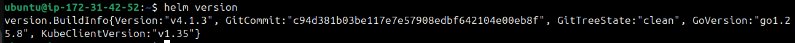

---

## Task 2: Add a Repository and Search
1. Add the Bitnami repository: `helm repo add bitnami https://charts.bitnami.com/bitnami`
2. Update: `helm repo update`
3. Search: `helm search repo nginx` and `helm search repo bitnami`

   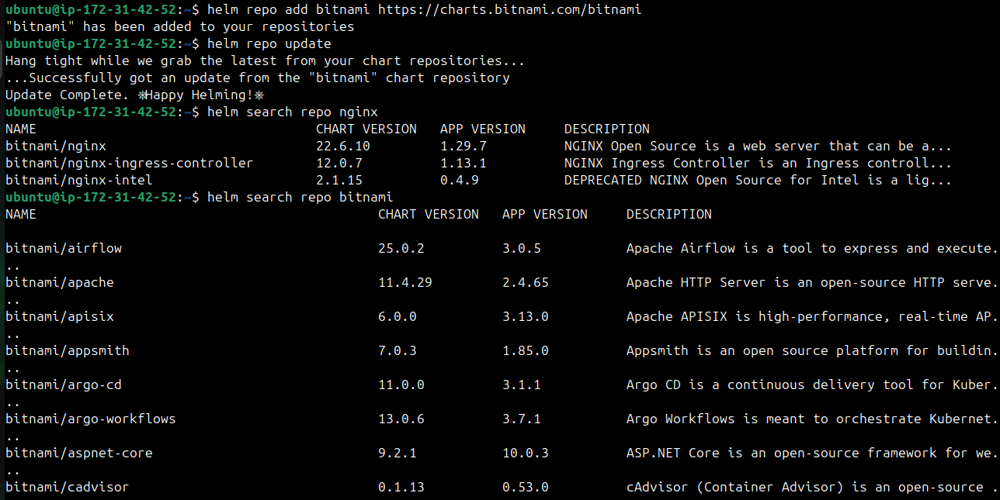

**Verify:** How many charts does Bitnami have?

   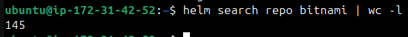

---

## Task 3: Install a Chart
1. Deploy nginx: `helm install my-nginx bitnami/nginx`

   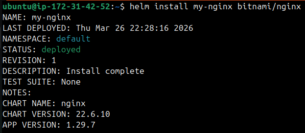

2. Check what was created: `kubectl get all`

   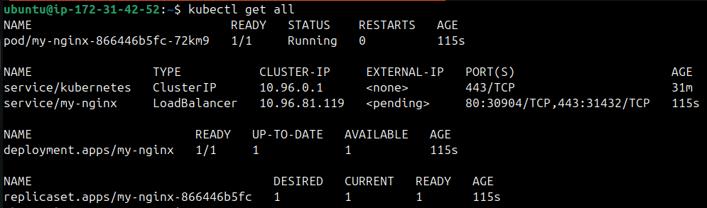

3. Inspect the release: `helm list`, `helm status my-nginx`, `helm get manifest my-nginx`

One command replaced writing a Deployment, Service, and ConfigMap by hand.

**Verify:** How many Pods are running? What Service type was created?
   * `One` pod is running, service type is `LoadBalancer`.

---

## Task 4: Customize with Values
1. View defaults: `helm show values bitnami/nginx`
2. Install a custom release with `--set replicaCount=3 --set service.type=NodePort`

   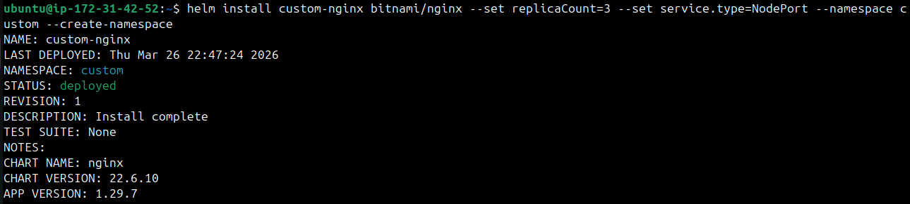

   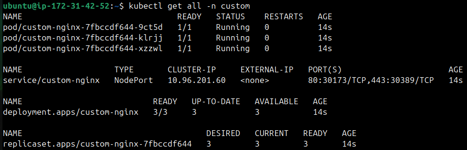

3. Create a `custom-values.yaml` file with replicaCount, service type, and resource limits
4. Install another release using `-f custom-values.yaml`
5. Check overrides: `helm get values <release-name>`

   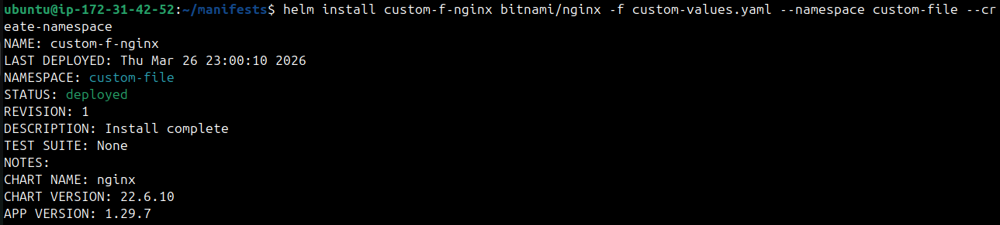

   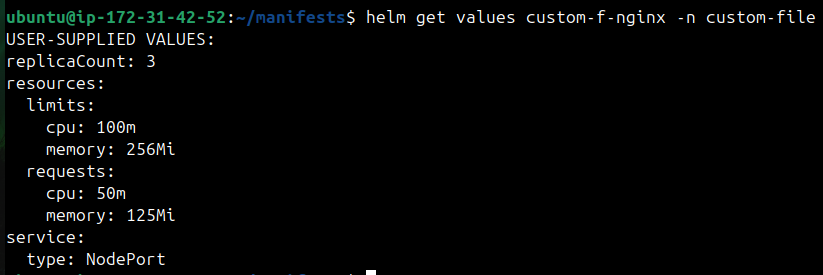

**Verify:** Does the values file release have the correct replicas and service type? - **YES**

---

## Task 5: Upgrade and Rollback
1. Upgrade: `helm upgrade my-nginx bitnami/nginx --set replicaCount=5`

   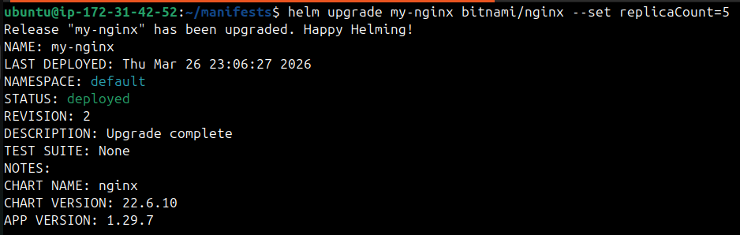

2. Check history: `helm history my-nginx`
3. Rollback: `helm rollback my-nginx 1`
4. Check history again — rollback creates a new revision (3), not overwriting revision 2

   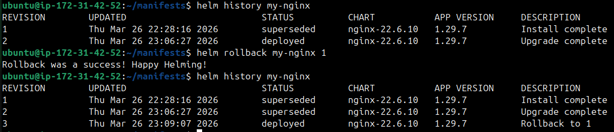

Same concept as Deployment rollouts from Day 52, but at the full stack level.

**Verify:** How many revisions after the rollback?
   * **3 revisions**

---

## Task 6: Create Your Own Chart
1. Scaffold: `helm create my-app`
2. Explore the directory: `Chart.yaml`, `values.yaml`, `templates/deployment.yaml`
3. Look at the Go template syntax in templates: `{{ .Values.replicaCount }}`, `{{ .Chart.Name }}`

   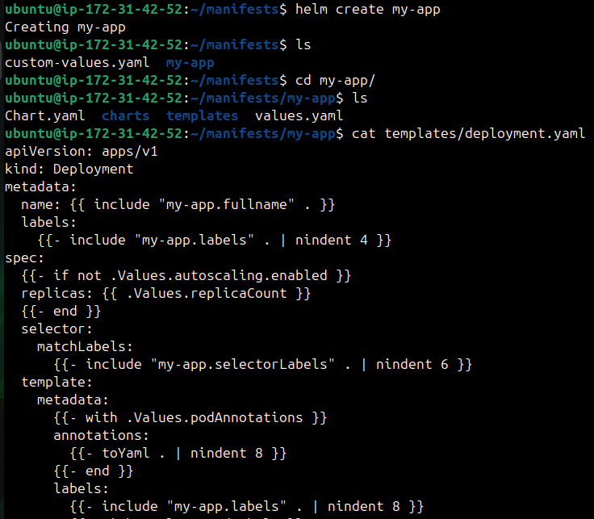

4. Edit `values.yaml` — set replicaCount to 3 and image to nginx:1.25
5. Validate: `helm lint my-app`

   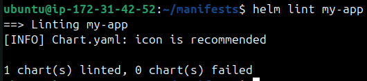

6. Preview: `helm template my-release ./my-app`
7. Install: `helm install my-release ./my-app`

   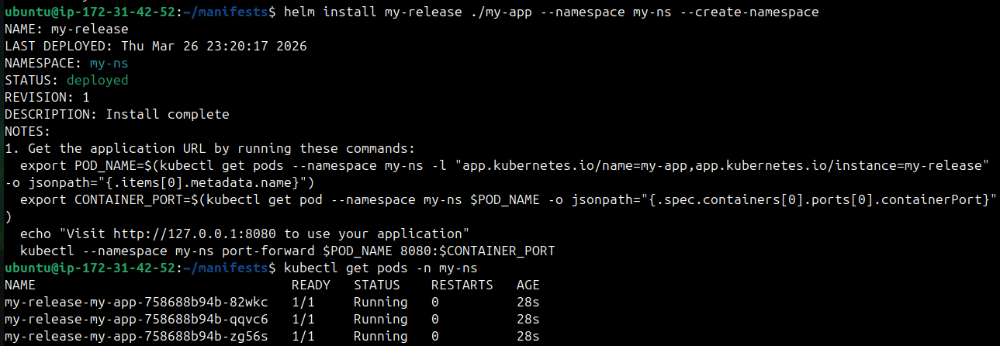

8. Upgrade: `helm upgrade my-release ./my-app --set replicaCount=5`

   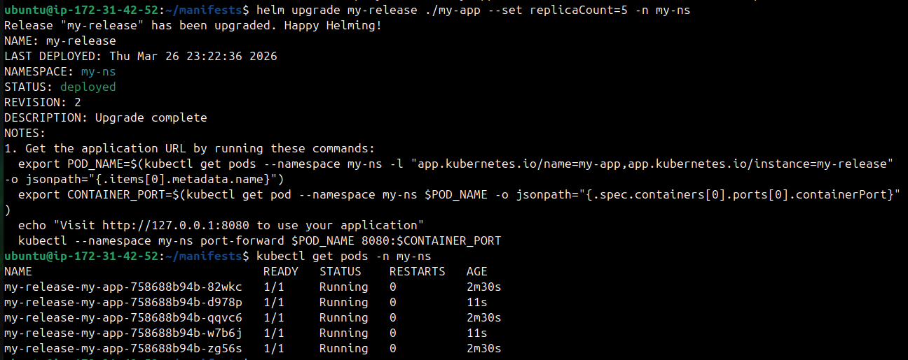

**Verify:** After installing, 3 replicas? After upgrading, 5? - **YES**

---

## Task 7: Clean Up
1. Uninstall all releases: `helm uninstall <name>` for each
2. Remove chart directory and values file
3. Use `--keep-history` if you want to retain release history for auditing

**Verify:** Does `helm list` show zero releases?

   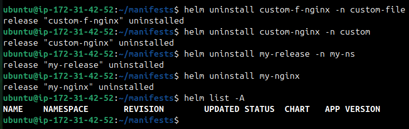

---

- What Helm is and the three core concepts
   * Helm is the package manager for Kubernetes.It simplifies deploying, upgrading, and 
     managing applications by packaging Kubernetes manifests into reusable units.
     * Three core concepts:
       - **Chart** — a package of Kubernetes manifest templates
       - **Release** — a specific installation of a chart in your cluster
       - **Repository** — a collection of charts (like a package repo)

- How to install, customize, upgrade, and rollback
   * **Install**
     - `helm install my-nginx bitnami/nginx`
     - Creates a new release named my-nginx from the Bitnami Nginx chart.
   * **Customize**
     - Using values with set : `helm install my-nginx bitnami/nginx --set replicaCount=3`
     - Overrides the default replicaCount in values.yaml.
     - Using values in file : `helm install my-nginx bitnami/nginx -f custom-values.yml`
     - Loads overrides from a YAML file.
   * **Upgrade**
     - `helm upgrade my-nginx bitnami/nginx --set image.tag=1.25`
     - Updates the release with a new image tag.
   * **Rollback**
     - `helm rollback my-nginx 1` (1 is revision number)
     - Rolls back the release to revision 1.

- The structure of a Helm chart and how Go templating works

   * **Structure**

```sh
   mychart/
   ├── Chart.yaml        # Metadata: name, version, description
   ├── values.yaml       # Default configuration values
   ├── charts/           # Sub‑charts (dependencies)
   ├── templates/        # Kubernetes manifest templates
   │   ├── deployment.yaml
   │   ├── service.yaml
   │   └── _helpers.tpl  # Helper template functions
   └── README.md         # Optional documentation
```
   * Chart.yaml → Defines chart metadata.
   * values.yaml → Holds default values that can be overridden at install/upgrade.
   * templates/ → Contains Kubernetes manifests written with Go templating.
   * _helpers.tpl → Stores reusable template snippets (like naming conventions).

   * **Go templating**
     * Helm uses Go template engine to render manifests.
     * Template references values with the {{ ... }} syntax.
     * Values comes from :
       - values.yml (defaults).
       - --set flag during installtion/upgrade (inline overrides).
       - -f custom-values.yml (file overrides).

- Your `custom-values.yaml` with explanations
```sh
replicaCount: 3 #Sets replicas to 3
service:
  type: NodePort #changes service type from LoadBalancer to NodePort
resources:  #Adds resources requests and limits
  requests:
    cpu: "50m"
    memory: "125Mi"
  limits:
    cpu: "100m"
    memory: "256Mi"
```

---

