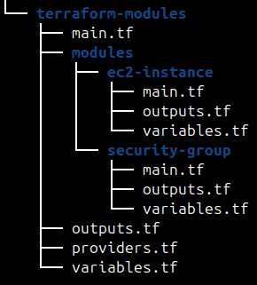
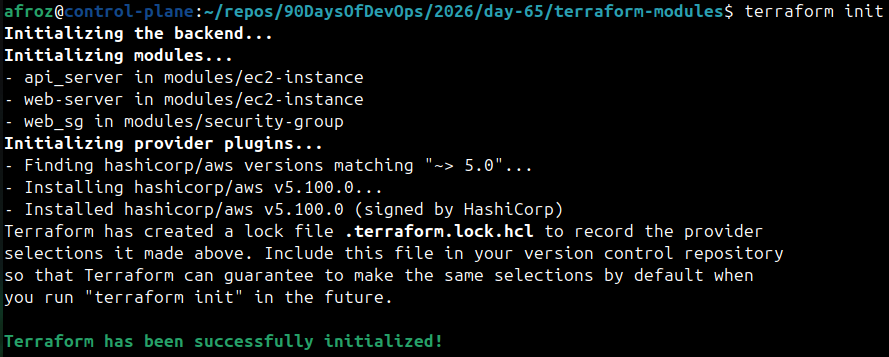
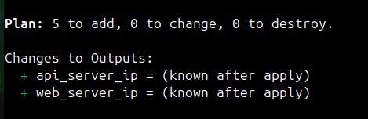
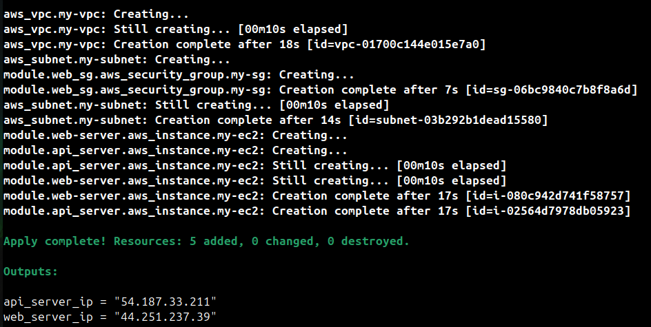
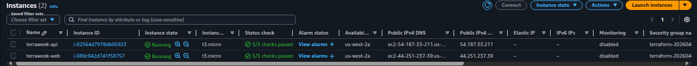
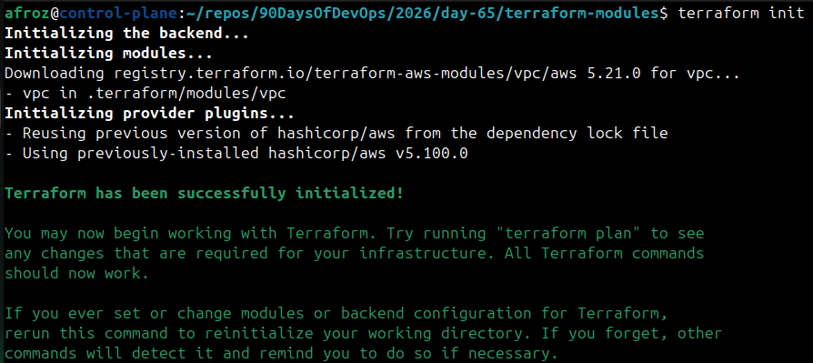
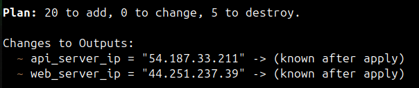
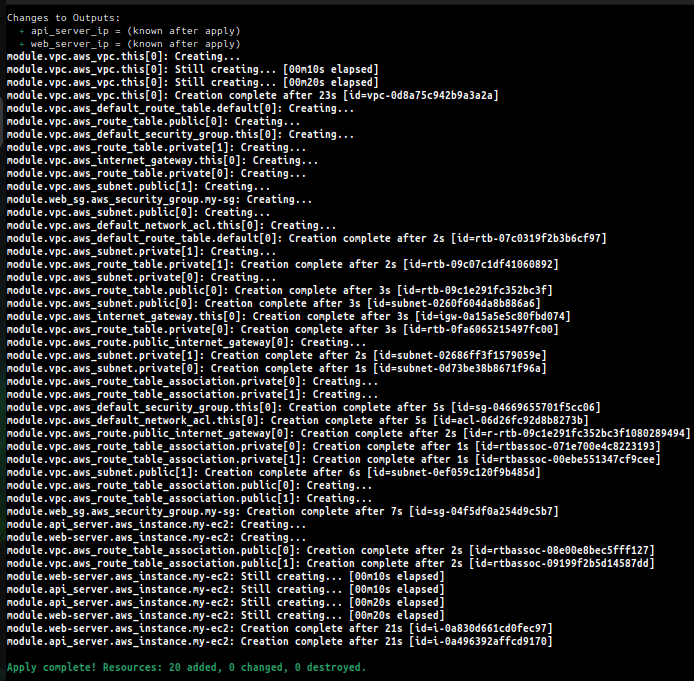
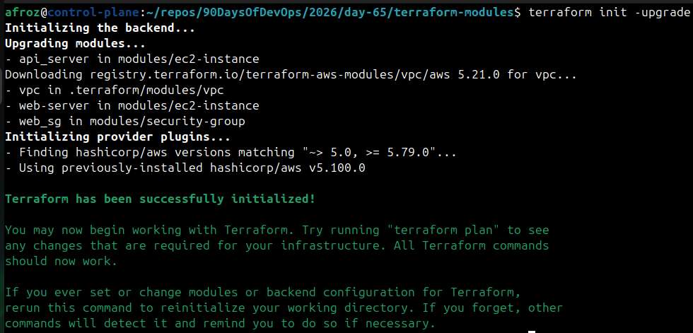

# Day 65 -- Terraform Modules: Build Reusable Infrastructure

## Task 1: Understand Module Structure
A Terraform module is just a directory with `.tf` files. Create this structure:

```
terraform-modules/
  main.tf                    # Root module -- calls child modules
  variables.tf               # Root variables
  outputs.tf                 # Root outputs
  providers.tf               # Provider config
  modules/
    ec2-instance/
      main.tf                # EC2 resource definition
      variables.tf           # Module inputs
      outputs.tf             # Module outputs
    security-group/
      main.tf                # Security group resource definition
      variables.tf           # Module inputs
      outputs.tf             # Module outputs
```

Create all the directories and empty files. This is the standard layout every Terraform project follows.

   
   
**Document:** What is the difference between a "root module" and a "child module"?
   * `root module` 
      - It is where terraform commands are run.
      - Entry point with environment specific config.
   * `child module`
      - Called from root using module block.
      - Actual logic is written here. They reusable like functions.

---

## Task 2: Build a Custom EC2 Module
Create `modules/ec2-instance/`:

1. **`variables.tf`** -- define inputs:
   - `ami_id` (string)
   - `instance_type` (string, default: `"t2.micro"`)
   - `subnet_id` (string)
   - `security_group_ids` (list of strings)
   - `instance_name` (string)
   - `tags` (map of strings, default: `{}`)

2. **`main.tf`** -- define the resource:
   - `aws_instance` using all the variables
   - Merge the Name tag with additional tags

3. **`outputs.tf`** -- expose:
   - `instance_id`
   - `public_ip`
   - `private_ip`

Do NOT apply yet -- just write the module.

---

## Task 3: Build a Custom Security Group Module
Create `modules/security-group/`:

1. **`variables.tf`** -- define inputs:
   - `vpc_id` (string)
   - `sg_name` (string)
   - `ingress_ports` (list of numbers, default: `[22, 80]`)
   - `tags` (map of strings, default: `{}`)

2. **`main.tf`** -- define the resource:
   - `aws_security_group` in the given VPC
   - Use `dynamic "ingress"` block to create rules from the `ingress_ports` list
   - Allow all egress

3. **`outputs.tf`** -- expose:
   - `sg_id`

This is your first time using a `dynamic` block -- it loops over a list to generate repeated nested blocks.

---

## Task 4: Call Your Modules from Root
In the root `main.tf`, wire everything together:

1. Create a VPC and subnet directly (or reuse your Day 62 config)
2. Call the security group module:
```hcl
module "web_sg" {
  source        = "./modules/security-group"
  vpc_id        = aws_vpc.main.id
  sg_name       = "terraweek-web-sg"
  ingress_ports = [22, 80, 443]
  tags          = local.common_tags
}
```

3. Call the EC2 module -- deploy **two instances** with different names using the same module:
```hcl
module "web_server" {
  source             = "./modules/ec2-instance"
  ami_id             = data.aws_ami.amazon_linux.id
  instance_type      = "t2.micro"
  subnet_id          = aws_subnet.public.id
  security_group_ids = [module.web_sg.sg_id]
  instance_name      = "terraweek-web"
  tags               = local.common_tags
}

module "api_server" {
  source             = "./modules/ec2-instance"
  ami_id             = data.aws_ami.amazon_linux.id
  instance_type      = "t2.micro"
  subnet_id             = aws_subnet.public.id
  security_group_ids = [module.web_sg.sg_id]
  instance_name      = "terraweek-api"
  tags               = local.common_tags
}
```

4. Add root outputs that reference module outputs:
```hcl
output "web_server_ip" {
  value = module.web_server.public_ip
}

output "api_server_ip" {
  value = module.api_server.public_ip
}
```

5. Apply:
```bash
terraform init    # Downloads/links the local modules
terraform plan    # Should show all resources from both module calls
terraform apply
```

   

   

   

**Verify:** Two EC2 instances running, same security group, different names. Check the AWS console.

   

---

## Task 5: Use a Public Registry Module
Instead of building your own VPC from scratch, use the official module from the Terraform Registry.

1. Replace your hand-written VPC resources with:
```hcl
module "vpc" {
  source  = "terraform-aws-modules/vpc/aws"
  version = "~> 5.0"

  name = "terraweek-vpc"
  cidr = "10.0.0.0/16"

  azs             = ["us-west-2a", "us-west-2b  "]
  public_subnets  = ["10.0.1.0/24", "10.0.2.0/24"]
  private_subnets = ["10.0.3.0/24", "10.0.4.0/24"]

  enable_nat_gateway = false
  enable_dns_hostnames = true

  tags = local.common_tags
}
```

2. Update your EC2 and SG module calls to reference `module.vpc.vpc_id` and `module.vpc.public_subnets[0]`

3. Run:
```bash
terraform init     # Downloads the registry module
terraform plan
terraform apply
```

   

   

   

4. Compare: how many resources did the VPC module create vs your hand-written VPC from Day 62?
   * `VPC module` created 20 resources, and `hand-written VPC` created 5 resources.

**Document:** Where does Terraform download registry modules to? Check `.terraform/modules/`.
   * `./terraform/modules/vpc` - vpc module downloaded here

---

## Task 6: Module Versioning and Best Practices
1. Pin your registry module version explicitly:
   - `version = "5.1.0"` -- exact version
   - `version = "~> 5.0"` -- any 5.x version
   - `version = ">= 5.0, < 6.0"` -- range

2. Run `terraform init -upgrade` to check for newer versions

   

3. Check the state to see how modules appear:
```bash
terraform state list
```

   

Notice the `module.vpc.`, `module.web_server.`, `module.web_sg.` prefixes.

4. Destroy everything:
```bash
terraform destroy
```

Write down five module best practices:
- Always pin versions for registry modules
- Keep modules focused -- one concern per module
- Use variables for everything, hardcode nothing
- Always define outputs so callers can reference resources
- Add a README.md to every custom module


- Comparison: hand-written VPC vs registry VPC module (resources created)

* **Hand-written VPC (Day 62) **
   - VPC 1
   - Subnet 1
   - Internet Gateway 1
   - Route Table 1
   - Route Table Association 1
   - Security Group 1
Total = 6 resources

* **VPC Module Terraform Registry**
   - VPC
   - aws_vpc.this 1
   - Default resources (auto-managed by module)
   - aws_default_network_acl.this 1
   - aws_default_route_table.default 1
   - aws_default_security_group.this 1
   - Internet Gateway
   - aws_internet_gateway.this 1
   - Subnets Public 2 , Private 2 Total subnets = 4
   - Route Tables Public 1 Private 2 ,Total = 3
   - Routes aws_route.public_internet_gateway 1
   - Route Table Associations Public 2 Private 2 Total = 4
Total = 17 resources

---
