# Day 70 -- Variables, Facts, Conditionals and Loops

## Task 1: Variables in Playbooks
Create `variables-demo.yml`:

```yaml
---
- name: Variable demo
  hosts: all
  become: true

  vars:
    app_name: terraweek-app
    app_port: 8080
    app_dir: "/opt/{{ app_name }}"
    packages:
      - git
      - curl
      - wget

  tasks:
    - name: Print app details
      debug:
        msg: "Deploying {{ app_name }} on port {{ app_port }} to {{ app_dir }}"

    - name: Create application directory
      file:
        path: "{{ app_dir }}"
        state: directory
        mode: '0755'

    - name: Install required packages
      yum:
        name: "{{ packages }}"
        state: present
```

Run it and verify the variables resolve correctly.

   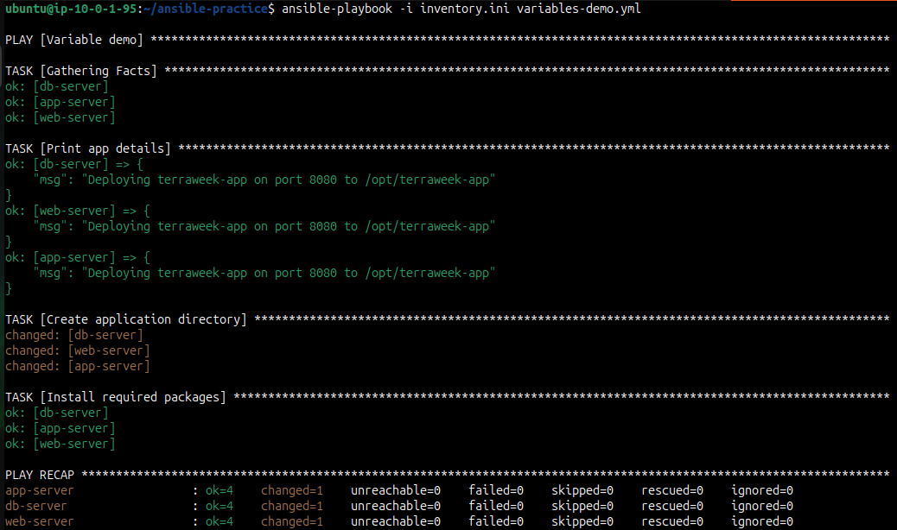

Now, override a variable from the command line:
```bash
ansible-playbook variables-demo.yml -e "app_name=my-custom-app app_port=9090"
```

   

**Verify:** Does the CLI variable override the playbook variable?
   - * **YES**

---

## Task 2: group_vars and host_vars
Variables should not live inside playbooks. Move them to dedicated files.

Create this structure:
```
ansible-practice/
  inventory.ini
  ansible.cfg
  group_vars/
    all.yml
    web.yml
    db.yml
  host_vars/
    web-server.yml
  playbooks/
    site.yml
```

   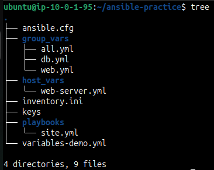

**`group_vars/all.yml`** -- applies to every host:
```yaml
---
ntp_server: pool.ntp.org
app_env: development
common_packages:
  - vim
  - htop
  - tree
```

**`group_vars/web.yml`** -- applies only to the web group:
```yaml
---
http_port: 80
max_connections: 1000
web_packages:
  - nginx
```

**`group_vars/db.yml`** -- applies only to the db group:
```yaml
---
db_port: 3306
db_packages:
  - mysql-server
```

**`host_vars/web-server.yml`** -- applies only to this specific host:
```yaml
---
max_connections: 2000
custom_message: "This is the primary web server"
```

Write a playbook `site.yml` that uses these variables:
```yaml
---
- name: Apply common config
  hosts: all
  become: true
  tasks:
    - name: Install common packages
      yum:
        name: "{{ common_packages }}"
        state: present
    - name: Show environment
      debug:
        msg: "Environment: {{ app_env }}"

- name: Configure web servers
  hosts: web
  become: true
  tasks:
    - name: Show web config
      debug:
        msg: "HTTP port: {{ http_port }}, Max connections: {{ max_connections }}"
    - name: Show host-specific message
      debug:
        msg: "{{ custom_message }}"
```

Run it and observe which variables apply to which hosts.

   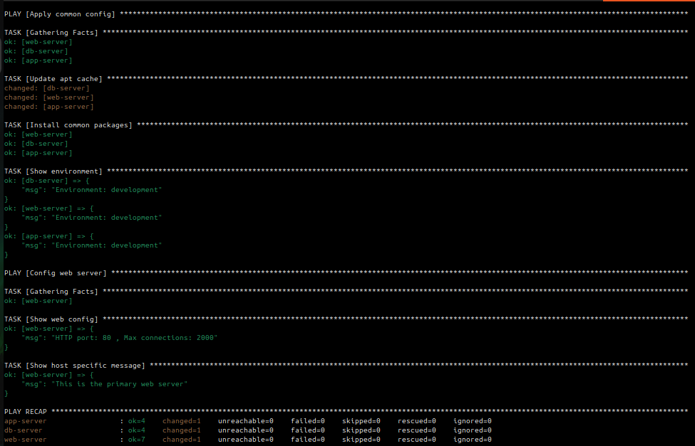


   - In `hosts:all` variables came from group_vars/all.yml
   - In `hosts:web` variable came from two files
      - `http_port` from group_vars/db.yml
      - `max_connections` & `custom_message` from hosts_vars/web-server.yml

**Document:** What is the variable precedence?
  > host_vars > group_vars > playbook vars, and `-e` overrides everything

---

## Task 3: Ansible Facts -- Gathering System Information
Ansible automatically collects "facts" about each managed node -- OS, IP, memory, CPU, disks, and hundreds more.

1. **See all facts for a host:**
```bash
ansible web-server -m setup
```

   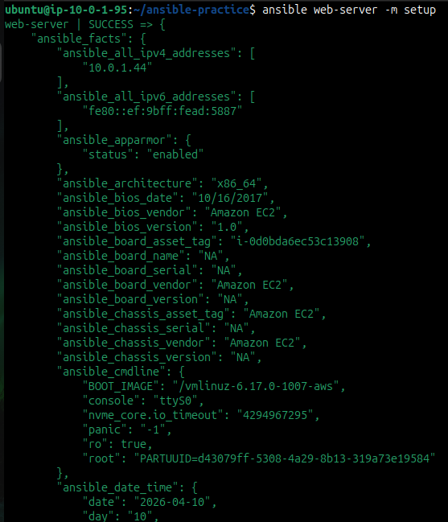

2. **Filter specific facts:**
```bash
ansible web-server -m setup -a "filter=ansible_os_family"
ansible web-server -m setup -a "filter=ansible_distribution*"
ansible web-server -m setup -a "filter=ansible_memtotal_mb"
ansible web-server -m setup -a "filter=ansible_default_ipv4"
```

   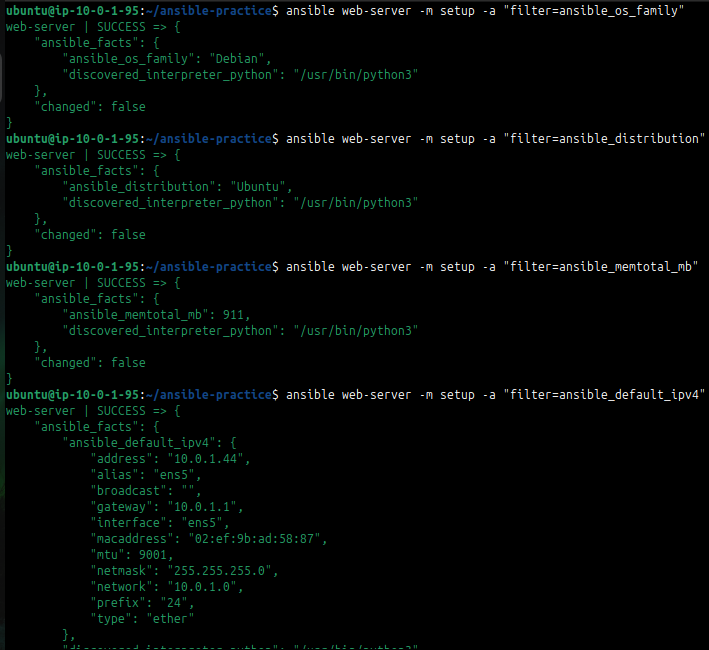

3. **Use facts in a playbook** -- create `facts-demo.yml`:
```yaml
---
- name: Facts demo
  hosts: all
  tasks:
    - name: Show OS info
      debug:
        msg: >
          Hostname: {{ ansible_hostname }},
          OS: {{ ansible_distribution }} {{ ansible_distribution_version }},
          RAM: {{ ansible_memtotal_mb }}MB,
          IP: {{ ansible_default_ipv4.address }}

    - name: Show all network interfaces
      debug:
        var: ansible_interfaces
```

Run it and observe the facts printed for each host.

   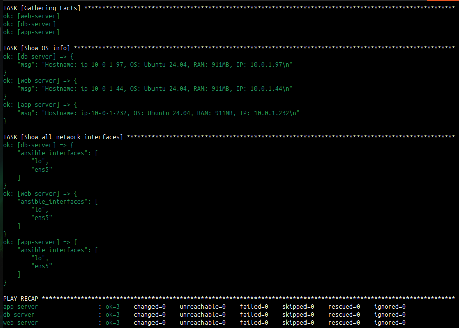

**Document:** Name five facts you would use in real playbooks and why.
   - `ansible_hostname` to identify the host and use it in configs/logs
   - `ansible_default_ipv4.address` to get the primary IP for networking tasks
   - `ansible_os_family` to apply OS-specific tasks (e.g., RedHat vs Debian)
   - `ansible_distribution` to handle version-specific package installs
   - `ansible_mounts` determine available disk space dynamically

---

## Task 4: Conditionals with when
Tasks should not always run on every host. Use `when` to control execution.

Create `conditional-demo.yml`:

```yaml
---
- name: Conditional tasks demo
  hosts: all
  become: true

  tasks:
    - name: Install Nginx (only on web servers)
      yum:
        name: nginx
        state: present
      when: "'web' in group_names"

    - name: Install MySQL (only on db servers)
      yum:
        name: mysql-server
        state: present
      when: "'db' in group_names"

    - name: Show warning on low memory hosts
      debug:
        msg: "WARNING: This host has less than 1GB RAM"
      when: ansible_memtotal_mb < 1024

    - name: Run only on Amazon Linux
      debug:
        msg: "This is an Amazon Linux machine"
      when: ansible_distribution == "Amazon"

    - name: Run only on Ubuntu
      debug:
        msg: "This is an Ubuntu machine"
      when: ansible_distribution == "Ubuntu"

    - name: Run only in production
      debug:
        msg: "Production settings applied"
      when: app_env == "production"

    - name: Multiple conditions (AND)
      debug:
        msg: "Web server with enough memory"
      when:
        - "'web' in group_names"
        - ansible_memtotal_mb >= 512

    - name: OR condition
      debug:
        msg: "Either web or app server"
      when: "'web' in group_names or 'app' in group_names"
```

Run it and observe which tasks are skipped on which hosts.

   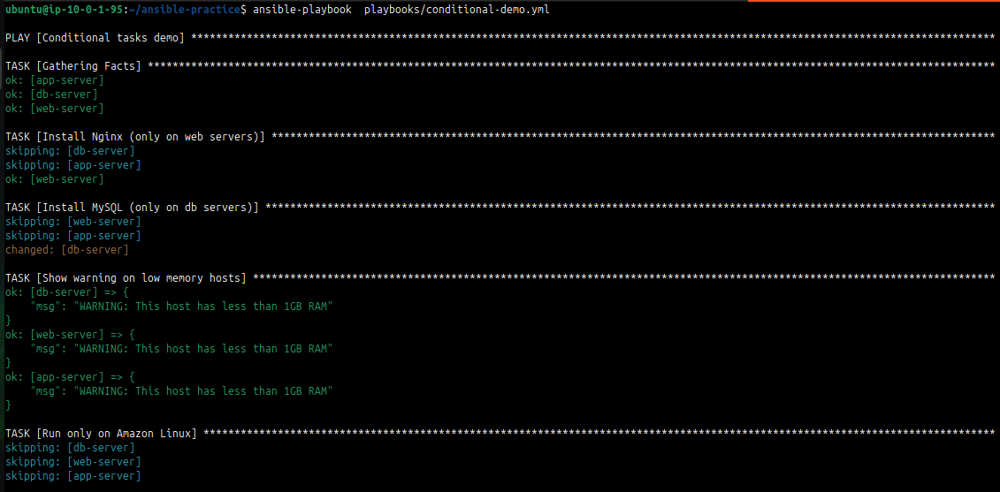
   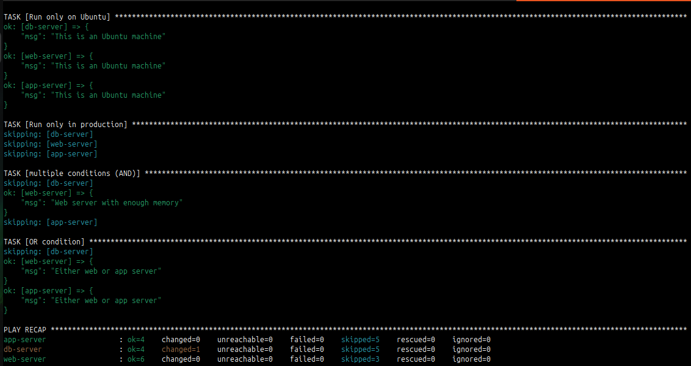

**Verify:** Are tasks correctly skipping on hosts that don't match the condition?
   - **YES**

---

## Task 5: Loops
Create `loops-demo.yml`:

```yaml
---
- name: Loops demo
  hosts: all
  become: true

  vars:
    users:
      - name: deploy
        groups: wheel
      - name: monitor
        groups: wheel
      - name: appuser
        groups: users

    directories:
      - /opt/app/logs
      - /opt/app/config
      - /opt/app/data
      - /opt/app/tmp

  tasks:
    - name: Create multiple users
      user:
        name: "{{ item.name }}"
        groups: "{{ item.groups }}" 
        state: present
      loop: "{{ users }}"

    - name: Create multiple directories
      file:
        path: "{{ item }}"
        state: directory
        mode: '0755'
      loop: "{{ directories }}"

    - name: Install multiple packages
      yum:
        name: "{{ item }}"
        state: present
      loop:
        - git
        - curl
        - unzip
        - jq

    - name: Print each user created
      debug:
        msg: "Created user {{ item.name }} in group {{ item.groups }}"
      loop: "{{ users }}"
```

Run it and observe the loop output -- each iteration is shown separately.

   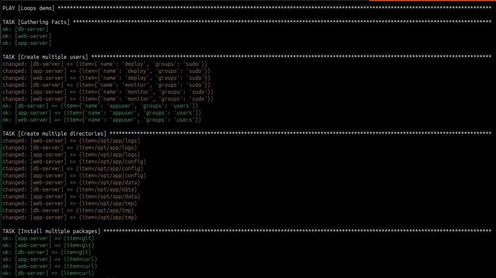
   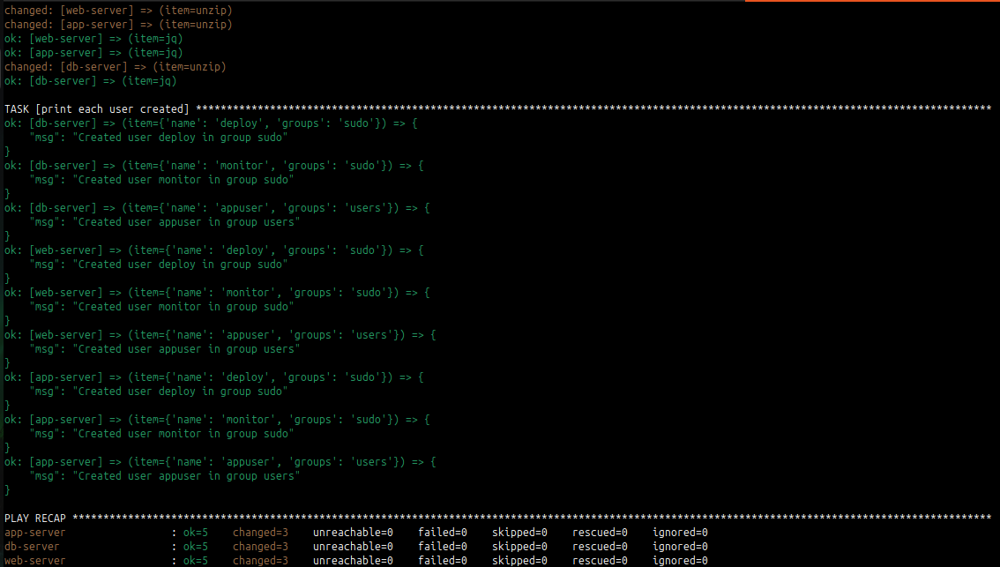

**Document:** What is the difference between `loop` and the older `with_items`? 
   - `with_items` is old looping syntax.
   - `loop` is the modern recommended syntax.

---

## Task 6: Register, Debug, and Combine Everything
Build a real-world playbook `server-report.yml` that combines variables, facts, conditionals, and register:

```yaml
---
- name: Server Health Report
  hosts: all

  tasks:
    - name: Check disk space
      command: df -h /
      register: disk_result

    - name: Check memory
      command: free -m
      register: memory_result

    - name: Check running services
      shell: systemctl list-units --type=service --state=running | head -20
      register: services_result

    - name: Generate report
      debug:
        msg:
          - "========== {{ inventory_hostname }} =========="
          - "OS: {{ ansible_distribution }} {{ ansible_distribution_version }}"
          - "IP: {{ ansible_default_ipv4.address }}"
          - "RAM: {{ ansible_memtotal_mb }}MB"
          - "Disk: {{ disk_result.stdout_lines[1] }}"
          - "Running services (first 20): {{ services_result.stdout_lines | length }}"

    - name: Flag if disk is critically low
      debug:
        msg: "ALERT: Check disk space on {{ inventory_hostname }}"
      when: "'9[0-9]%' in disk_result.stdout or '100%' in disk_result.stdout"

    - name: Save report to file
      copy:
        content: |
          Server: {{ inventory_hostname }}
          OS: {{ ansible_distribution }} {{ ansible_distribution_version }}
          IP: {{ ansible_default_ipv4.address }}
          RAM: {{ ansible_memtotal_mb }}MB
          Disk: {{ disk_result.stdout }}
          Checked at: {{ ansible_date_time.iso8601 }}
        dest: "/tmp/server-report-{{ inventory_hostname }}.txt"
      become: true
```

Run it and verify the report file is created on each server.

   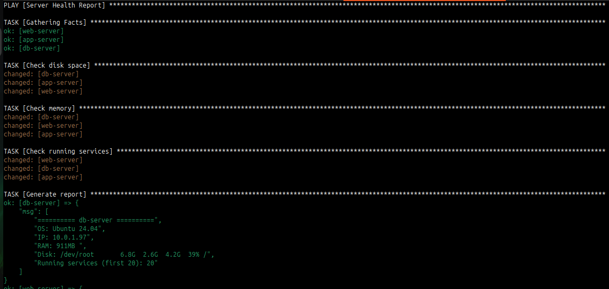
   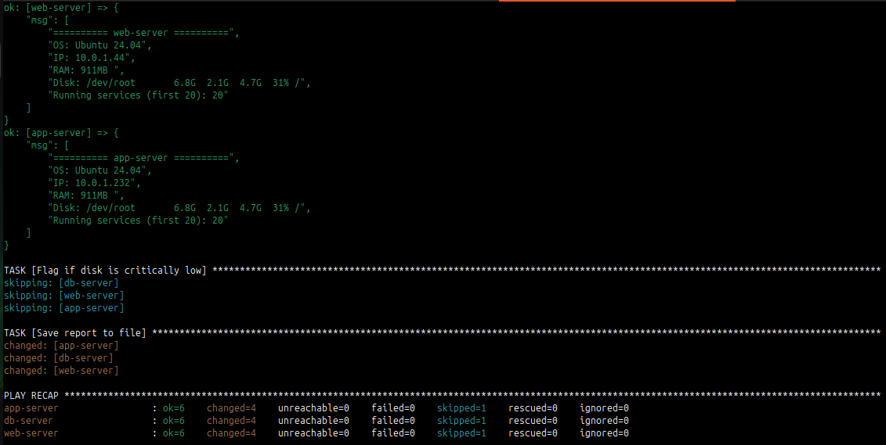

**Verify:** SSH into a server and read `/tmp/server-report-*.txt`. Does it contain accurate information? **YES**

   - **app server**
   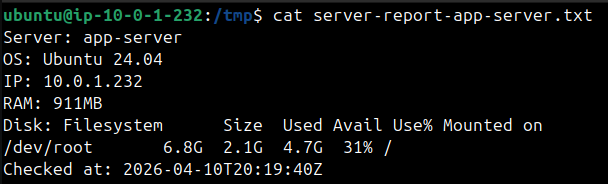

   - **db server**
   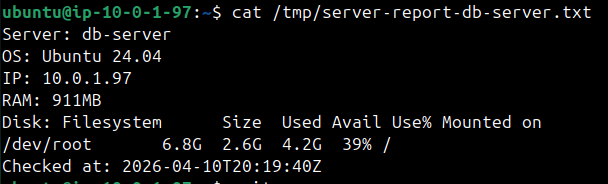

   - **web serve**
   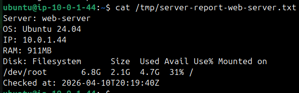

---
