# Day 74 -- Node Exporter, cAdvisor, and Grafana Dashboards

## Task 1: Add Node Exporter for Host Metrics
Node Exporter exposes Linux system metrics (CPU, memory, disk, filesystem, network) in Prometheus format.

Update your `docker-compose.yml` from Day 73 -- add the Node Exporter service:
```yaml
  node-exporter:
    image: prom/node-exporter:latest
    container_name: node-exporter
    ports:
      - "9100:9100"
    volumes:
      - /proc:/host/proc:ro
      - /sys:/host/sys:ro
      - /:/rootfs:ro
    command:
      - '--path.procfs=/host/proc'
      - '--path.sysfs=/host/sys'
      - '--path.rootfs=/rootfs'
      - '--collector.filesystem.mount-points-exclude=^/(sys|proc|dev|host|etc)($$|/)'
    restart: unless-stopped
```

**Why these volume mounts?**
- `/proc` -- kernel and process information (CPU stats, memory info)
- `/sys` -- hardware and driver details
- `/` -- filesystem usage (disk space)

All mounted read-only (`ro`) -- Node Exporter only reads, never modifies.

Add it as a scrape target in `prometheus.yml`:
```yaml
scrape_configs:
  - job_name: "prometheus"
    static_configs:
      - targets: ["localhost:9090"]

  - job_name: "node-exporter"
    static_configs:
      - targets: ["node-exporter:9100"]
```

Restart the stack:
```bash
docker compose up -d
```

Verify Node Exporter is healthy:
```bash
curl http://localhost:9100/metrics | head -20
```

   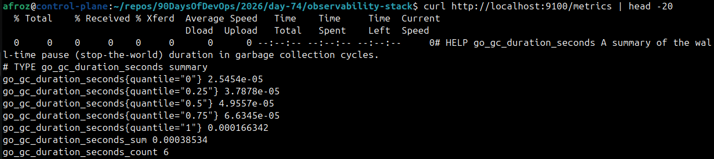

Check Prometheus Targets page -- `node-exporter` should show as `UP`.

   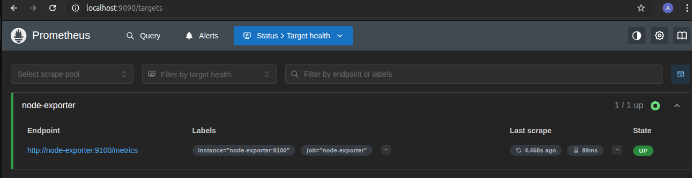

Run these queries in Prometheus to see host metrics:

- CPU: percentage of time spent idle (per core)
   - node_cpu_seconds_total{mode="idle"}

   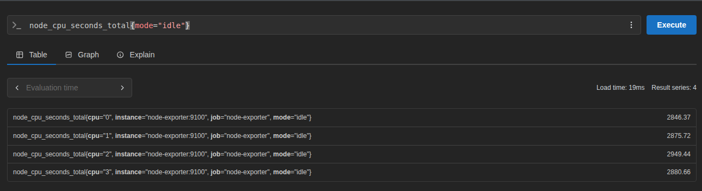

- Memory: total vs available
  - node_memory_MemTotal_bytes (in GB)

   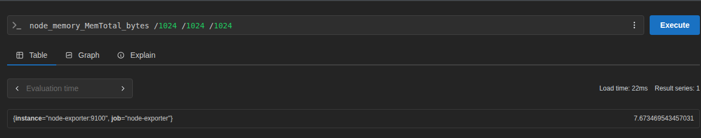

  - node_memory_MemAvailable_bytes (in GB)

   

- Memory usage percentage
   - (1 - node_memory_MemAvailable_bytes / node_memory_MemTotal_bytes) * 100

   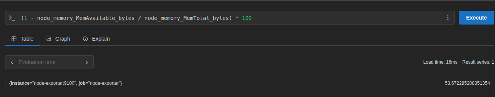

- Disk: filesystem usage percentage
   - (1 - node_filesystem_avail_bytes / node_filesystem_size_bytes) * 100

   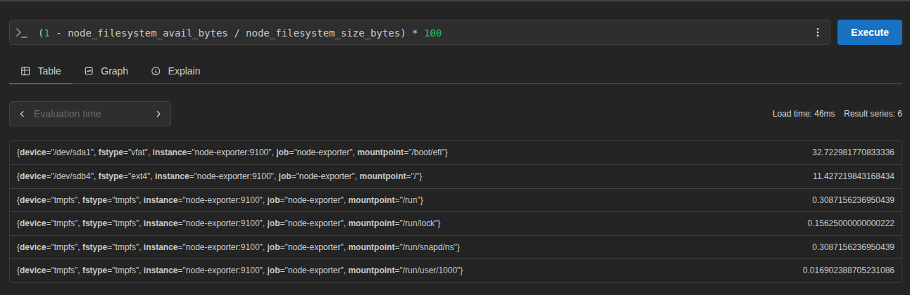

- Network: bytes received per second
   - rate(node_network_receive_bytes_total[5m])

   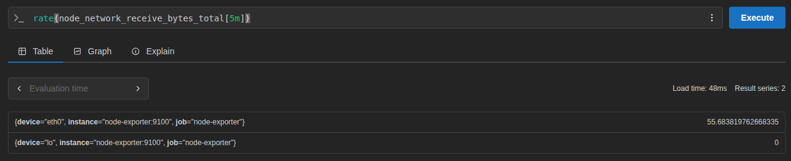

---

## Task 2: Add cAdvisor for Container Metrics
cAdvisor (Container Advisor) monitors resource usage and performance of running Docker containers.

Add it to your `docker-compose.yml`:
```yaml
  cadvisor:
    image: gcr.io/cadvisor/cadvisor:latest
    container_name: cadvisor
    ports:
      - "8080:8080"
    volumes:
      - /var/run/docker.sock:/var/run/docker.sock:ro
      - /sys:/sys:ro
      - /var/lib/docker/:/var/lib/docker:ro
    restart: unless-stopped
```

**Why these volume mounts?**
- Docker socket (`docker.sock`) -- lets cAdvisor discover and query running containers
- `/sys` -- kernel-level container stats (cgroups)
- `/var/lib/docker/` -- container filesystem information

Add cAdvisor as a Prometheus scrape target:
```yaml
  - job_name: "cadvisor"
    static_configs:
      - targets: ["cadvisor:8080"]
```

Restart and verify:
```bash
docker compose up -d
```

Open `http://localhost:8080` to see the cAdvisor web UI. Click on Docker Containers to see per-container stats.

   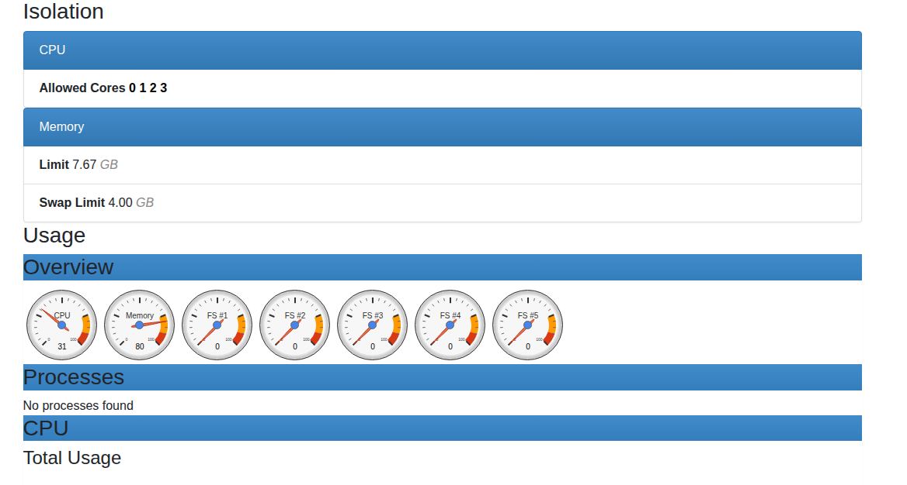

Run these queries in Prometheus:

- CPU usage per container (in seconds)
   - rate(container_cpu_usage_seconds_total{name!=""}[5m]) #Did not work for me(name label dos not exists)

   - rate(container_cpu_usage_seconds_total{id=~".*docker.*scope"}[5m])

   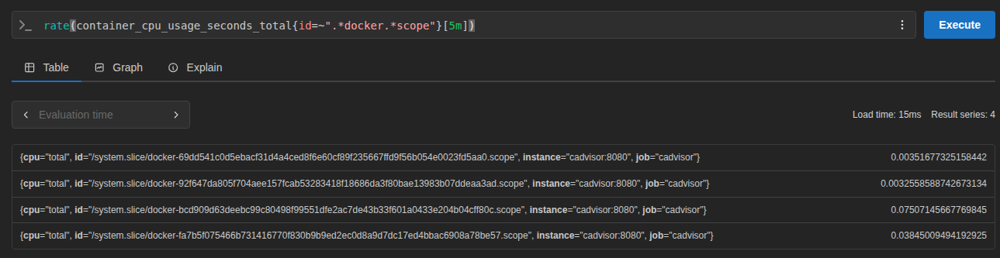

- Memory usage per container
   - container_memory_usage_bytes{id=~".*docker.*scope"} (in MB)

   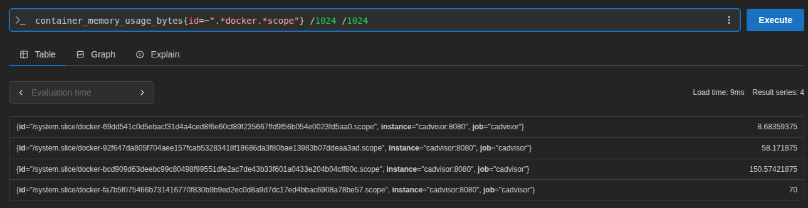

- Network received bytes per container
   - rate(container_network_receive_bytes_total{id=~".*docker.*scope"}[5m])

   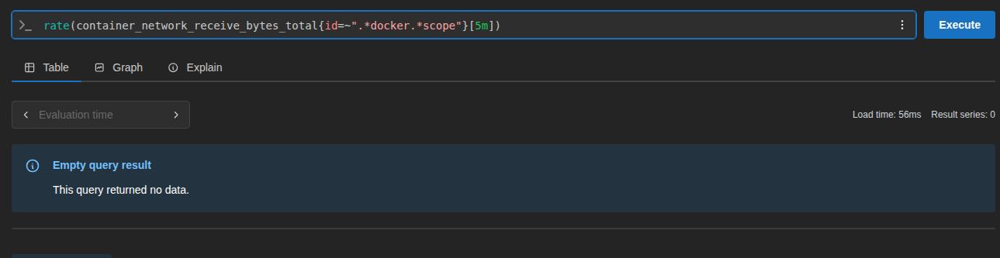

- Which container is using the most memory?
   - topk(3, container_memory_usage_bytes{id=~".*docker.*scope"}) (in MB)

   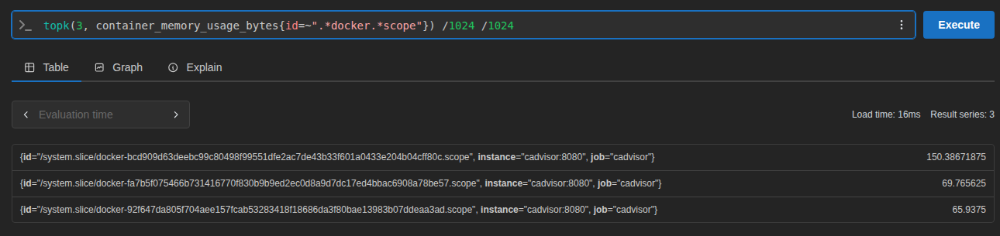

The `{name!=""}` filter removes aggregated/system-level entries and shows only named containers.
Since the `{name!=""}` was not working, I replaced it with `{id=~".*docker.*scope"}`.

**Document:** What is the difference between Node Exporter and cAdvisor? When would you use each?
   - `Node Exporter`exposes host OS & hardware metrics (CPU, memory, disk, network). Use it to monitor physical/virtual machine health.
   - `cAdvisor` exposes container-level metrics (CPU, memory, network per container). Use it to monitor Docker/Kubernetes container performance.

---

## Task 3: Set Up Grafana
Grafana is the visualization layer. It connects to Prometheus (and later Loki) and lets you build dashboards, set alerts, and share views with your team.

Add Grafana to your `docker-compose.yml`:
```yaml
  grafana:
    image: grafana/grafana-enterprise:latest
    container_name: grafana
    ports:
      - "3000:3000"
    volumes:
      - grafana_data:/var/lib/grafana
    environment:
      - GF_SECURITY_ADMIN_USER=admin
      - GF_SECURITY_ADMIN_PASSWORD=admin123
    restart: unless-stopped
```

Add the volume at the bottom of your compose file:
```yaml
volumes:
  prometheus_data:
  grafana_data:
```

Restart:
```bash
docker compose up -d
```

Open `http://localhost:3000`. Log in with `admin` / `admin123`.

**Add Prometheus as a datasource:**
1. Go to Connections > Data Sources > Add data source
2. Select Prometheus
3. Set URL to `http://prometheus:9090` (use the container name, not localhost -- they are on the same Docker network)
4. Click Save & Test -- you should see "Successfully queried the Prometheus API"

   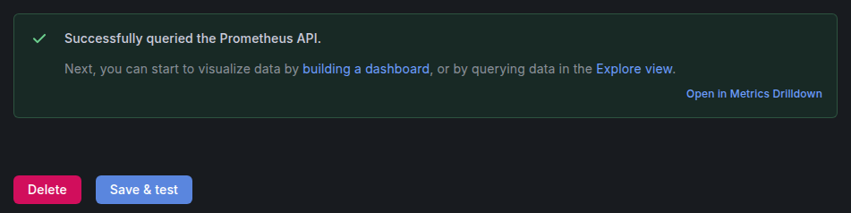

---

## Task 4: Build Your First Dashboard
Create a dashboard that shows the health of your system at a glance.

1. Go to Dashboards > New Dashboard > Add Visualization
2. Select Prometheus as the datasource

**Panel 1 -- CPU Usage (Gauge):**
```promql
100 - (avg(rate(node_cpu_seconds_total{mode="idle"}[5m])) * 100)
```
- Visualization: Gauge
- Title: "CPU Usage %"
- Set thresholds: green < 60, yellow < 80, red >= 80

**Panel 2 -- Memory Usage (Gauge):**
```promql
(1 - node_memory_MemAvailable_bytes / node_memory_MemTotal_bytes) * 100
```
- Visualization: Gauge
- Title: "Memory Usage %"

**Panel 3 -- Container CPU Usage (Time Series):**
```promql
rate(container_cpu_usage_seconds_total{id=~".*docker.*scope"}[5m]) * 100
```
- Visualization: Time series
- Title: "Container CPU Usage"
- Legend: `{{name}}`

**Panel 4 -- Container Memory Usage (Bar Chart):**
```promql
container_memory_usage_bytes{id=~".*docker.*scope"} / 1024 / 1024
```
- Visualization: Bar chart
- Title: "Container Memory (MB)"
- Legend: `{{name}}`

**Panel 5 -- Disk Usage (Stat):**
```promql
(1 - node_filesystem_avail_bytes{mountpoint="/"} / node_filesystem_size_bytes{mountpoint="/"}) * 100
```
- Visualization: Stat
- Title: "Disk Usage %"

Save the dashboard as "DevOps Observability Overview".

   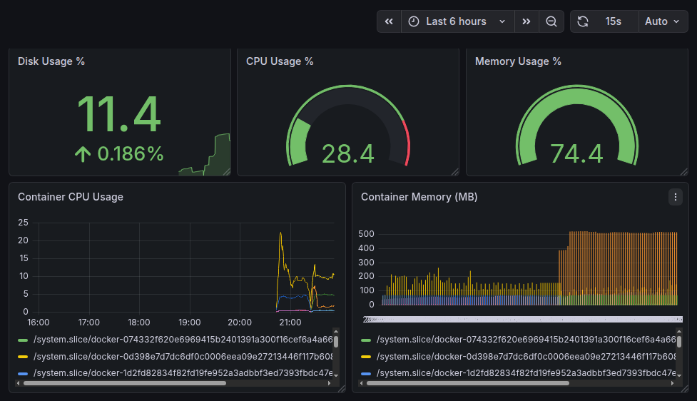

---

## Task 5: Auto-Provision Datasources with YAML
In production, you do not click through the UI to add datasources. You provision them with configuration files so the setup is repeatable.

Create the provisioning directory structure:
```bash
mkdir -p grafana/provisioning/datasources
mkdir -p grafana/provisioning/dashboards
```

Create `grafana/provisioning/datasources/datasources.yml`:
```yaml
apiVersion: 1

datasources:
  - name: Prometheus
    type: prometheus
    access: proxy
    url: http://prometheus:9090
    isDefault: true
    editable: false
```

Update the Grafana service in `docker-compose.yml` to mount the provisioning directory:
```yaml
  grafana:
    image: grafana/grafana-enterprise:latest
    container_name: grafana
    ports:
      - "3000:3000"
    volumes:
      - grafana_data:/var/lib/grafana
      - ./grafana/provisioning:/etc/grafana/provisioning
    environment:
      - GF_SECURITY_ADMIN_USER=admin
      - GF_SECURITY_ADMIN_PASSWORD=admin123
    restart: unless-stopped
```

Restart Grafana:
```bash
docker compose up -d grafana
```

Check Connections > Data Sources -- Prometheus should already be there without any manual setup.

   - `Default is manually added, the other prometheus is provisioned by config.

   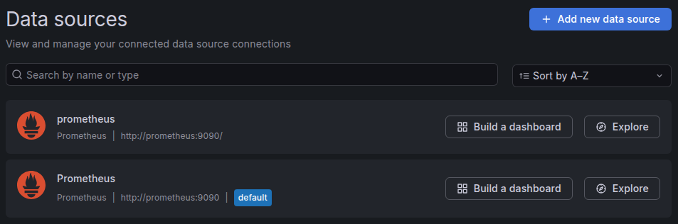

**Document:** Why is provisioning datasources via YAML better than configuring them manually through the UI?
  - Auto cofigured on startup.
  - YAML files in git tracks changes, roll back if neede.
  - Same config can be used accross different environment.

---

## Task 6: Import a Community Dashboard
The Grafana community maintains thousands of pre-built dashboards. Import one for Node Exporter:

1. Go to Dashboards > New > Import
2. Enter dashboard ID: **1860** (Node Exporter Full)
3. Select your Prometheus datasource
4. Click Import

Explore the imported dashboard. It has dozens of panels covering CPU, memory, disk, network, and more -- all built on the same Node Exporter metrics you queried manually.

   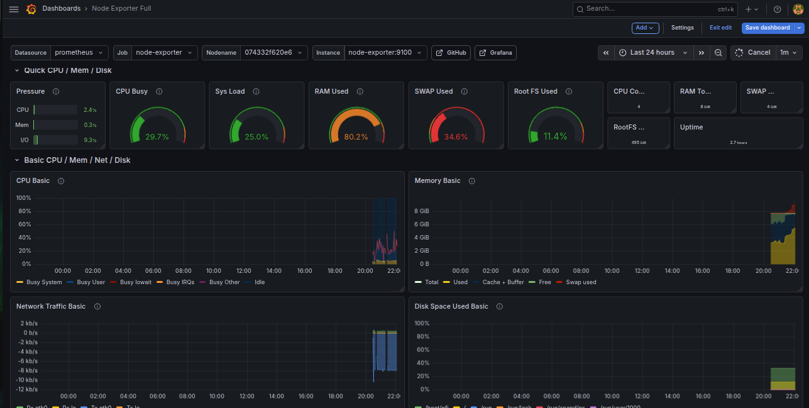

**Try another one:** Import dashboard ID **193** (Docker monitoring via cAdvisor). Select Prometheus as the datasource and explore container-level stats.

   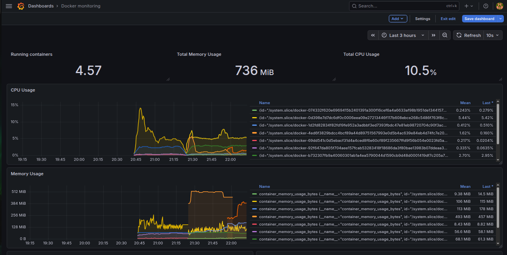

**Your full `docker-compose.yml` should now have these services:**
- `prometheus`
- `node-exporter`
- `cadvisor`
- `grafana`
- `notes-app` (from Day 73)

Verify all are running:
```bash
docker compose ps
```

   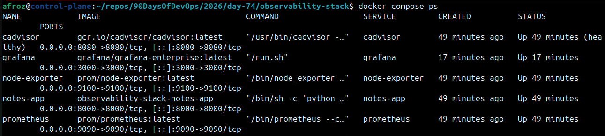

---

- How datasource provisioning works via YAML

   - Create the provisioning directory structure:
    ```bash
    mkdir -p grafana/provisioning/datasources
    mkdir -p grafana/provisioning/dashboards
    ```

   - Create YAML file `grafana/provisioning/datasources/datasources.yml`:
    ```yaml
    apiVersion: 1

    datasources:
    - name: Prometheus
        type: prometheus
        access: proxy
        url: http://prometheus:9090
        isDefault: true
        editable: false
    ```

   - Update the Grafana service in `docker-compose.yml` to mount the provisioning directory:
    ```yaml
        volumes:
        - grafana_data:/var/lib/grafana
        - ./grafana/provisioning:/etc/grafana/provisioning
    ```
   - Datasource ready

    >  Check Connections > Data Sources -- Prometheus should already be there without any manual setup.


---

### reload only prometheus.yml config
curl -X POST http://localhost:9090/-/reload
