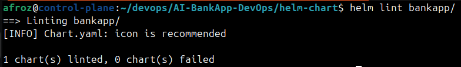
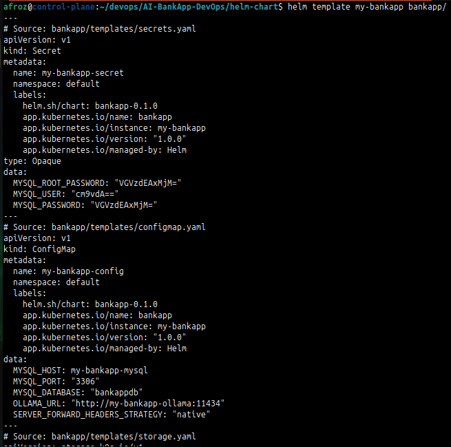
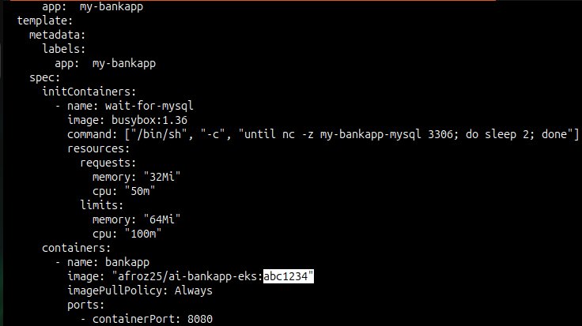
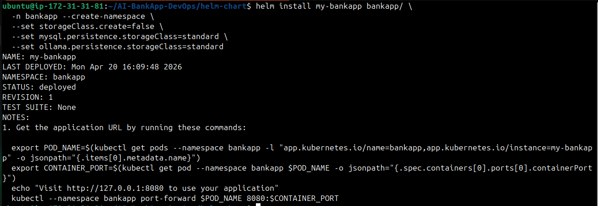
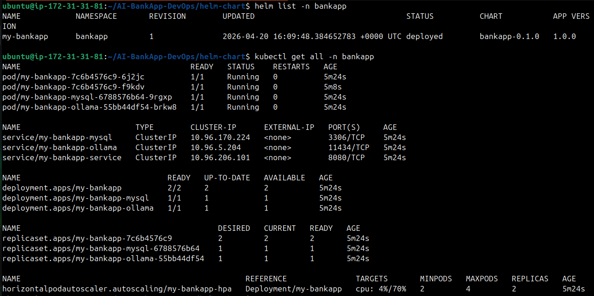
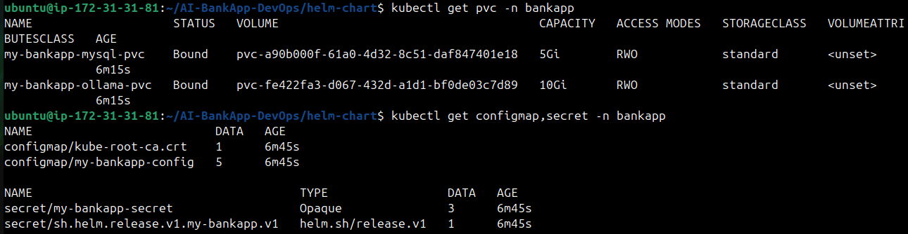
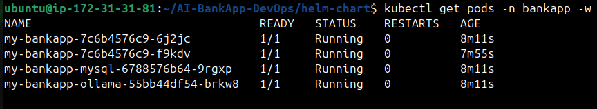
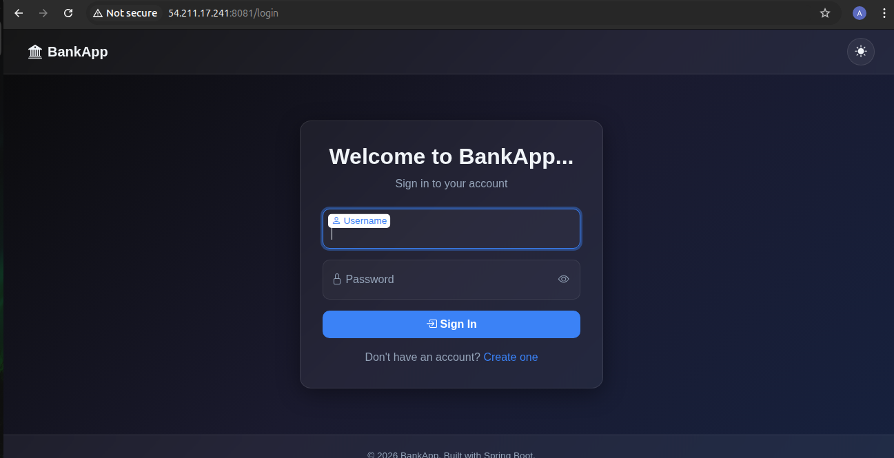

# Day 79 -- Creating a Custom Helm Chart for AI-BankApp

## Task 1: Scaffold the Chart and Study the Raw Manifests
Make sure you have the AI-BankApp repo cloned:
```bash
cd AI-BankApp-DevOps
```

Study the raw manifests you are converting:
```bash
ls k8s/
```

Map each file to what it does:

| File | Purpose |
|------|---------|
| `namespace.yml` | Creates `bankapp` namespace |
| `configmap.yml` | MySQL host, port, database, Ollama URL |
| `secrets.yml` | MySQL credentials (base64 encoded) |
| `pv.yml` | StorageClass (gp3 via EBS CSI) |
| `pvc.yml` | PVCs for MySQL (5Gi) and Ollama (10Gi) |
| `bankapp-deployment.yml` | BankApp with init containers, probes, envFrom |
| `mysql-deployment.yml` | MySQL with EBS volume mount, probes |
| `ollama-deployment.yml` | Ollama with postStart model pull, probes |
| `service.yml` | ClusterIP services for all 3 components |
| `hpa.yml` | HPA for BankApp (2-4 replicas, 70% CPU) |
| `gateway.yml` | Envoy Gateway + HTTPRoute + TLS |
| `cert-manager.yml` | Let's Encrypt ClusterIssuer |

Now scaffold a Helm chart:
```bash
mkdir helm-chart && cd helm-chart
helm create bankapp
```

Delete the generated template files -- you will write your own from the raw manifests:
```bash
rm -rf bankapp/templates/*.yaml bankapp/templates/tests/
```

Keep `_helpers.tpl` and `NOTES.txt` -- you will customize them.

---

## Task 2: Define Chart.yaml and values.yaml
Edit `bankapp/Chart.yaml`:
```yaml
apiVersion: v2
name: bankapp
description: AI-BankApp -- Spring Boot banking application with MySQL and Ollama AI chatbot
type: application
version: 0.1.0
appVersion: "1.0.0"
maintainers:
  - name: TrainWithShubham
    url: https://github.com/TrainWithShubham
keywords:
  - bankapp
  - spring-boot
  - mysql
  - ollama
  - ai
```

Now create `bankapp/values.yaml` -- extract every hardcoded value from the raw manifests into configurable values:
```yaml
# BankApp configuration
bankapp: # Root key for application settings
  replicaCount: 4  # Number of application pods
  image:
    repository: trainwithshubham/ai-bankapp-eks  # Docker image repository
    tag: "latest"  # Image tag/version
    pullPolicy: Always  # Always pull image on deploy
  resources:
    requests:
      memory: "256Mi"  # Minimum memory required
      cpu: "250m"      # Minimum CPU required
    limits:
      memory: "512Mi"  # Maximum memory allowed
      cpu: "500m"      # Maximum CPU allowed
  service:
    type: ClusterIP  # Internal Kubernetes service
    port: 8080       # Service port
  autoscaling:
    enabled: true  # Enable Horizontal Pod Autoscaler
    minReplicas: 2  # Minimum number of pods
    maxReplicas: 4  # Maximum number of pods
    targetCPUUtilization: 70  # CPU % threshold for scaling

# MySQL configuration
mysql:
  enabled: true  # Deploy MySQL or not
  image:
    repository: mysql  # MySQL image
    tag: "8.0"         # MySQL version
  resources:
    requests:
      memory: "256Mi"  # Minimum memory
      cpu: "250m"      # Minimum CPU
    limits:
      memory: "512Mi"  # Maximum memory
      cpu: "500m"      # Maximum CPU
  persistence:
    size: 5Gi  # Persistent volume size
    storageClass: gp3  # Storage class name

# Ollama AI configuration
ollama:
  enabled: true  # Enable Ollama deployment
  image:
    repository: ollama/ollama  # Ollama image
    tag: "latest"  # Image version
  model: tinyllama  # Model to load at startup
  resources:
    requests:
      memory: "2Gi"  # Minimum memory
      cpu: "900m"    # Minimum CPU 
    limits:
      memory: "2.5Gi"  # Maximum memory
      cpu: "1500m"     # Maximum CPU
  persistence:
    size: 10Gi  # Storage for models/data
    storageClass: gp3  # Storage class

# Shared configuration
config:
  mysqlDatabase: bankappdb  # Database name used by app
  ollamaUrl: ""  # Auto-generated from service name if empty

# Secrets
secrets:
  mysqlRootPassword: Test@123  # Root password
  mysqlUser: root  # Application DB user
  mysqlPassword: Test@123  # Application DB password
  
# StorageClass configuration
storageClass:
  create: true  # Whether to create storage class
  name: gp3  # Storage class name
  provisioner: ebs.csi.aws.com  # AWS EBS CSI provisioner

# Gateway (optional -- for EKS with Envoy Gateway)
gateway:
  enabled: false  # Enable ingress/gateway
  hostname: ""  # DNS hostname (e.g bankapp.example.com)
  tls:
    enabled: false  # Enable/Disable HTTPS/TLS
```

**Compare:** The raw `k8s/secrets.yml` has base64-encoded credentials hardcoded. The Helm chart uses `values.yaml` and templates the Secret, so each environment can override credentials without editing YAML.

---

## Task 3: Write the Core Templates
Convert the raw manifests into Helm templates. Each template uses `{{ .Values }}` instead of hardcoded values.

**`bankapp/templates/configmap.yaml`** (from `k8s/configmap.yml`):
```yaml
apiVersion: v1
kind: ConfigMap
metadata:
  name: {{ include "bankapp.fullname" . }}-config
  namespace: {{ .Release.Namespace }}
  labels:
    {{- include "bankapp.labels" . | nindent 4 }}
data:
  MYSQL_HOST: {{ include "bankapp.fullname" . }}-mysql
  MYSQL_PORT: "3306"
  MYSQL_DATABASE: {{ .Values.config.mysqlDatabase | quote }}
  OLLAMA_URL: {{ default (printf "http://%s-ollama:11434" (include "bankapp.fullname" .)) .Values.config.ollamaUrl | quote }}
  SERVER_FORWARD_HEADERS_STRATEGY: "native"
```

**`bankapp/templates/secrets.yaml`** (from `k8s/secrets.yml`):
```yaml
apiVersion: v1
kind: Secret
metadata:
  name: {{ include "bankapp.fullname" . }}-secret
  namespace: {{ .Release.Namespace }}
  labels:
    {{- include "bankapp.labels" . | nindent 4 }}
type: Opaque
data:
  MYSQL_ROOT_PASSWORD: {{ .Values.secrets.mysqlRootPassword | b64enc | quote }}
  MYSQL_USER: {{ .Values.secrets.mysqlUser | b64enc | quote }}
  MYSQL_PASSWORD: {{ .Values.secrets.mysqlPassword | b64enc | quote }}
```

Notice: `b64enc` automatically base64 encodes the values. No more manual encoding.

**`bankapp/templates/storage.yaml`** (from `k8s/pv.yml` + `k8s/pvc.yml`):
```yaml
{{- if .Values.storageClass.create }}
apiVersion: storage.k8s.io/v1
kind: StorageClass
metadata:
  name: {{ .Values.storageClass.name }}
provisioner: {{ .Values.storageClass.provisioner }}
parameters:
  type: gp3
  fsType: ext4
reclaimPolicy: Delete
volumeBindingMode: WaitForFirstConsumer
allowVolumeExpansion: true
{{- end }}
---
{{- if .Values.mysql.enabled }}
apiVersion: v1
kind: PersistentVolumeClaim
metadata:
  name: {{ include "bankapp.fullname" . }}-mysql-pvc
  namespace: {{ .Release.Namespace }}
  labels:
    {{- include "bankapp.labels" . | nindent 4 }}
spec:
  storageClassName: {{ .Values.mysql.persistence.storageClass }}
  accessModes:
    - ReadWriteOnce
  resources:
    requests:
      storage: {{ .Values.mysql.persistence.size }}
{{- end }}
---
{{- if .Values.ollama.enabled }}
apiVersion: v1
kind: PersistentVolumeClaim
metadata:
  name: {{ include "bankapp.fullname" . }}-ollama-pvc
  namespace: {{ .Release.Namespace }}
  labels:
    {{- include "bankapp.labels" . | nindent 4 }}
spec:
  storageClassName: {{ .Values.ollama.persistence.storageClass }}
  accessModes:
    - ReadWriteOnce
  resources:
    requests:
      storage: {{ .Values.ollama.persistence.size }}
{{- end }}
```

---

## Task 4: Write the Deployment Templates
**`bankapp/templates/bankapp-deployment.yaml`** (from `k8s/bankapp-deployment.yml`):
```yaml
apiVersion: apps/v1
kind: Deployment
metadata:
  name: {{ include "bankapp.fullname" . }}
  namespace: {{ .Release.Namespace }}
  labels:
    {{- include "bankapp.labels" . | nindent 4 }}
spec:
  {{- if not .Values.bankapp.autoscaling.enabled }}
  replicas: {{ .Values.bankapp.replicaCount }}
  {{- end }}
  selector:
    matchLabels:
      app: {{ include "bankapp.fullname" . }}
  template:
    metadata:
      labels:
        app: {{ include "bankapp.fullname" . }}
    spec:
      initContainers:
        - name: wait-for-mysql
          image: busybox:1.36
          command: ["/bin/sh", "-c", "until nc -z {{ include "bankapp.fullname" . }}-mysql 3306; do sleep 2; done"]
          resources:
            requests: { memory: "32Mi", cpu: "50m" }
            limits: { memory: "64Mi", cpu: "100m" }
        {{- if .Values.ollama.enabled }}
        - name: wait-for-ollama
          image: busybox:1.36
          command: ["/bin/sh", "-c", "until nc -z {{ include "bankapp.fullname" . }}-ollama 11434; do sleep 2; done"]
          resources:
            requests: { memory: "32Mi", cpu: "50m" }
            limits: { memory: "64Mi", cpu: "100m" }
        {{- end }}
      containers:
        - name: bankapp
          image: "{{ .Values.bankapp.image.repository }}:{{ .Values.bankapp.image.tag }}"
          imagePullPolicy: {{ .Values.bankapp.image.pullPolicy }}
          ports:
            - containerPort: 8080
          envFrom:
            - configMapRef:
                name: {{ include "bankapp.fullname" . }}-config
            - secretRef:
                name: {{ include "bankapp.fullname" . }}-secret
          {{- with .Values.bankapp.resources }}
          resources:
            {{- toYaml . | nindent 12 }}
          {{- end }}
          readinessProbe:
            httpGet:
              path: /actuator/health
              port: 8080
            initialDelaySeconds: 30
            failureThreshold: 15
          livenessProbe:
            httpGet:
              path: /actuator/health
              port: 8080
            initialDelaySeconds: 60
            periodSeconds: 10
            failureThreshold: 5
```

**Key template decisions:**
- Init containers dynamically reference the MySQL and Ollama service names via `{{ include "bankapp.fullname" . }}`
- Ollama init container is conditional (`{{- if .Values.ollama.enabled }}`)
- Health probes use `/actuator/health` -- Spring Boot's built-in health endpoint
- `replicas` is omitted when HPA is enabled (HPA manages the count)

**`bankapp/templates/mysql-deployment.yaml`** (from `k8s/mysql-deployment.yml`):
```yaml
{{- if .Values.mysql.enabled }}
apiVersion: apps/v1
kind: Deployment
metadata:
  name: {{ include "bankapp.fullname" . }}-mysql
  namespace: {{ .Release.Namespace }}
  labels:
    {{- include "bankapp.labels" . | nindent 4 }}
spec:
  selector:
    matchLabels:
      app: {{ include "bankapp.fullname" . }}-mysql
  strategy:
    type: Recreate
  template:
    metadata:
      labels:
        app: {{ include "bankapp.fullname" . }}-mysql
    spec:
      containers:
        - name: mysql
          image: "{{ .Values.mysql.image.repository }}:{{ .Values.mysql.image.tag }}"
          ports:
            - containerPort: 3306
          env:
            - name: MYSQL_ROOT_PASSWORD
              valueFrom:
                secretKeyRef:
                  name: {{ include "bankapp.fullname" . }}-secret
                  key: MYSQL_ROOT_PASSWORD
            - name: MYSQL_DATABASE
              valueFrom:
                configMapKeyRef:
                  name: {{ include "bankapp.fullname" . }}-config
                  key: MYSQL_DATABASE
          {{- with .Values.mysql.resources }}
          resources:
            {{- toYaml . | nindent 12 }}
          {{- end }}
          volumeMounts:
            - name: mysql-storage
              mountPath: /var/lib/mysql
          readinessProbe:
            exec:
              command: ["mysqladmin", "ping", "-h", "localhost"]
            initialDelaySeconds: 15
            failureThreshold: 10
          livenessProbe:
            exec:
              command: ["mysqladmin", "ping", "-h", "localhost"]
            initialDelaySeconds: 30
            periodSeconds: 10
            failureThreshold: 5
      volumes:
        - name: mysql-storage
          persistentVolumeClaim:
            claimName: {{ include "bankapp.fullname" . }}-mysql-pvc
{{- end }}
```

**`bankapp/templates/ollama-deployment.yaml`** (from `k8s/ollama-deployment.yml`):
```yaml
{{- if .Values.ollama.enabled }}
apiVersion: apps/v1
kind: Deployment
metadata:
  name: {{ include "bankapp.fullname" . }}-ollama
  namespace: {{ .Release.Namespace }}
  labels:
    {{- include "bankapp.labels" . | nindent 4 }}
spec:
  selector:
    matchLabels:
      app: {{ include "bankapp.fullname" . }}-ollama
  strategy:
    type: Recreate
  template:
    metadata:
      labels:
        app: {{ include "bankapp.fullname" . }}-ollama
    spec:
      containers:
        - name: ollama
          image: "{{ .Values.ollama.image.repository }}:{{ .Values.ollama.image.tag }}"
          ports:
            - containerPort: 11434
          {{- with .Values.ollama.resources }}
          resources:
            {{- toYaml . | nindent 12 }}
          {{- end }}
          volumeMounts:
            - name: ollama-storage
              mountPath: /root/.ollama
          lifecycle:
            postStart:
              exec:
                command:
                  - /bin/sh
                  - -c
                  - |
                    until ollama list > /dev/null 2>&1; do sleep 2; done
                    ollama pull {{ .Values.ollama.model }}
          readinessProbe:
            exec:
              command: ["/bin/sh", "-c", "ollama list | grep -q {{ .Values.ollama.model }}"]
            initialDelaySeconds: 30
            failureThreshold: 30
          livenessProbe:
            httpGet:
              path: /
              port: 11434
            initialDelaySeconds: 60
            periodSeconds: 10
            failureThreshold: 5
      volumes:
        - name: ollama-storage
          persistentVolumeClaim:
            claimName: {{ include "bankapp.fullname" . }}-ollama-pvc
{{- end }}
```

Notice: the Ollama model name (`tinyllama`) is now a value (`{{ .Values.ollama.model }}`). You can switch models without editing YAML.

---

## Task 5: Write the Services and HPA Templates
**`bankapp/templates/services.yaml`** (from `k8s/service.yml`):
```yaml
apiVersion: v1
kind: Service
metadata:
  name: {{ include "bankapp.fullname" . }}-mysql
  namespace: {{ .Release.Namespace }}
spec:
  selector:
    app: {{ include "bankapp.fullname" . }}-mysql
  ports:
    - port: 3306
---
{{- if .Values.ollama.enabled }}
apiVersion: v1
kind: Service
metadata:
  name: {{ include "bankapp.fullname" . }}-ollama
  namespace: {{ .Release.Namespace }}
spec:
  selector:
    app: {{ include "bankapp.fullname" . }}-ollama
  ports:
    - port: 11434
{{- end }}
---
apiVersion: v1
kind: Service
metadata:
  name: {{ include "bankapp.fullname" . }}-service
  namespace: {{ .Release.Namespace }}
spec:
  type: {{ .Values.bankapp.service.type }}
  sessionAffinity: ClientIP
  sessionAffinityConfig:
    clientIP:
      timeoutSeconds: 3600
  selector:
    app: {{ include "bankapp.fullname" . }}
  ports:
    - port: {{ .Values.bankapp.service.port }}
      targetPort: 8080
```

**`bankapp/templates/hpa.yaml`** (from `k8s/hpa.yml`):
```yaml
{{- if .Values.bankapp.autoscaling.enabled }}
apiVersion: autoscaling/v2
kind: HorizontalPodAutoscaler
metadata:
  name: {{ include "bankapp.fullname" . }}-hpa
  namespace: {{ .Release.Namespace }}
  labels:
    {{- include "bankapp.labels" . | nindent 4 }}
spec:
  scaleTargetRef:
    apiVersion: apps/v1
    kind: Deployment
    name: {{ include "bankapp.fullname" . }}
  minReplicas: {{ .Values.bankapp.autoscaling.minReplicas }}
  maxReplicas: {{ .Values.bankapp.autoscaling.maxReplicas }}
  metrics:
    - type: Resource
      resource:
        name: cpu
        target:
          type: Utilization
          averageUtilization: {{ .Values.bankapp.autoscaling.targetCPUUtilization }}
  behavior:
    scaleUp:
      stabilizationWindowSeconds: 30
      policies:
        - type: Pods
          value: 2
          periodSeconds: 60
    scaleDown:
      stabilizationWindowSeconds: 300
      policies:
        - type: Pods
          value: 1
          periodSeconds: 60
{{- end }}
```

---

## Task 6: Validate and Deploy
**Lint the chart:**
```bash
helm lint bankapp/
```

   
   
**Render templates locally** -- see the final YAML without deploying:
```bash
helm template my-bankapp bankapp/
```

Review the output. Every `{{ }}` should be resolved to actual values.

   

**Render with overrides:**
```bash
helm template my-bankapp bankapp/ \
  --set bankapp.image.tag=abc1234 \
  --set bankapp.replicaCount=2 \
  --set ollama.enabled=false
```

   
   
Notice: setting `ollama.enabled=false` removes the Ollama Deployment, Service, PVC, and the init container from the BankApp. One boolean controls an entire component.

**Dry run against the cluster:**
```bash
helm install my-bankapp bankapp/ --dry-run --debug -n bankapp --create-namespace
```

**Deploy for real (on Kind -- skip StorageClass creation since Kind uses its own):**
```bash
helm install my-bankapp bankapp/ \
  -n bankapp --create-namespace \
  --set storageClass.create=false \
  --set mysql.persistence.storageClass=standard \
  --set ollama.persistence.storageClass=standard
```

   

Verify:
```bash
helm list -n bankapp
kubectl get all -n bankapp
kubectl get pvc -n bankapp
kubectl get configmap,secret -n bankapp
```

   
   

Wait for all pods to be ready (Ollama takes time to pull the model):
```bash
kubectl get pods -n bankapp -w
```

   

Access the app:
```bash
kubectl port-forward svc/my-bankapp-service -n bankapp 8080:8080 --address 0.0.0.0
```

Open `http://localhost:8080` -- you should see the AI-BankApp login page.

   

**Compare: 12 raw YAML files vs 1 Helm command.** Same result, but now configurable, versionable, and rollback-safe.

**Clean up:**
```bash
helm uninstall my-bankapp -n bankapp
```

---

- Side-by-side comparison: raw `k8s/` manifests vs Helm templates (pick 2-3 files)

    ```yml
    ##Helm Template
    apiVersion: v1
    kind: Secret
    metadata:
      name: {{ include "bankapp.fullname" . }}-secret
      namespace: {{ .Release.Namespace }}
      labels:
      {{- include "bankapp.labels" . | nindent 4 }}
    type: Opaque
    data:
      MYSQL_ROOT_PASSWORD: {{ .Values.secrets.mysqlRootPassword | b64enc | quote }}
      MYSQL_USER: {{ .Values.secrets.mysqlUser | b64enc | quote }}
      MYSQL_PASSWORD: {{ .Values.secrets.mysqlPassword | b64enc | quote }}
    ```

            ==========VS==========
            
    ```yml
    ##Raw manifest
    apiVersion: v1
    kind: Secret
    metadata:
      name: bankapp-secret
      namespace: bankapp
    type: Opaque
    data:
      MYSQL_ROOT_PASSWORD: VGVzdEAxMjM=   # Test@123
      MYSQL_USER: cm9vdA==                 # root
      MYSQL_PASSWORD: VGVzdEAxMjM=         # Test@123
    ```

   - `Raw manifest` :
     - Fixed/hardcoded values for name, namespace.
     - User and Password values as well.
     - Need to changed every manifest for different values.
   - `Helm Template` :
     - Uses halm placeholders for name, namespace, labels.
     - Allows values to be passed using `values.yml`.
     - Or can be passed while installing chart using `--set`.
     - Parameterized and reusable.

    ```yml
    ##Helm Template
    {{- if .Values.ollama.enabled }}
    apiVersion: v1
    kind: Service
    metadata:
      name: {{ include "bankapp.fullname" . }}-ollama
      namespace: {{ .Release.Namespace }}
    spec:
      selector:
        app: {{ include "bankapp.fullname" . }}-ollama
      ports:
        - port: 11434
    {{- end}}
    ```

            ==========VS==========

    ```yml
    ##Raw manifest
    apiVersion: v1
    kind: Service
    metadata:
      name: ollama-service
      namespace: bankapp
    spec:
      selector:
        app: ollama
      ports:
        - port: 11434
    ```

   - `Raw manifest` :
     - Fixed/hardcoded values for name, namespace.
     - Fixed service name, selector.
     - Need to changed every manifest for different values.
   - `Helm Template` :
     - Provides conditional creation of ollama.
     - Uses halm placeholders for name, namespace, labels.
     - Values like service name, namespace and selector are all configurable.
     - Parameterized and reusable.

- Go template syntax cheat sheet: `{{ .Values }}`, `if`, `range`, `with`, `include`, `toYaml`, `nindent`, `b64enc`
   - `{{ .Values }}` : Access values defined in values.yml
   - `if` : Conditionally render content 
      ```yml
      {{- if .Values.metrics.enabled }}
      # Metrics service manifest here
      {{- end }}
      ```
   - `range` : Loop through lists/maps and render each item
      ```yml
      {{- range .Values.ports }}
      - name: {{ .name }}
        containerPort: {{ .containerPort }}
      {{- end }}
      ```
    - `with`:  Temporarily change context to a nested object for cleaner access
       ```yml
       {{- with .Values.resources }}
       resources:
         limits:
           cpu: {{ .cpu }}
           memory: {{ .memory }}
       {{- end }}
      ```
    - `include` : Reuse named template defined elsewhere in the chart
       ```yml
       {{ include "bankapp.labels" . }}   # Call a named template
       ```
    - `toYaml` : Convert a map/object into properly formatted YAML
       ```yml
       spec:
       {{- toYaml .Values.resources | nindent 2 }}
       ```
    - `nindent` : Indent output by N spaces, useful for yml alignment
       ```yml
       {{ toYaml .Values.resources	nindent 4 }}
       ```
    - `b64enc` : Base64 encode a string, often for Kubernetes Secrets
       ```yml
       data:
         password: {{ .Values.mysqlRootPassword | b64enc }}
       ```

- Output of `helm template` showing rendered manifests

```yml
helm template my-bankapp bankapp/
---
# Source: bankapp/templates/secrets.yaml
apiVersion: v1
kind: Secret
metadata:
  name: my-bankapp-secret
  namespace: default
  labels:
    helm.sh/chart: bankapp-0.1.0
    app.kubernetes.io/name: bankapp
    app.kubernetes.io/instance: my-bankapp
    app.kubernetes.io/version: "1.0.0"
    app.kubernetes.io/managed-by: Helm
type: Opaque
data:
  MYSQL_ROOT_PASSWORD: "VGVzdEAxMjM="
  MYSQL_USER: "cm9vdA=="
  MYSQL_PASSWORD: "VGVzdEAxMjM="
---
# Source: bankapp/templates/configmap.yaml
apiVersion: v1
kind: ConfigMap
metadata:
  name: my-bankapp-config
  namespace: default
  labels:
    helm.sh/chart: bankapp-0.1.0
    app.kubernetes.io/name: bankapp
    app.kubernetes.io/instance: my-bankapp
    app.kubernetes.io/version: "1.0.0"
    app.kubernetes.io/managed-by: Helm
data:
  MYSQL_HOST: my-bankapp-mysql
  MYSQL_PORT: "3306"
  MYSQL_DATABASE: "bankappdb"
  OLLAMA_URL: "http://my-bankapp-ollama:11434"
  SERVER_FORWARD_HEADERS_STRATEGY: "native"
---
# Source: bankapp/templates/storage.yaml
apiVersion: storage.k8s.io/v1
kind: StorageClass
metadata:
  name: gp3
provisioner: ebs.csi.aws.com
parameters:
  type: gp3
  fsType: ext4
reclaimPolicy: Delete
volumeBindingMode: WaitForFirstConsumer
allowVolumeExpansion: true
---
# Source: bankapp/templates/storage.yaml
apiVersion: v1
kind: PersistentVolumeClaim
metadata:
  name: my-bankapp-mysql-pvc
  namespace: default
  labels:
    helm.sh/chart: bankapp-0.1.0
    app.kubernetes.io/name: bankapp
    app.kubernetes.io/instance: my-bankapp
    app.kubernetes.io/version: "1.0.0"
    app.kubernetes.io/managed-by: Helm
spec:
  storageClassName: gp3
  accessModes:
    - ReadWriteOnce
  resources:
    requests:
      storage: 5Gi
---
# Source: bankapp/templates/storage.yaml
apiVersion: v1
kind: PersistentVolumeClaim
metadata:
  name: my-bankapp-ollama-pvc
  namespace: default
  labels:
    helm.sh/chart: bankapp-0.1.0
    app.kubernetes.io/name: bankapp
    app.kubernetes.io/instance: my-bankapp
    app.kubernetes.io/version: "1.0.0"
    app.kubernetes.io/managed-by: Helm
spec:
  storageClassName: gp3
  accessModes:
    - ReadWriteOnce
  resources:
    requests:
      storage: 10Gi
---
# Source: bankapp/templates/services.yaml
apiVersion: v1
kind: Service
metadata:
  name: my-bankapp-mysql
  namespace: default
spec:
  selector:
    app: my-bankapp-mysql
  ports:
    - port: 3306
---
# Source: bankapp/templates/services.yaml
apiVersion: v1
kind: Service
metadata:
  name: my-bankapp-ollama
  namespace: default
spec:
  selector:
    app: my-bankapp-ollama
  ports:
    - port: 11434
---
# Source: bankapp/templates/services.yaml
apiVersion: v1
kind: Service
metadata:
  name: my-bankapp-service
  namespace: default
spec:
  type: ClusterIP
  sessionAffinity: ClientIP
  sessionAffinityConfig:
    clientIP:
      timeoutSeconds: 3600
  selector:
    app: my-bankapp
  ports:
    - port: 8080
      targetPort: 8080
---
# Source: bankapp/templates/bankapp-deployment.yaml
apiVersion: apps/v1
kind: Deployment
metadata:
  name: my-bankapp
  namespace: default
  labels:
    helm.sh/chart: bankapp-0.1.0
    app.kubernetes.io/name: bankapp
    app.kubernetes.io/instance: my-bankapp
    app.kubernetes.io/version: "1.0.0"
    app.kubernetes.io/managed-by: Helm
spec:
  selector:
    matchLabels:
      app:  my-bankapp
  template:
    metadata:
      labels:
        app:  my-bankapp
    spec:
      initContainers:
        - name: wait-for-mysql
          image: busybox:1.36
          command: ["/bin/sh", "-c", "until nc -z my-bankapp-mysql 3306; do sleep 2; done"]
          resources:
            requests:
              memory: "32Mi"
              cpu: "50m"
            limits:
              memory: "64Mi"
              cpu: "100m"
        - name: wait-for-ollama
          image: busybox:1.36
          command: ["/bin/sh", "-c", "until nc -z my-bankapp-ollama 11434; do sleep 2; done"]
          resources:
            requests:
              memory: "32Mi"
              cpu: "50m"
            limits:
              memory: "64Mi"
              cpu: "100m"
      containers:
        - name: bankapp
          image: "afroz25/ai-bankapp-eks:latest"
          imagePullPolicy: Always
          ports:
            - containerPort: 8080
          envFrom:
            - configMapRef:
                name: my-bankapp-config
            - secretRef:
                name: my-bankapp-secret
          resources:
            limits:
              cpu: 500m
              memory: 512Mi
            requests:
              cpu: 250m
              memory: 256Mi
          readinessProbe:
            httpGet:
              path: /actuator/health
              port: 8080
            initialDelaySeconds: 30
            failureThreshold: 15
          livenessProbe:
            httpGet:
              path: /actuator/health
              port: 8080
            initialDelaySeconds: 60
            periodSeconds: 10
            failureThreshold: 5
---
# Source: bankapp/templates/mysql-deployment.yaml
apiVersion: apps/v1
kind: Deployment
metadata:
  name: my-bankapp-mysql
  namespace: default
  labels:
    helm.sh/chart: bankapp-0.1.0
    app.kubernetes.io/name: bankapp
    app.kubernetes.io/instance: my-bankapp
    app.kubernetes.io/version: "1.0.0"
    app.kubernetes.io/managed-by: Helm
spec:
  selector:
    matchLabels:
      app: my-bankapp-mysql
  strategy:
    type: Recreate
  template:
    metadata:
      labels:
        app: my-bankapp-mysql
    spec:
      containers:
        - name: mysql
          image: "mysql:8.0"
          ports:
            - containerPort: 3306
          env:
            - name: MYSQL_ROOT_PASSWORD
              valueFrom:
                secretKeyRef:
                  name: my-bankapp-secret
                  key: MYSQL_ROOT_PASSWORD
            - name: MYSQL_DATABASE
              valueFrom:
                configMapKeyRef:
                  name: my-bankapp-config
                  key: MYSQL_DATABASE
          resources:
            limits:
              cpu: 500m
              memory: 512Mi
            requests:
              cpu: 250m
              memory: 256Mi
          volumeMounts:
            - name: mysql-storage
              mountPath: /var/lib/mysql
          readinessProbe:
            exec:
              command: ["mysqladmin", "ping", "-h", "localhost"]
            initialDelaySeconds: 15
            failureThreshold: 10
          livenessProbe:
            exec:
              command: ["mysqladmin", "ping", "-h", "localhost"]
            initialDelaySeconds: 30
            periodSeconds: 10
            failureThreshold: 5
      volumes:
        - name: mysql-storage
          persistentVolumeClaim:
            claimName: my-bankapp-mysql-pvc
---
# Source: bankapp/templates/ollama-deployment.yaml
apiVersion: apps/v1
kind: Deployment
metadata:
  name: my-bankapp-ollama
  namespace: default
  labels:
    helm.sh/chart: bankapp-0.1.0
    app.kubernetes.io/name: bankapp
    app.kubernetes.io/instance: my-bankapp
    app.kubernetes.io/version: "1.0.0"
    app.kubernetes.io/managed-by: Helm
spec:
  selector:
    matchLabels:
      app: my-bankapp-ollama
  strategy:
    type: Recreate
  template:
    metadata:
      labels:
        app: my-bankapp-ollama
    spec:
      containers:
        - name: ollama
          image: "ollama/ollama:latest"
          ports:
            - containerPort: 11434
          resources:
            limits:
              cpu: 1500m
              memory: 2.5Gi
            requests:
              cpu: 900m
              memory: 2Gi
          volumeMounts:
            - name: ollama-storage
              mountPath: /root/.ollama
          lifecycle:
            postStart:
              exec:
                command:
                  - /bin/sh
                  - -c
                  - |
                    until ollama list > /dev/null 2>&1; do sleep 2; done
                    ollama pull tinyllama
          readinessProbe:
            exec:
              command: ["/bin/sh", "-c", "ollama list | grep -q tinyllama"]
            initialDelaySeconds: 30
            failureThreshold: 30
          livenessProbe:
            httpGet:
              path: /
              port: 11434
            initialDelaySeconds: 60
            periodSeconds: 10
            failureThreshold: 5
      volumes:
        - name: ollama-storage
          persistentVolumeClaim:
            claimName: my-bankapp-ollama-pvc
---
# Source: bankapp/templates/hpa.yaml
apiVersion: autoscaling/v2
kind: HorizontalPodAutoscaler
metadata:
  name: my-bankapp-hpa
  namespace: default
spec:
  scaleTargetRef:
    apiVersion: apps/v1
    kind: Deployment
    name: my-bankapp
  minReplicas: 2
  maxReplicas: 4
  metrics:
    - type: Resource
      resource:
        name: cpu
        target:
          type: Utilization
          averageUtilization: 70
  behavior:
    scaleUp:
      stabilizationWindowSeconds: 30
      policies:
        - type: Pods
          value: 2
          periodSeconds: 60
    scaleDown:
      stabilizationWindowSeconds: 300
      policies:
        - type: Pods
          value: 1
          periodSeconds: 60
```

---
