# Day 84 -- Introduction to GitOps and ArgoCD

## Task 1: Understand GitOps
Research and write notes on:

1. **What is GitOps?**
   - A deployment methodology where Git is the single source of truth for infrastructure and application state
   - An operator (ArgoCD) watches Git and ensures the live cluster matches the desired state in the repository
   - If someone changes something in the cluster manually, the operator reverts it (self-healing)
   - All changes go through Git -- pull requests, code review, audit trail

2. **GitOps vs traditional CI/CD:**

| Aspect | Traditional CI/CD | GitOps |
|--------|------------------|--------|
| Deployment trigger | CI pipeline runs `kubectl apply` | Git commit triggers sync |
| Source of truth | Pipeline scripts | Git repository |
| Drift detection | None | Continuous reconciliation |
| Rollback | Re-run pipeline or manual | `git revert` |
| Audit trail | Pipeline logs | Git history |
| Access control | Pipeline needs cluster credentials | Only ArgoCD has cluster access |
| Security | CI server has broad cluster access | Developers push to Git, never to the cluster |

3. **The AI-BankApp's GitOps flow:**
```
Developer pushes code to feat/gitops
         |
    [GitHub Actions CI]
    - Build Maven project
    - Run tests
    - Build Docker image
    - Push to DockerHub (tagged with git SHA)
    - Update image tag in k8s/bankapp-deployment.yml
    - Commit the change back to Git
         |
    [ArgoCD watches the repo]
    - Detects the new commit
    - Compares k8s/ manifests with live cluster
    - Syncs the change (rolling update)
    - BankApp pods restart with the new image
         |
    [Zero human intervention after git push]
```

4. **Four GitOps principles** (from OpenGitOps):
   - **Declarative** -- the desired state is expressed declaratively (Kubernetes YAML)
   - **Versioned and immutable** -- the desired state is stored in Git (versioned, auditable)
   - **Pulled automatically** -- agents (ArgoCD) pull the desired state, not pushed by CI
   - **Continuously reconciled** -- agents continuously compare desired vs actual and correct drift

---

## Task 2: Access ArgoCD on Your EKS Cluster
ArgoCD was installed by Terraform on Day 81 (via `terraform/argocd.tf`). Verify it is running:

```bash
kubectl get pods -n argocd
```

   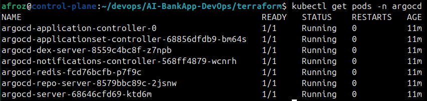

You should see pods for: `argocd-server`, `argocd-repo-server`, `argocd-application-controller`, `argocd-applicationset-controller`, `argocd-redis`, and `argocd-dex-server`.

**Get the ArgoCD admin password:**
```bash
kubectl -n argocd get secret argocd-initial-admin-secret \
  -o jsonpath="{.data.password}" | base64 -d && echo
```

**Access the ArgoCD UI:**

Option A -- via LoadBalancer (if Terraform exposed it):
```bash
export ARGOCD_URL=$(kubectl get svc argocd-server -n argocd \
  -o jsonpath='{.status.loadBalancer.ingress[0].hostname}')
echo "ArgoCD URL: http://$ARGOCD_URL"
```

   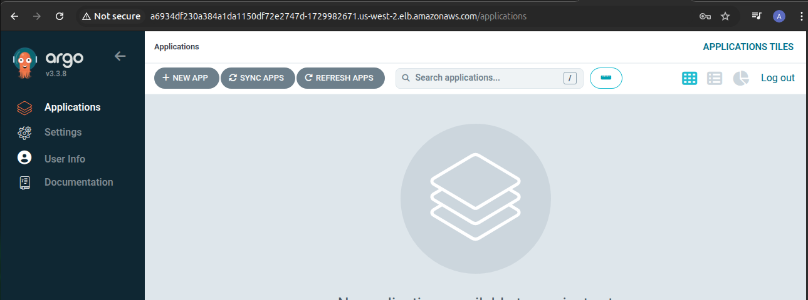

Option B -- via port-forward:
```bash
kubectl port-forward svc/argocd-server -n argocd 8443:443
```

Open `https://localhost:8443` (accept the self-signed certificate). Log in with:
- Username: `admin`
- Password: the value from the command above

**Install the ArgoCD CLI:**
```bash
# macOS
brew install argocd

# Linux
curl -sSL -o argocd https://github.com/argoproj/argo-cd/releases/latest/download/argocd-linux-amd64
chmod +x argocd
sudo mv argocd /usr/local/bin/

# Verify
argocd version --client
```

   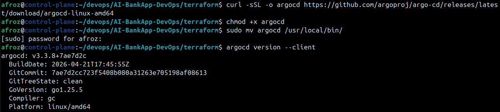

Log in via CLI:
```bash
argocd login $ARGOCD_URL --username admin --password <your-password> --insecure
# or for port-forward:
argocd login localhost:8443 --username admin --password <your-password> --insecure
```

   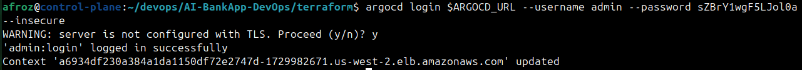

**Explore the ArgoCD UI:**
- **Applications** -- shows all managed applications (empty for now)
- **Settings > Repositories** -- Git repos ArgoCD can access
- **Settings > Clusters** -- Kubernetes clusters ArgoCD manages (your EKS cluster is the default `in-cluster`)

   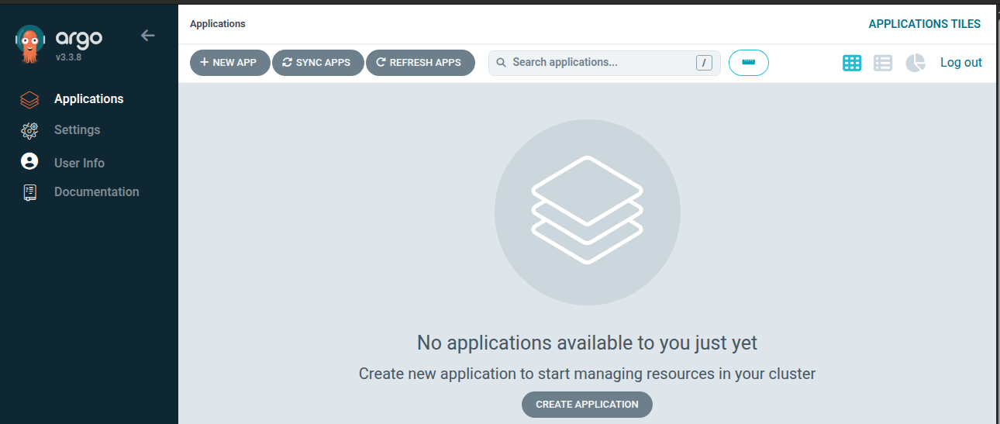
   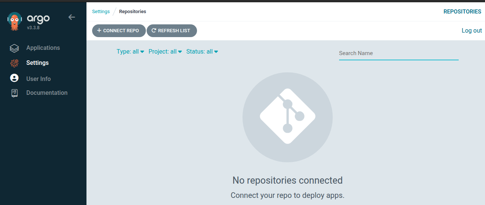
   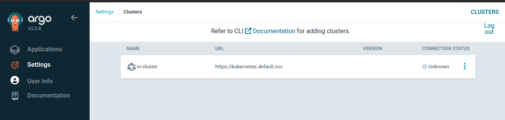

---

## Task 3: Study the AI-BankApp's ArgoCD Application Manifest
Open `argocd/application.yml` from the AI-BankApp repo:

```yaml
apiVersion: argoproj.io/v1alpha1
kind: Application
metadata:
  name: bankapp
  namespace: argocd
spec:
  project: default
  source:
    repoURL: https://github.com/TrainWithShubham/AI-BankApp-DevOps.git
    targetRevision: feat/gitops
    path: k8s
  destination:
    server: https://kubernetes.default.svc
    namespace: bankapp
  syncPolicy:
    automated:
      prune: true
      selfHeal: true
    syncOptions:
      - CreateNamespace=true
      - ServerSideApply=true
```

**Break down every field:**

| Field | Value | Purpose |
|-------|-------|---------|
| `source.repoURL` | The AI-BankApp GitHub repo | Where ArgoCD fetches manifests from |
| `source.targetRevision` | `feat/gitops` | Which Git branch to watch |
| `source.path` | `k8s` | The directory containing Kubernetes manifests |
| `destination.server` | `kubernetes.default.svc` | Deploy to the local cluster (in-cluster) |
| `destination.namespace` | `bankapp` | Target namespace for resources |
| `syncPolicy.automated` | enabled | ArgoCD syncs automatically on Git changes |
| `prune: true` | enabled | Delete resources removed from Git |
| `selfHeal: true` | enabled | Revert manual changes made directly to the cluster |
| `CreateNamespace=true` | enabled | Create the `bankapp` namespace if it does not exist |
| `ServerSideApply=true` | enabled | Use server-side apply for better conflict handling |

---

## Task 4: Deploy the AI-BankApp via ArgoCD
First, make sure the BankApp is NOT already deployed (clean slate):
```bash
kubectl delete namespace bankapp 2>/dev/null
```

**Fork the AI-BankApp repo** -- you need your own copy to push changes later:
1. Go to https://github.com/TrainWithShubham/AI-BankApp-DevOps
2. Click "Fork" and create your fork
3. Note your fork URL: `https://github.com/<your-username>/AI-BankApp-DevOps.git`

**Create the ArgoCD Application** (update the repoURL to your fork):
```bash
cat <<EOF | kubectl apply -f -
apiVersion: argoproj.io/v1alpha1
kind: Application
metadata:
  name: bankapp
  namespace: argocd
spec:
  project: default
  source:
    repoURL: https://github.com/<your-username>/AI-BankApp-DevOps.git
    targetRevision: feat/gitops
    path: k8s
  destination:
    server: https://kubernetes.default.svc
    namespace: bankapp
  syncPolicy:
    automated:
      prune: true
      selfHeal: true
    syncOptions:
      - CreateNamespace=true
      - ServerSideApply=true
EOF
```

**Watch ArgoCD deploy the app:**
- In the ArgoCD UI, click on the `bankapp` application
- You will see a visual tree of all Kubernetes resources being created
- Each resource shows its sync and health status (green = healthy, yellow = progressing, red = degraded)

Or watch via CLI:
```bash
argocd app get bankapp
argocd app wait bankapp
```

   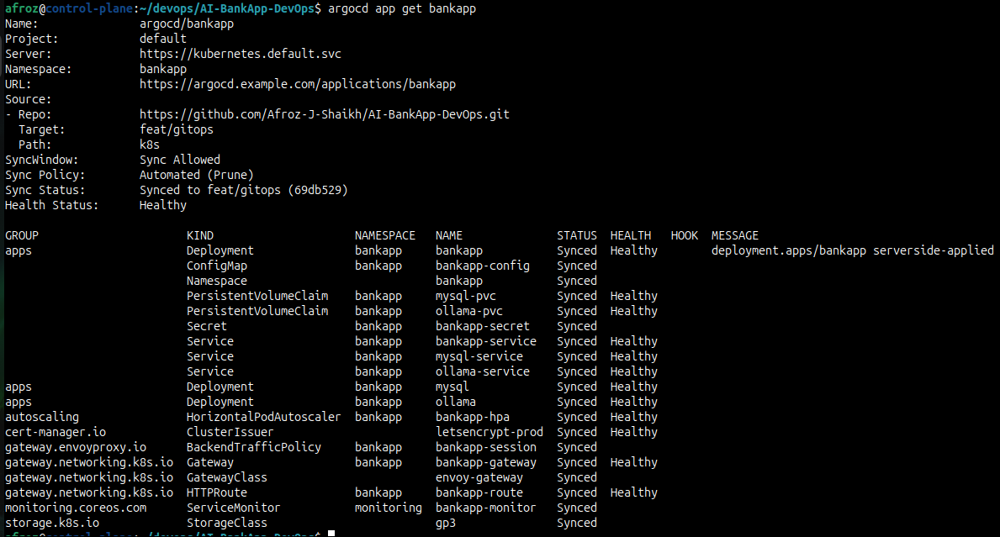
   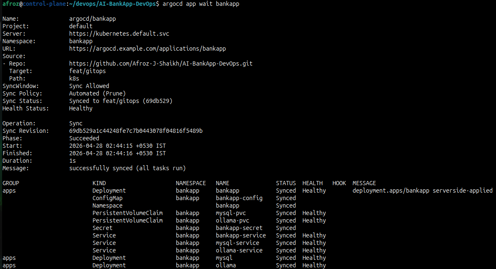
   
Monitor pods coming up:
```bash
kubectl get pods -n bankapp -w
```

   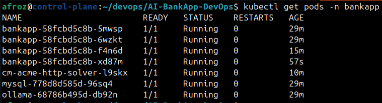

The deployment order is automatic -- ArgoCD applies all manifests from the `k8s/` directory. MySQL and Ollama start first, then the BankApp's init containers wait for dependencies.

After everything is healthy (5-10 minutes):
```bash
argocd app get bankapp
```

Status should show: `Health: Healthy`, `Sync: Synced`.

---

## Task 5: Explore ArgoCD's Live View
Click on the `bankapp` application in the ArgoCD UI. You will see:

**The resource tree:**
```
bankapp (Application)
  |-- Namespace: bankapp
  |-- StorageClass: gp3
  |-- PVC: mysql-pvc (Bound)
  |-- PVC: ollama-pvc (Bound)
  |-- ConfigMap: bankapp-config
  |-- Secret: bankapp-secret
  |-- Deployment: mysql -> ReplicaSet -> Pod
  |-- Deployment: ollama -> ReplicaSet -> Pod
  |-- Deployment: bankapp -> ReplicaSet -> Pod (x4)
  |-- Service: mysql-service
  |-- Service: ollama-service
  |-- Service: bankapp-service
  |-- HPA: bankapp-hpa
```

**Click on any resource** to see its details:
- Pod logs (live streaming)
- Events
- YAML manifest (as applied to the cluster)
- Diff (what changed since last sync)

   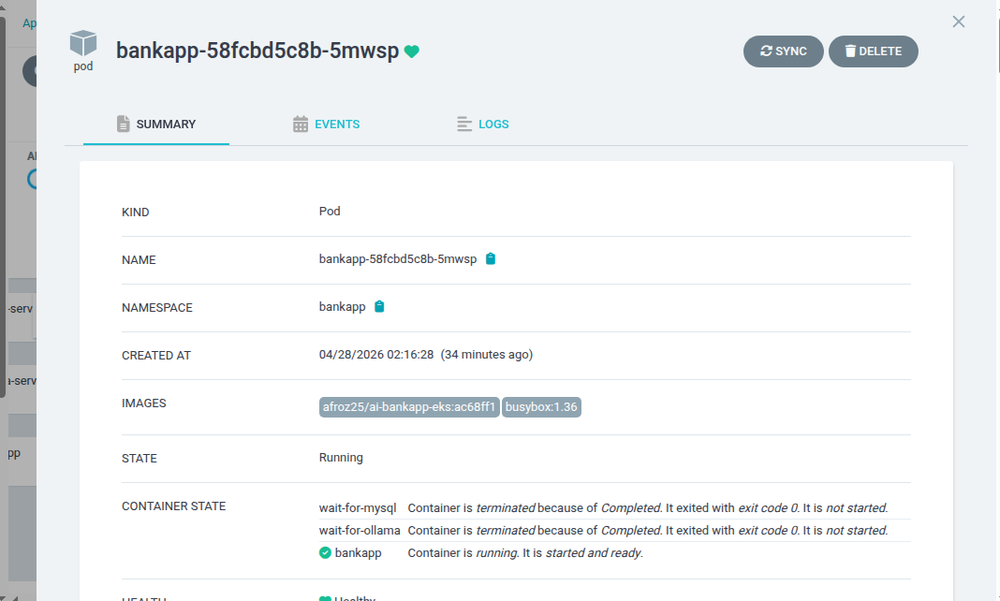

**App Details tab shows:**
- Source repo and path
- Last sync time and revision (git commit SHA)
- Sync status and health status
- History of all syncs

   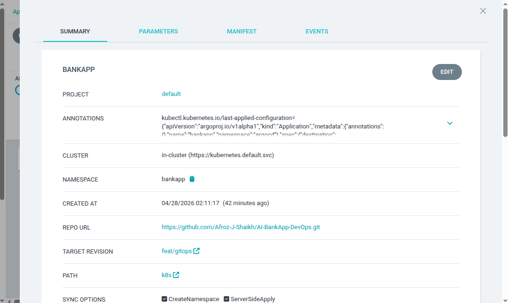

**Check the sync history:**
```bash
argocd app history bankapp
```

   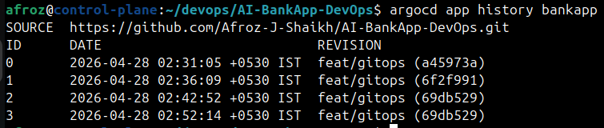

This shows every revision that was synced, when, and the commit SHA.

---

## Task 6: Test Self-Healing
ArgoCD's `selfHeal: true` means it reverts any manual changes made directly to the cluster.

**Test 1 -- Manually scale the BankApp:**
```bash
kubectl scale deployment bankapp -n bankapp --replicas=1
```

Watch what happens:
```bash
kubectl get pods -n bankapp -w
```

   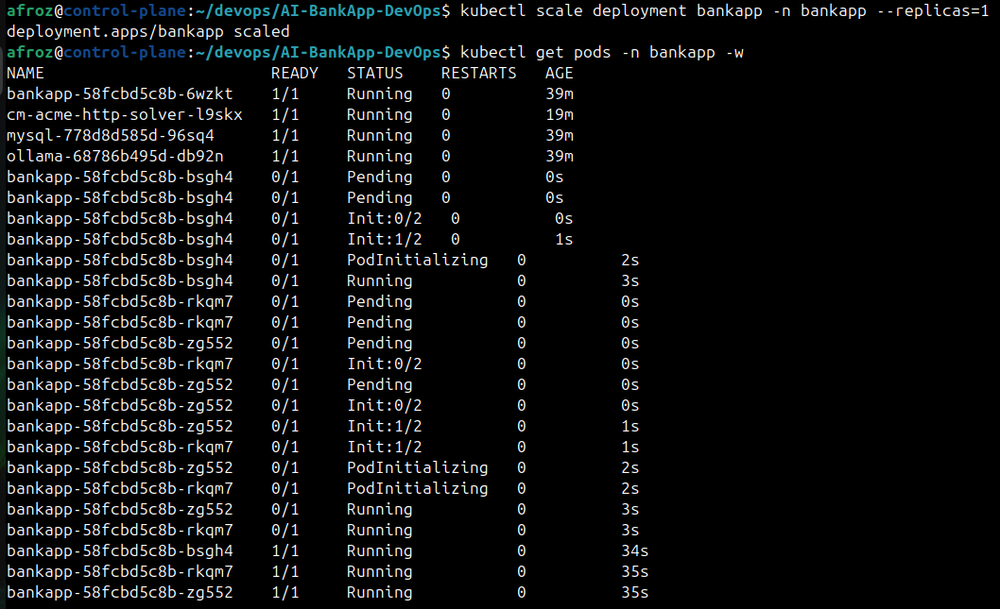

   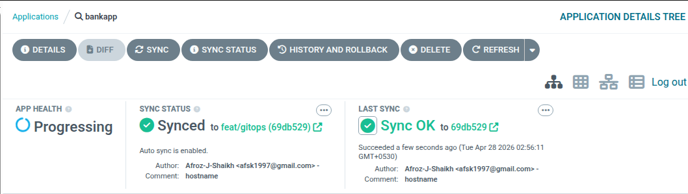

Within 3-5 minutes, ArgoCD detects the drift and scales it back to the value defined in Git (4 replicas, or whatever the HPA decides). Check the ArgoCD UI -- you will see a sync event.

**Test 2 -- Manually delete a ConfigMap:**
```bash
kubectl delete configmap bankapp-config -n bankapp
```

   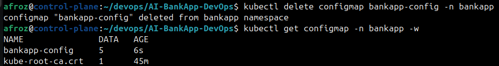

ArgoCD will recreate it from Git within minutes.

**Test 3 -- Manually change an environment variable:**
```bash
kubectl edit configmap bankapp-config -n bankapp
# Change MYSQL_DATABASE to something wrong
```

   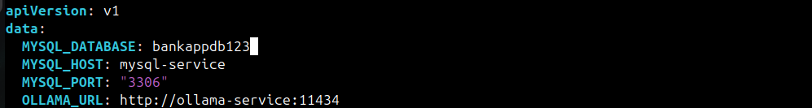
   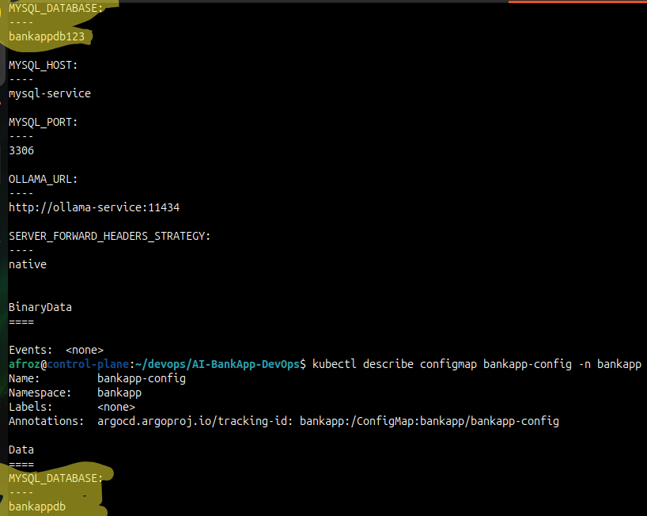

ArgoCD will overwrite your change with the value from Git.

**This is the core GitOps promise:** The cluster always matches Git. Manual changes do not survive. All changes must go through Git (pull requests, review, merge).

**Document:** What happened during each self-healing test? How quickly did ArgoCD revert the changes?
   - ArgoCD detected drift and recreated those resources within 2-3 minitues matchig live state of cluster with desired state in Git.

---

- What `prune`, `selfHeal`, and `ServerSideApply` do
   - prune Delete resources removed from Git
   - selfHeal Revert manual changes made directly to the cluster
   - ServerSideApply Use server-side apply for better conflict handling

- Screenshot of the ArgoCD UI showing the bankapp Application resource tree
   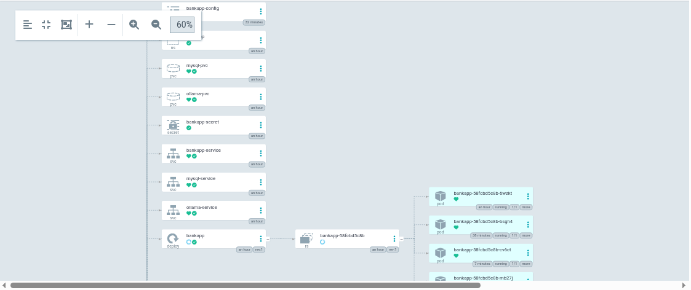
   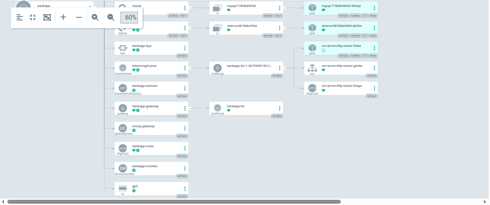

- The Application manifest with every field explained

```yml
apiVersion: argoproj.io/v1alpha1  # ArgoCD Application API version
kind: Application                # Defines an ArgoCD application
metadata:
  name: bankapp                  # Name of the ArgoCD application
  namespace: argocd              # Namespace where ArgoCD is installed
spec:
  project: default               # ArgoCD project (logical grouping)
  source:
    repoURL: https://github.com/Afroz-J-Shaikh/AI-BankApp-DevOps.git  # GitHub repo where manifests are stored
    targetRevision: feat/gitops   # Git branch ArgoCD watches for changes
    path: k8s                     # Directory inside repo containing Kubernetes manifests
  destination:
    server: https://kubernetes.default.svc  # Deploy to in-cluster Kubernetes API server
    namespace: bankapp            # Target namespace where resources will be deployed
  syncPolicy:
    automated:                   # Enable automatic synchronization
      prune: true                # Remove resources deleted from Git
      selfHeal: true             # Revert manual changes in the cluster
    syncOptions:
      - CreateNamespace=true     # Automatically create namespace if it doesn't exist
      - ServerSideApply=true     # Use server-side apply to handle conflicts better
```

---
