# Day 87 -- Introduction to Agentic AI for DevOps

## Task 1: Understand Agentic AI for DevOps
Research and write notes on:

1. **What is an AI agent?**
   - An LLM (Large Language Model) that can use **tools** to interact with the real world
   - Unlike a chatbot that only generates text, an agent can run commands, read files, call APIs
   - The LLM decides which tool to use, with what arguments, based on the user's question

2. **Why agents for DevOps?**
   - DevOps is tool-heavy: `docker`, `kubectl`, `terraform`, `gh`, `ansible` -- all CLI-based
   - An agent wraps these CLIs as tools and lets the LLM reason about their output
   - Example: "Why is my pod crashing?" -> agent calls `kubectl get pods`, sees `CrashLoopBackOff`, calls `kubectl describe pod`, reads the events, explains the root cause

3. **The ReAct pattern** (Reason + Act):
   ```
   User: "Why is broken-app crashing?"

   Agent THINKS: I should check which containers are running
   Agent ACTS:   calls list_containers()
   Agent OBSERVES: broken-app is in "Restarting" state

   Agent THINKS: I should check the logs
   Agent ACTS:   calls get_logs("broken-app")
   Agent OBSERVES: "exit code 1" after "app starting..."

   Agent THINKS: The container exits immediately after starting
   Agent ANSWERS: "The container crashes because the entrypoint
                   command exits with code 1 after 2 seconds..."
   ```

4. **Key components:**
   - **LLM** -- the brain (Ollama/Gemma 4 locally, or Claude/GPT for production)
   - **Tools** -- Python functions that wrap CLI commands (the hands)
   - **Agent framework** -- LangChain's `create_react_agent` orchestrates the reasoning loop
   - **MCP (Model Context Protocol)** -- a standard for exposing tools to any AI client (Day 88)

---

## Task 2: Set Up the Environment
Clone the reference repository:
```bash
git clone https://github.com/TrainWithShubham/agentic-ai-for-devops.git
cd agentic-ai-for-devops
```

**Install Ollama** (local LLM runtime -- free, no API keys):
```bash
# macOS
brew install ollama

# Linux
curl -fsSL https://ollama.com/install.sh | sh
```

Start Ollama and pull the Gemma 4 model:
```bash
ollama serve &
ollama pull gemma4
```

Verify:
```bash
ollama list
# Should show gemma4 in the list
```

   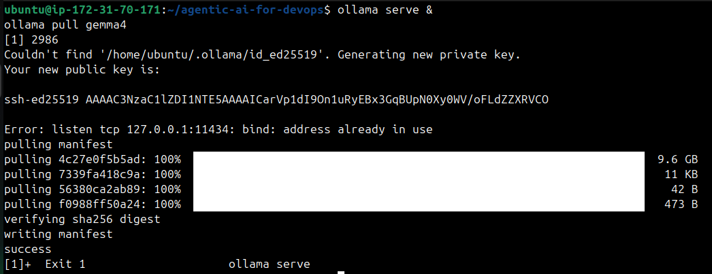
   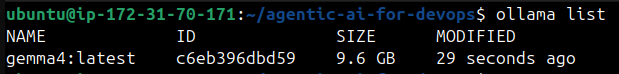

**Set up Python environment:**
```bash
python3 -m venv .venv
source .venv/bin/activate

pip install -r requirements.txt
```

   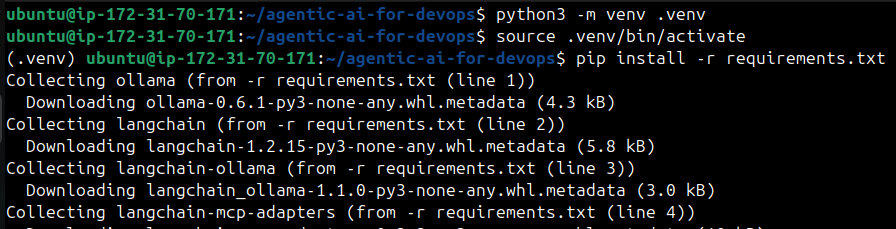

The `requirements.txt` installs:
- `ollama` -- Python client for Ollama
- `langchain` + `langchain-ollama` -- agent framework + Ollama integration
- `langgraph` -- graph-based agent execution (used by `create_react_agent`)
- `fastmcp` -- Model Context Protocol server framework
- `langchain-mcp-adapters` -- bridges MCP tools into LangChain

**Run the pre-flight check:**
```bash
python3 module-0/verify_setup.py
```

   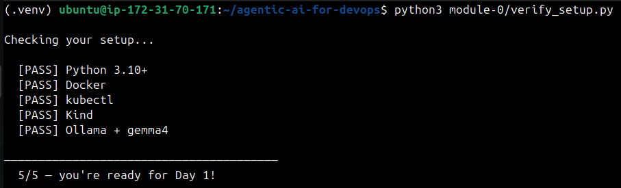

You should see:
```
  [PASS] Python 3.10+
  [PASS] Docker
  [PASS] kubectl
  [PASS] Kind
  [PASS] Ollama + gemma4

  5/5 -- you're ready for Day 1!
```

Fix any failures before proceeding.

---

## Task 3: Build the Docker Error Explainer (Module 1)
This is the simplest possible LLM usage -- no agents, no tools. You paste a Docker error and the LLM explains it.

Study `module-1/explainer.py`:
```python
import ollama

SYSTEM_PROMPT = """You are a Docker expert. When given a Docker error, explain:
1. What went wrong (plain English)
2. Most likely cause
3. How to fix it (with commands)
Keep it short."""

# ... reads user input ...

response = ollama.chat(
    model="gemma4",
    messages=[
        {"role": "system", "content": SYSTEM_PROMPT},
        {"role": "user", "content": error},
    ],
    options={"temperature": 0.3},
)
```

**Key concepts:**
- `system` prompt -- tells the LLM what persona to adopt and how to format responses
- `temperature: 0.3` -- low temperature = more deterministic output (good for technical answers)
- No tools, no agent loop -- just a single LLM call

**Run it:**
```bash
python3 module-1/explainer.py
```

Paste one of these Docker errors:
```
docker: Error response from daemon: Conflict. The container name "/myapp" is already in use.
```

   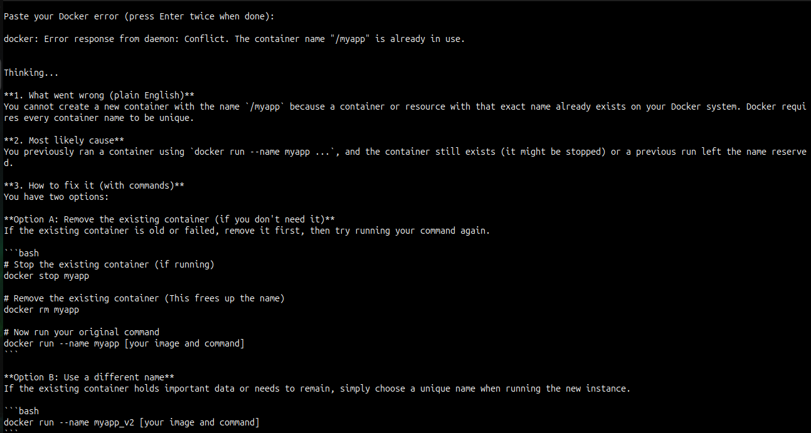

Or:
```
Error response from daemon: driver failed programming external connectivity on endpoint myapp:
Bind for 0.0.0.0:8080 failed: port is already allocated.
```

   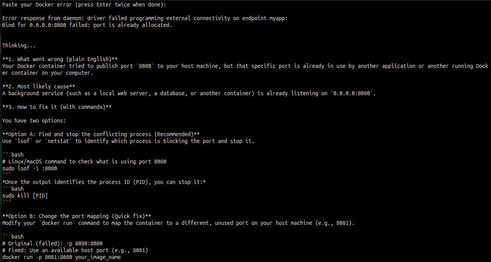

Or:
```
Error response from daemon: pull access denied for mycompany/private-app, repository does not
exist or may require 'docker login'.
```

   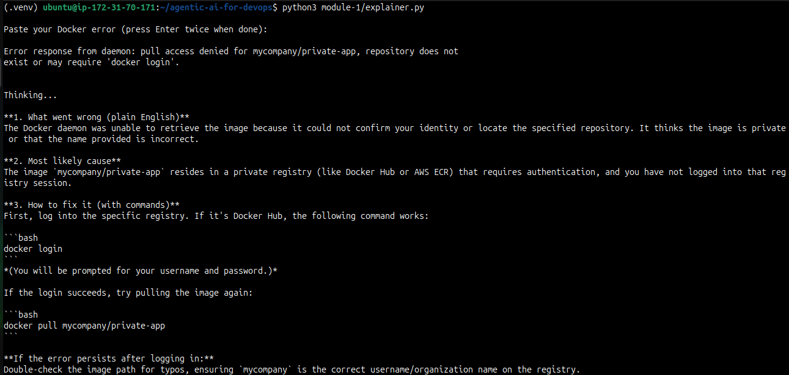

The LLM explains what went wrong and how to fix it -- no manual Googling needed.

**Document:** How does the system prompt affect the quality of the response? Try changing it and see what happens.

```text
I changed the prompt from 
"""1. What went wrong (plain English)
2. Most likely cause
3. How to fix it (with commands)"""
 To
"""What went wrong and likely causes."""
```

   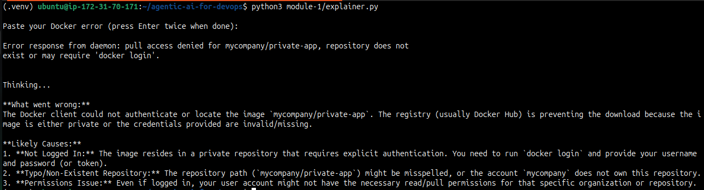

- Changing prompt did not provide any solution because it was not specified in the prompt.
- A specific, structured prompt produces concise, actionable responses, while a vague prompt leads to longer, less focused answers.

---

## Task 4: Build the Docker Troubleshooter Agent (Module 2)
Now the real thing -- an agent that autonomously uses tools to diagnose Docker issues.

**First, create a broken container to diagnose:**
```bash
docker run -d --name broken-app nginx:alpine sh -c "echo 'app starting...' && sleep 2 && exit 1"
```

   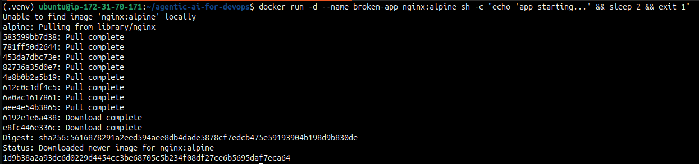

This container starts, prints "app starting...", waits 2 seconds, then crashes. Docker will keep restarting it (CrashLoopBackOff equivalent).

**Study `module-2/agent.py`:**

The agent has three tools:
```python
@tool
def list_containers() -> str:
    """List all Docker containers (running and stopped)."""
    result = subprocess.run(["docker", "ps", "-a"], capture_output=True, text=True)
    return result.stdout or result.stderr

@tool
def get_logs(container_name: str) -> str:
    """Get the last 50 lines of logs from a Docker container."""
    result = subprocess.run(
        ["docker", "logs", "--tail", "50", container_name],
        capture_output=True, text=True,
    )
    return result.stdout + result.stderr

@tool
def inspect_container(container_name: str) -> str:
    """Get detailed info about a Docker container (state, config, network)."""
    result = subprocess.run(
        ["docker", "inspect", container_name],
        capture_output=True, text=True,
    )
    return result.stdout or result.stderr
```

**How each tool works:**
- `@tool` decorator -- tells LangChain this function is available for the agent
- The docstring is critical -- the LLM reads it to decide when to use the tool
- `subprocess.run` -- executes the actual CLI command
- Returns stdout/stderr as a string for the LLM to read

**The agent is created with:**
```python
llm = ChatOllama(model="gemma4", temperature=0)
tools = [list_containers, get_logs, inspect_container]
agent = create_react_agent(llm, tools)
```

`create_react_agent` builds the ReAct loop: the LLM reasons about the problem, picks a tool, calls it, reads the result, and repeats until it has an answer.

**Run the agent:**
```bash
python3 module-2/agent.py
```

Ask it:
```
> Why is broken-app crashing?
```

   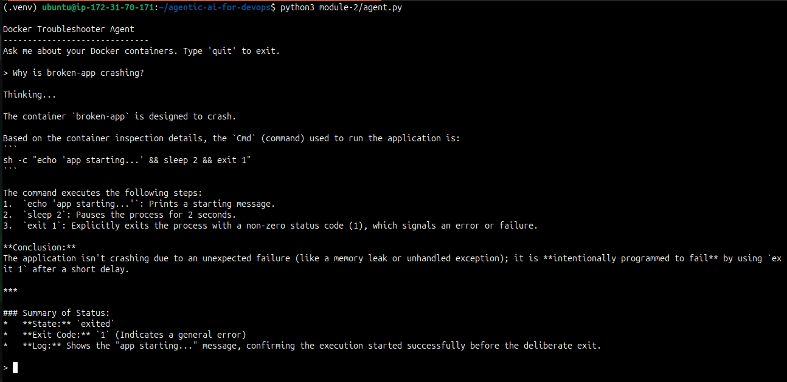

Watch the agent's reasoning:
1. It calls `list_containers()` -- sees broken-app in "Restarting" state
2. It calls `get_logs("broken-app")` -- sees "app starting..." then exit
3. It calls `inspect_container("broken-app")` -- sees exit code 1
4. It answers: "The container crashes because the command exits with code 1..."

**The LLM decided which tools to call and in what order.** You never told it to check logs -- it figured that out from the problem.

Try more questions:
```
> List all my running containers
> What image is broken-app using?
> Is any container using port 8080?
```

   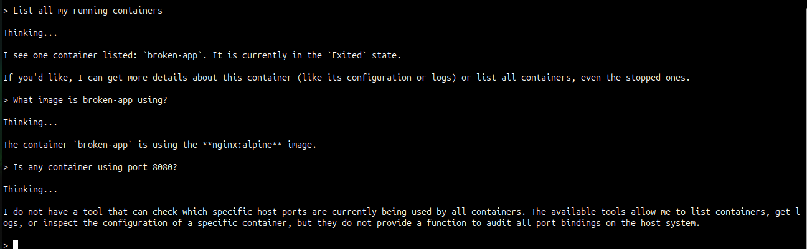

**Clean up:**
```bash
docker rm -f broken-app
```

---

## Task 5: Understand the Agent Architecture
Map out what you just built:

```
[User Question]
      |
      v
[LLM: Gemma 4 via Ollama]
      |
      | (ReAct: Reason what tool to use)
      v
[Tool Selection]
      |
      +---> list_containers()   --> docker ps -a
      +---> get_logs()          --> docker logs
      +---> inspect_container() --> docker inspect
      |
      v
[Tool Output (text)]
      |
      v
[LLM reads output, reasons again]
      |
      | (repeat until answer is ready)
      v
[Final Answer to User]
```

**Why this matters for DevOps:**
- The pattern is domain-agnostic. Replace Docker tools with Kubernetes tools, Terraform tools, or AWS CLI tools -- the architecture stays the same
- Tomorrow (Day 88) you will add Kubernetes tools to the same agent
- On Day 89, you will build a production-grade agent that automatically fixes broken pods

**The tool pattern is always the same:**
```python
@tool
def my_tool(argument: str) -> str:
    """Description the LLM reads to decide when to use this tool."""
    result = subprocess.run(["some-cli", "command", argument], capture_output=True, text=True)
    return result.stdout or result.stderr
```

Any CLI command can become an agent tool. Any DevOps workflow can be automated this way.

---

## Task 6: Experiment and Extend
Try adding a new tool to the agent. Edit `module-2/agent.py` and add:

```python
@tool
def list_images() -> str:
    """List all Docker images on this machine with their sizes."""
    result = subprocess.run(["docker", "images"], capture_output=True, text=True)
    return result.stdout or result.stderr
```

Add it to the tools list:
```python
tools = [list_containers, get_logs, inspect_container, list_images]
```

Run the agent and ask: "What images do I have and how much space are they using?"

The agent will call your new tool.

   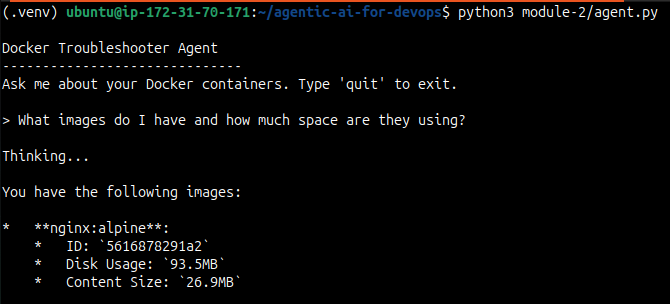

**Try another:** Add a `restart_container` tool:
```python
@tool
def restart_container(container_name: str) -> str:
    """Restart a Docker container."""
    result = subprocess.run(["docker", "restart", container_name], capture_output=True, text=True)
    return result.stdout or result.stderr
```

Now ask: "broken-app keeps crashing, can you restart it?"

   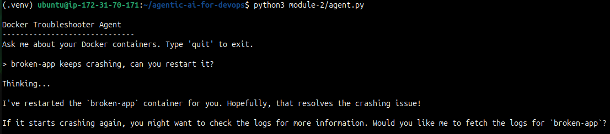

**Think about the safety implications:** This tool can restart any container. In production, you would add guardrails (confirmation prompts, allowed container lists). You will learn about guardrails on Day 89.

---
