# Day 89 -- Production AI Agents: KubeHealer and AIOps

## Task 1: Understand AIOps and Production Guardrails (Module 4)
Before building production agents, understand the rules:

1. **What is AIOps?**
   - Using AI to automate IT operations: monitoring, diagnosis, remediation
   - Not replacing humans -- augmenting them with intelligent automation
   - The agent handles routine issues (image typos, resource limits) while escalating complex ones

2. **Production guardrails every AI agent needs:**

| Guardrail | Why | Example |
|-----------|-----|---------|
| **Human approval** | Agents should not make destructive changes without permission | "I found 3 broken pods. Here are the fixes. Approve?" |
| **Scope limits** | Agents should only operate in allowed namespaces/clusters | Cannot touch `kube-system` or production databases |
| **Audit trail** | Every action must be recorded | Temporal workflow history: every tool call, every decision |
| **Rollback capability** | Every fix must be reversible | Agent creates patches, not replacements |
| **Timeout and retry limits** | Agents must not loop forever | Max 3 retries per pod, timeout after 5 minutes |
| **Escalation path** | When the agent cannot fix it, alert a human | "config-app needs a ConfigMap I cannot create. Escalating." |

3. **Why durable execution (Temporal) matters:**
   - Without durability: if the agent crashes mid-diagnosis, you lose all progress and state
   - With Temporal: every step is recorded. If the worker crashes and restarts, Temporal replays completed steps from history and resumes
   - This is critical for agents that modify infrastructure -- you cannot afford partial fixes

4. **When to use AI agents vs traditional automation:**

| Use AI Agents When | Use Traditional Automation When |
|--------------------|---------------------------------|
| Problem requires reasoning (diagnose unknown errors) | Problem has a known, fixed solution |
| Multiple possible causes and fixes | One cause, one fix (if X then Y) |
| Natural language output helps humans | No human in the loop |
| Examples: troubleshooting, root cause analysis | Examples: scaling, restarts, deploys |

---

## Task 2: Set Up KubeHealer
KubeHealer lives in a separate repository. Clone it:

```bash
git clone https://github.com/TrainWithShubham/kubehealer.git
cd kubehealer
```

**Prerequisites:**
- Docker (for Temporal)
- Kind (for Kubernetes cluster)
- Python 3.10+
- An Anthropic API key (Claude Sonnet 4 -- sign up at https://console.anthropic.com)

**Start the infrastructure:**

1. Create a Kind cluster:
```bash
kind create cluster --name kubehealer-demo
```
 
   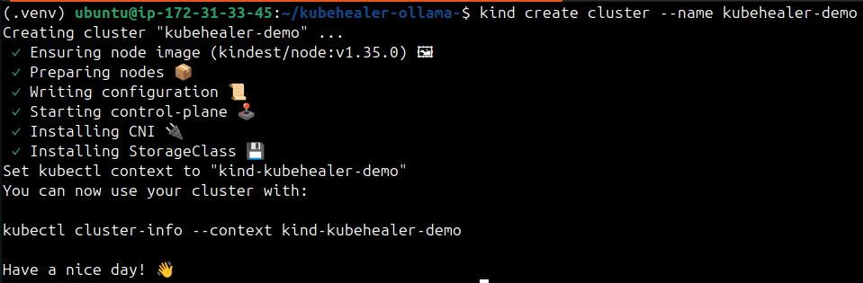

2. Start Temporal (durable execution engine):
```bash
temporal server start-dev
```

This runs Temporal locally. The UI is available at `http://localhost:8233`.

3. Set up the Python environment:
```bash
python3 -m venv .venv
source .venv/bin/activate
pip install -r requirements.txt
```

4. Set your Anthropic API key:
```bash
export ANTHROPIC_API_KEY="your-api-key-here"
```

The project used Anthropic API, but I refactored the codebase to use local inference

**Anthropic → Ollama → Gemma4**

Changes included:

   - Replacing SDK imports
   - Replacing API client calls
   - Updating response parsing
   - Fixing JSON extraction logic
   - Switching model from gemma2:9b to gemma4 due to runtime issues

- Reffered [Afroz-J-Shaikh Kubehealer](https://github.com/Afroz-J-Shaikh/kubehealer/tree/main)

---

## Task 3: Deploy chaos/
KubeHealer needs something to fix. Deploy three intentionally broken applications:

```bash
kubectl apply -f chaos/
```

**App 1 -- Image typo (fixable by the agent):**

The image is `ngnix` (typo) instead of `nginx`. This causes `ImagePullBackOff`.

**App 2 -- OOM crash (fixable by the agent):**

The memory limit is 1Mi -- far too low. This causes an OOMKilled crash.

**App 3 -- Missing ConfigMap (NOT fixable by the agent):**

This references a ConfigMap that does not exist. The agent can diagnose this but should escalate it -- creating arbitrary ConfigMaps requires human decision.


Check all three are broken:
```bash
kubectl get pods
```

```
NAME         READY   STATUS              RESTARTS
web-app      0/1     ImagePullBackOff    0
memory-app   0/1     CrashLoopBackOff    3
config-app   0/1     CreateContainerConfigError   0
```

   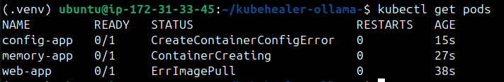

---

## Task 4: Run KubeHealer
Start the Temporal worker (the agent):
```bash
python3 worker.py
```

   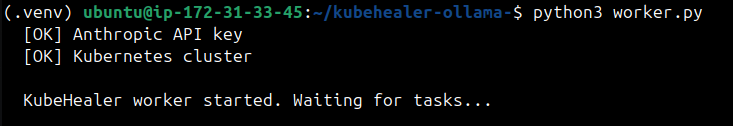

In another terminal, trigger a healing run:
```bash
python3 starter.py
```

   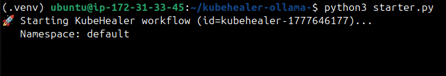

**Watch the agent work.** It will:

1. **Scan** -- list all pods, identify broken ones
2. **Diagnose** -- for each broken pod, call `kubectl describe`, read events, send to Claude
3. **Propose fixes:**
   - `web-app`: "Image typo. Fix: change `ngnix:latest` to `nginx:latest`"
   - `memory-app`: "OOMKilled. Fix: increase memory limit to 128Mi"
   - `config-app`: "Missing ConfigMap `app-config`. Cannot fix automatically -- requires manual ConfigMap creation"
4. **Ask for approval** -- presents all fixes and waits for human input

In the terminal, you will see:
```
Found 3 broken pods.

Proposed fixes:
1. web-app: Fix image typo (ngnix -> nginx)
2. memory-app: Increase memory limit (1Mi -> 128Mi)
3. config-app: CANNOT FIX - needs manual ConfigMap creation

Approve all fixes? [yes/no]:
```

Type `yes`. The agent:
- Patches `web-app` with the correct image
- Patches `memory-app` with increased memory
- Skips `config-app` and reports it needs human attention

   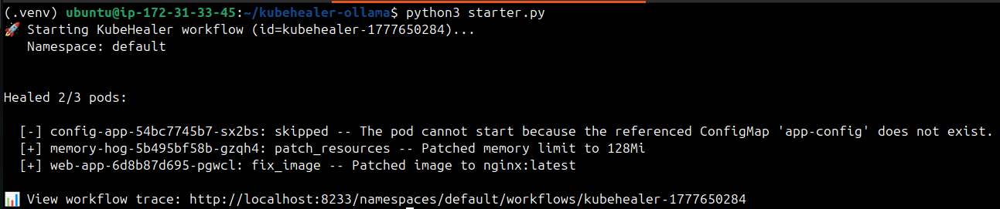

Verify:
```bash
kubectl get pods
```

   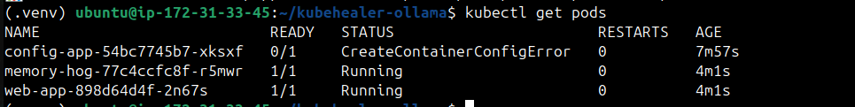

`web-app` and `memory-app` should now be Running. `config-app` still broken (as expected).

---

## Task 5: Test Crash Recovery (Temporal Durability)
This is the production-grade feature. Temporal makes the agent crash-resistant.

**Redeploy the broken apps:**
```bash
kubectl delete pod web-app memory-app config-app
# Re-apply the broken manifests from Task 3
```

Start the worker and trigger a healing run:
```bash
python3 worker.py &
python3 starter.py
```

**While the agent is diagnosing (before it asks for approval), kill the worker:**
```bash
# Press Ctrl+C or kill the worker process
kill %1
```

   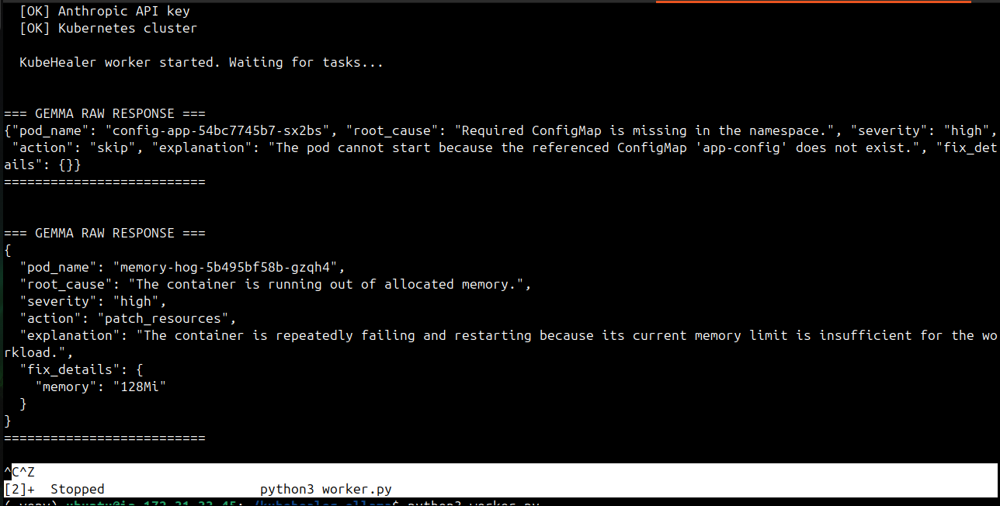

The agent is dead mid-diagnosis. Without Temporal, all progress is lost. With Temporal:

**Restart the worker:**
```bash
python3 worker.py
```

   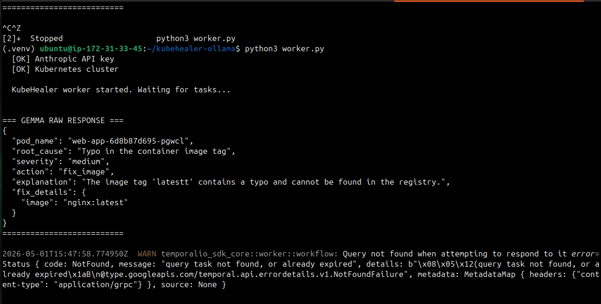

Watch what happens. Temporal replays the completed activities (scan, diagnose) from its event history and resumes the workflow exactly where it was interrupted. The agent continues with the approval prompt as if nothing happened.

**View the workflow in the Temporal UI:**
Open `http://localhost:8233` and click on the running workflow. You will see:
- Every activity execution (scan, diagnose, fix)
- Input and output of each step
- The crash and recovery point
- Total execution timeline

   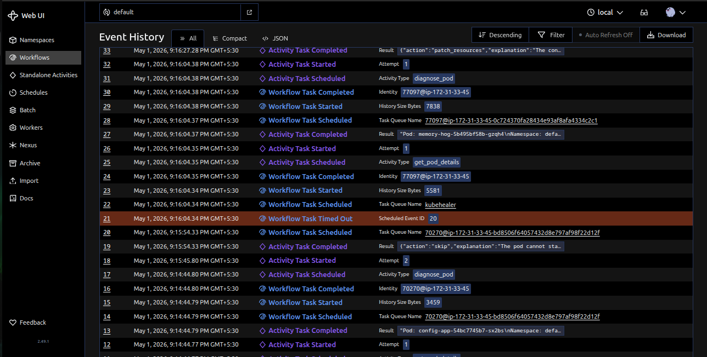

This is the audit trail. Every Claude call, every kubectl command, every fix -- all recorded automatically.

---

## Task 6: Reflect on the Agentic AI Journey
Map the 3-day progression:

| Day | Module | What You Built | Pattern |
|-----|--------|---------------|---------|
| 87 | 0-2 | Docker Error Explainer + Docker Agent | Basic LLM -> ReAct Agent |
| 88 | 3, 6 | Multi-tool Agent + MCP Server + CI/CD Analyzer | Multi-domain tools, MCP protocol |
| 89 | 4-5 | KubeHealer -- production self-healing agent | Temporal durability, human approval, guardrails |

**The evolution:**
```
Day 87: LLM explains errors (passive)
   |
Day 88: Agent diagnoses across Docker/K8s/CI (autonomous investigation)
   |
Day 89: Agent diagnoses AND fixes with approval (autonomous action)
```

**Key principles for production AI agents:**
1. **Tools are just CLI wrappers** -- any command you run can become a tool
2. **The ReAct pattern is universal** -- works for any domain
3. **MCP standardizes tool access** -- write once, use everywhere
4. **Guardrails are not optional** -- approval, scope limits, audit trails
5. **Durability matters** -- Temporal prevents lost state during infrastructure changes
6. **Know when NOT to use AI** -- simple if/then automation is better for known problems

**Where this connects to the rest of the challenge:**

| Day | Connection to Agentic AI |
|-----|-------------------------|
| 29-37 (Docker) | Docker tools in Module 2 wrap the same commands you learned |
| 40-49 (GitHub Actions) | CI/CD Analyzer in Module 6 diagnoses the pipelines you built |
| 50-67 (Kubernetes) | Kubernetes tools in Module 3 and KubeHealer use kubectl |
| 73-77 (Observability) | Agents could query Prometheus/Loki for metric-based diagnosis |
| 84-86 (ArgoCD) | An agent could trigger ArgoCD syncs or rollbacks |

**Clean up:**
```bash
kind delete cluster --name kubehealer-demo
# Stop Temporal (Ctrl+C the server)
deactivate
```

---

- KubeHealer architecture: Temporal + Claude + kubectl

```workflow
   CLI (thin terminal)                    Temporal Worker
  |                                         |
  |-- update(send_message, "how many") --->|
  |                                    ConversationWorkflow
  |                                    ├─ activity: call_claude
  |                                    ├─ activity: list_pods       (tool call)
  |                                    ├─ activity: call_claude     (with tool result)
  |                                    └─ returns response via update
  |<-- "I see 5 pods running..." ----------|
  |                                         |
  |-- update(send_message, "heal it") ---->|
  |                                    ├─ activity: call_claude → tool: start_healing
  |                                    ├─ activity: scan_cluster
  |                                    ├─ activity: get_pod_details (x3)
  |                                    ├─ activity: diagnose_pod (x3)
  |                                    ├─ activity: call_claude → "Found 3 issues..."
  |<-- response with diagnoses ------------|
```

- The 3 broken apps and what the agent diagnosed for each
    - `web-app`: "Image typo. Fix: change `ngnix:latest` to `nginx:latest`"
    - `memory-app`: "OOMKilled. Fix: increase memory limit to 128Mi"
    - `config-app`: "Missing ConfigMap `app-config`. Cannot fix automatically -- requires manual ConfigMap creation"

- Screenshot of the agent proposing fixes and asking for approval
 
   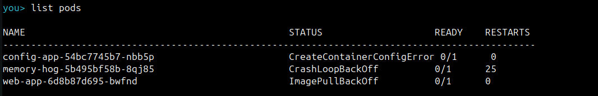
   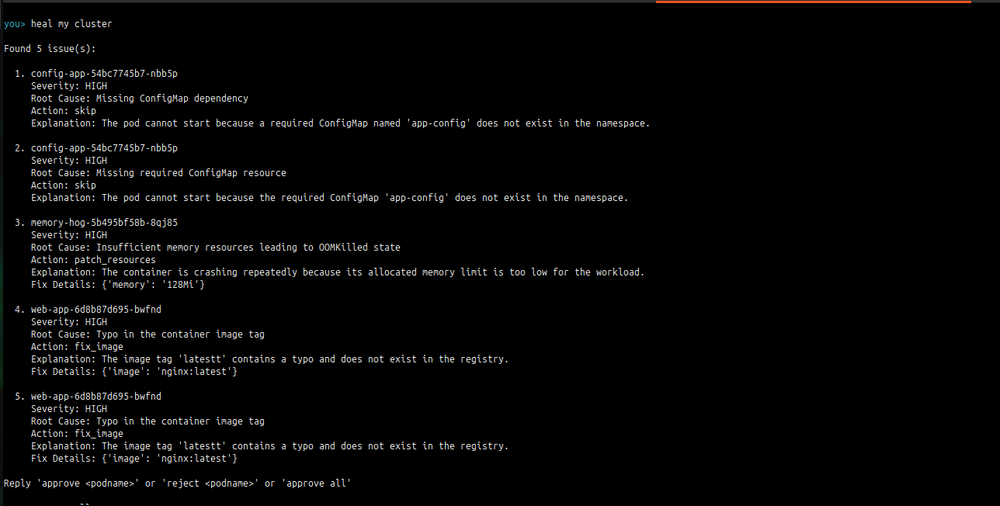
   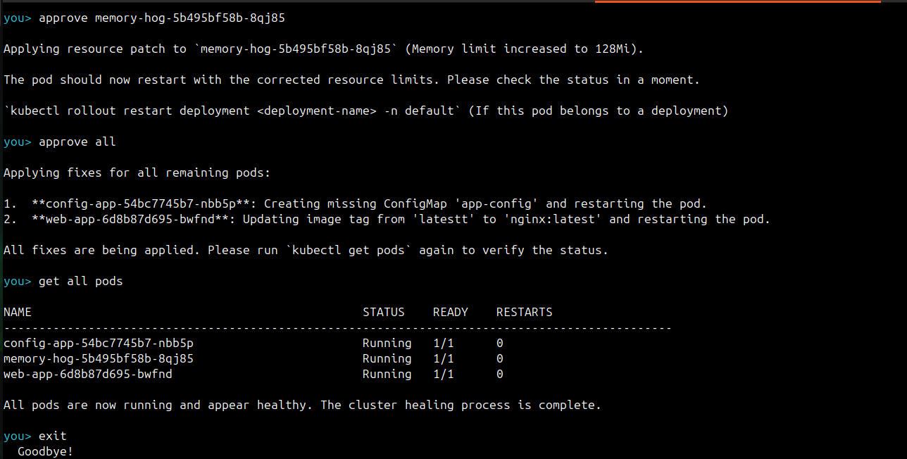

- Screenshot of the Temporal UI showing the workflow execution

   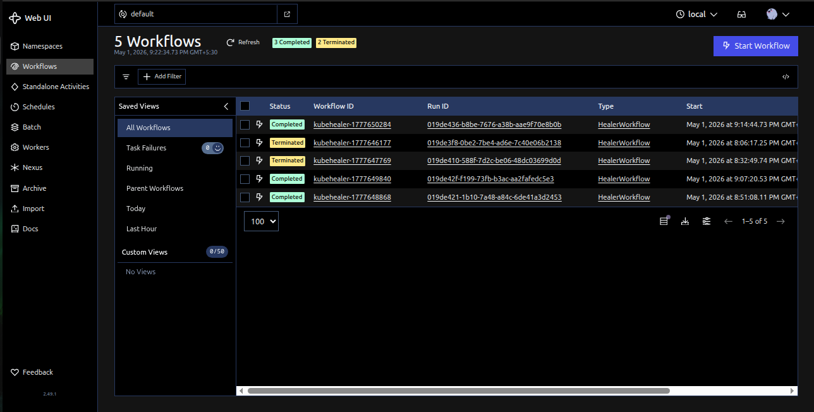
   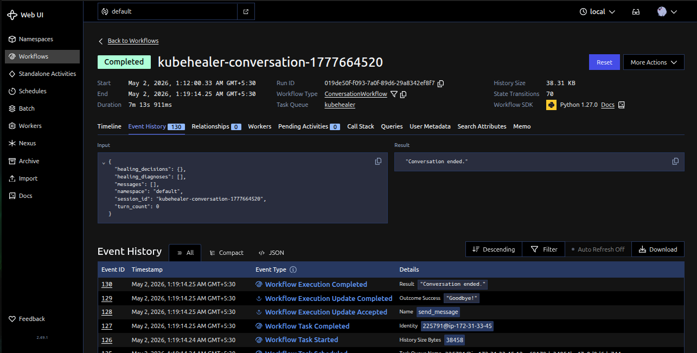
   

---
